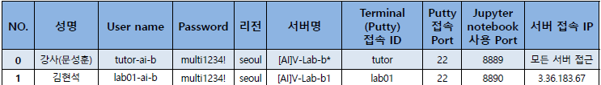

# Pday01_data load


### 캐글 shopee 공모전


##### AWS 서버 제공받고 환경설정



- EC2에서 인스턴트 서버 실행 [AI]V-Lab-b1


##### PuTTY 환경설정

- Session에 서버접속  IP 삽입
- SSH - Auth에서 ppk 삽입
- tunnels에서 127.0.0.1:8xxx 포트 번호 삽입
- 이름 지정 후 저장


##### 이후 개발할 가상환경 생성

1. 관리자 권한인 ubuntu로 putty 로그인
2. conda create -n cnn_env python=3.7
3. conda activate cnn_env
4. conda install nb_conda
5. conda install (numpy, pandas, tensorflow==2.4.1, matplotlib, sklearn, spicy) 등 필요한 모듈 설치
6. jupyter notebook --ip=0.0.0.0 --no-browser --port=8890


##### 데이터 로드

- 캐글에서 Shopee 데이터 다운로드
- filezilla 다운로드 후 환경설정
- filezilla 이용해서 가상환경에 데이터 업로드
- 쉘에서 unzip 파일명.zip 명령어로 압축 풀기

```python
import numpy as np
from PIL import Image
import matplotlib.pyplot as plt

img = Image.open('./data/train_images/0000a68812bc7e98c42888dfb1c07da0.jpg')
print(type(img))

plt.imshow(img)
plt.show()

pixel = np.array(img)

print(f'x좌표: 100, y좌표: 200의 pixel 값: {pixel[200,100]}')
```

