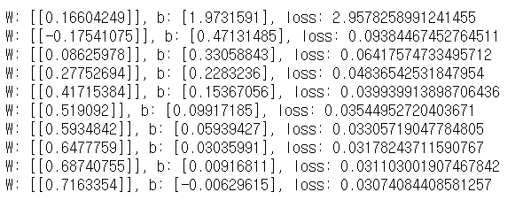
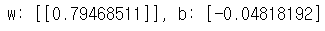
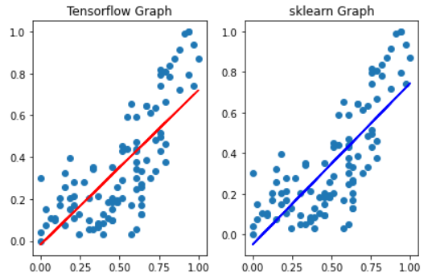
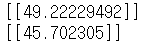
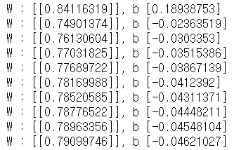
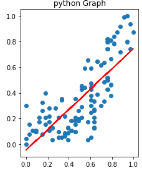
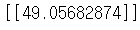

# Test04_ML


### 온도에 따른 오존량 예측


##### tensorflow를 이용해 구현

```python
# 온도에 따른 Ozone량 예측

import numpy as np
import pandas as pd
import matplotlib.pyplot as plt
from scipy import stats          # 이상치 처리
import tensorflow as tf          # tensorflow 구현
from sklearn import linear_model # sklearn으로 simpler linear regression 
from sklearn.preprocessing import MinMaxScaler # normalization 전처리


## Raw Data Loading
df = pd.read_csv('./ozone.csv')

training_data = df[['Temp', 'Ozone']]


## 결측치처리
training_data = training_data.dropna(how='any')


## 이상치(outlier) 처리
# z-score를 이용해서 outlier 처리
zscore_threshold = 1.8

# temp에 대한 outlier(지대점)
# np.abs() : 절대값을 구해주는 함수
# ~() : boolean mask의 역의 값을 구하는 함수
tmp = ~(np.abs(stats.zscore(training_data['Temp'])) > zscore_threshold)
training_data = training_data.loc[tmp]  # 110 rows × 2 columns

# Ozone에 대한 outlier
tmp = ~(np.abs(stats.zscore(training_data['Ozone'])) > zscore_threshold)
training_data = training_data.loc[tmp]  # 103 rows × 2 columns


## 정규화 처리 (Min-Max Scaler)
# Min-Max Scaler라고 불리는 객체를 생성
# 독립변수와 종속변수 각각 만들어줌

# x 변경
scaler_x = MinMaxScaler()  # 객체 생성
scaler_x.fit(training_data['Temp'].values.reshape(-1,1))
training_data['Temp'] = scaler_x.transform(training_data['Temp'].values.reshape(-1,1))

# t 변경
scaler_t = MinMaxScaler()  # 객체 생성
scaler_t.fit(training_data['Ozone'].values.reshape(-1,1))
training_data['Ozone'] = scaler_t.transform(training_data['Ozone'].values.reshape(-1,1))
display(training_data)


## Training Data Set
x_data = training_data['Temp'].values.reshape(-1,1)
t_data = training_data['Ozone'].values.reshape(-1,1)


## placeholder
X = tf.placeholder(shape=[None,1], dtype=tf.float32)
T = tf.placeholder(shape=[None,1], dtype=tf.float32)


## Weight & bias
W = tf.Variable(tf.random.normal([1,1]), name='weight')
b = tf.Variable(tf.random.normal([1]), name='bias')


## Hypothesis
H = tf.matmul(X, W) + b


## loss function
loss = tf.reduce_mean(tf.square(H-T))


## train
train = tf.train.GradientDescentOptimizer(learning_rate=1e-4).minimize(loss)


## session, 초기화
sess = tf.Session()
sess.run(tf.global_variables_initializer())


## 학습
for step in range(300000):
    _, W_val, b_val, loss_val = sess.run([train, W, b, loss],
                                         feed_dict={X: x_data, T: t_data})
    
    if step % 30000 == 0:
        print(f'W: {W_val}, b: {b_val}, loss: {loss_val}')
        
```




##### sklearn을 이용해서 구현

```python
# sklearn을 이용해서 구현
## Training Data Set
x_data = training_data['Temp'].values.reshape(-1,1)
t_data = training_data['Ozone'].values.reshape(-1,1)

model = linear_model.LinearRegression()
model.fit(x_data, t_data)

print(f'w: {model.coef_}, b: {model.intercept_}')

```




##### Graph로 비교

```python
# Graph로 비교
fig = plt.figure()
fig_tensorflow = fig.add_subplot(1,2,1)
fig_sklearn = fig.add_subplot(1,2,2)

fig_tensorflow.set_title('Tensorflow Graph')
fig_sklearn.set_title('sklearn Graph')

fig_tensorflow.scatter(x_data, t_data)
fig_tensorflow.plot(x_data, x_data*W_val.ravel() + b_val, color='r')

fig_sklearn.scatter(x_data, t_data)
fig_sklearn.plot(x_data, x_data*model.coef_.ravel() + model.intercept_, color='b')


fig.tight_layout()
plt.show()
```




##### 예측

```python
# prediction
# 온도가 62도 일때 Ozone량은 얼마일까

# sklearn을 이용
sklearn_result = model.predict([[62]])
print(sklearn_result)     # [[49.22229492]]

# tensorflow를 이용
tensorflow_result = sess.run(H, feed_dict={X:[[62]]})
print(tensorflow_result)
```




##### python으로 구현

```python
# Simple Linear Regression을 python으로 구현

import numpy as np
import pandas as pd
from scipy import stats          # 이상치 처리
from sklearn.preprocessing import MinMaxScaler # normalization 전처리


## Raw Data Loading
df = pd.read_csv('./ozone.csv')

training_data = df[['Temp', 'Ozone']]


## 결측치처리
training_data = training_data.dropna(how='any')


## 이상치(outlier) 처리
# z-score를 이용해서 outlier 처리
zscore_threshold = 1.8

# temp에 대한 outlier(지대점)
# np.abs() : 절대값을 구해주는 함수
# ~() : boolean mask의 역의 값을 구하는 함수
tmp = ~(np.abs(stats.zscore(training_data['Temp'])) > zscore_threshold)
training_data = training_data.loc[tmp]  # 110 rows × 2 columns

# Ozone에 대한 outlier
tmp = ~(np.abs(stats.zscore(training_data['Ozone'])) > zscore_threshold)
training_data = training_data.loc[tmp]  # 103 rows × 2 columns


## 정규화 처리 (Min-Max Scaler)
# Min-Max Scaler라고 불리는 객체를 생성
# 독립변수와 종속변수 각각 만들어줌

# x 변경
scaler_x = MinMaxScaler()  # 객체 생성
scaler_x.fit(training_data['Temp'].values.reshape(-1,1))
training_data['Temp'] = scaler_x.transform(training_data['Temp'].values.reshape(-1,1))

# t 변경
scaler_t = MinMaxScaler()  # 객체 생성
scaler_t.fit(training_data['Ozone'].values.reshape(-1,1))
training_data['Ozone'] = scaler_t.transform(training_data['Ozone'].values.reshape(-1,1))
display(training_data)


## Training Data Set
x_data = training_data['Temp'].values.reshape(-1,1)
t_data = training_data['Ozone'].values.reshape(-1,1)


# 2. Weight & bias
W = np.random.rand(1,1)
b = np.random.rand(1)


# 3. Hypothesis
def predict(x):
    
    y = np.dot(x,W) + b
    
    return y


# 4. loss function
def loss_func(input_obj):
    # input_obj : [W, b]
    
    input_W = input_obj[0]
    input_b = input_obj[1]
    
    y = np.dot(x_data, input_W) + input_b
    
    return np.mean(np.power((t_data - y), 2))


# 5. 편미분을 위한 함수
def numerical_derivative(f, x):
    # f: 미분하려고 하는 다변수 함수
    # x: 모든 값을 포함하는 numpy array  ex) f'(1.0, 2.0) = (8.0, 15.0)
    delta_x = 1e-4
    derivative_x = np.zeros_like(x)     # [[0 0]
                                        #  [0 0]]
    it = np.nditer(x, flags=['multi_index'])
    
    while not it.finished:
        
        idx = it.multi_index # 현재의 iterator의 index를 추출 => tuple형태 
        
        tmp = x[idx] # 현재 index의 값을 잠시 보존,
                     # delta_x를 이용한 값으로 ndarray를 수정한 후 편미분
                     # 함수값을 계산한 후 원상복구를 해줘야 다음 독립변수에
                     # 대한 편미분을 정상적으로 수행 가능
        x[idx] = tmp + delta_x
        fx_plus_delta = f(x)    # f([1.00001, 2.0]) => f(x + delta_x)
        
        x[idx] = tmp - delta_x
        fx_minus_delta = f(x)    # f([0.99999, 2.0]) => f(x - delta_x)
        
        derivative_x[idx] = (fx_plus_delta - fx_minus_delta) / (2 * delta_x)
        x[idx] = tmp
        
        it.iternext()
    
    return derivative_x


# 6. learning rate 설정
learning_rate = 1e-4


# 7. 학습을 진행
for step in range(300000):
    # ravel() : 무조건 1차원 벡터로 만들어버리는 함수
    input_param = np.concatenate((W.ravel(), b.ravel()), axis=0) # [W b]
    derivative_result = learning_rate * numerical_derivative(loss_func,input_param)
    
    W = W - derivative_result[:1].reshape(1,1)  # W 갱신
    b = b - derivative_result[1:]               # b 갱신
    
    if step % 30000 == 0:
        print(f'W : {W}, b {b}')
        
```




##### python 그래프 출력

```python
fig = plt.figure()
fig_python = fig.add_subplot(1,2,1)

fig_python.set_title('python Graph')

fig_python.scatter(x_data, t_data)
fig_python.plot(x_data, x_data*W.ravel() + b, color='r')

fig.tight_layout()
plt.show()

```




##### python 예측

```python
print(predict(62))
```

