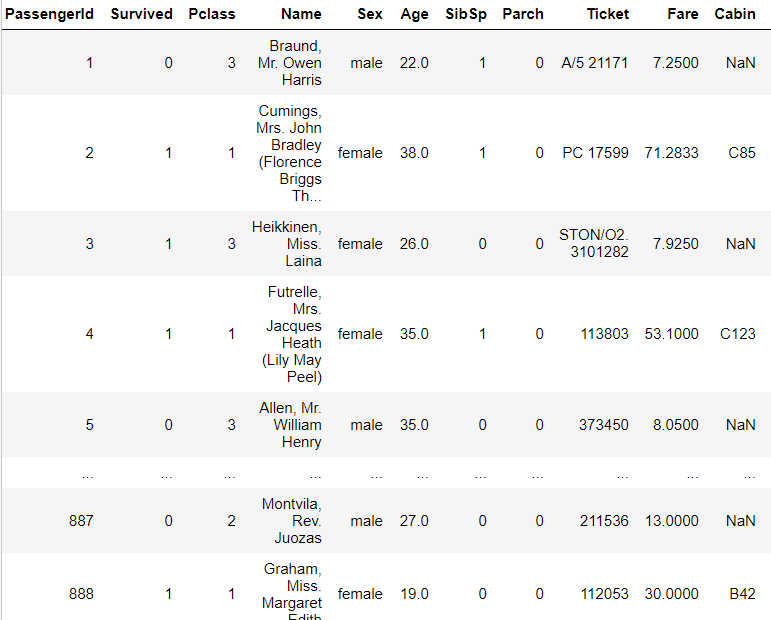
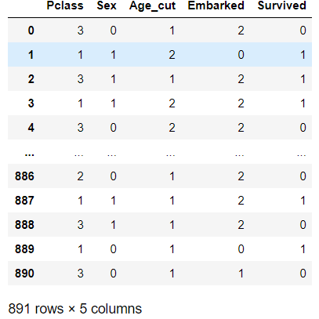
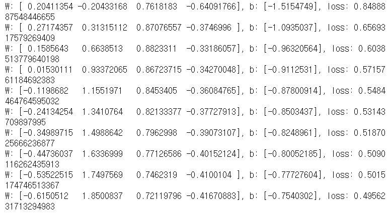
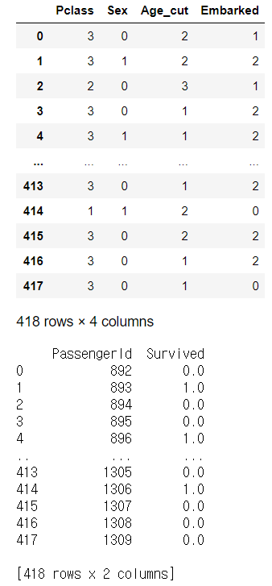

# Test05_Titanic


##### 데이터 로드

```python
import numpy as np
import pandas as pd

df = pd.read_csv('./data/titanic/train.csv')
display(df)

## 데이터 전처리 진행

# PassengerId : 그대로 사용, 종속변수에 영향을 미치지 않음
#               넣어봤자 Overfitting 문제만 생김
# Survived : 종속변수(lable) 0과 1로 되어있으니 그냥 씀
# Pclass : 1, 2, 3 숫자로 되어있음
# Name : 이름은 생존 여부에 영향을 미치지 않음
# Sex : male, female 숫자로 변환, 생존 여부에 가장 크게 영향
# Age : 결측치가 있음, 삭제보다는 값을 대체하는 게 중요
#       전체 사람의 평균으로 일단 사용
#       MISS인 사람의 평균으로 대체(결혼한 여성)
#       0~99범위를 가지는 실수값
#       0~10: 소아(0), 11~25: 청년(1), 26~49: 중년(2), 50~: 노년(3)
# Ticket : 포함시키지 않아도 됨
# Cabin : 객실번호 (제외, NaN을 수정해서 사용할지는 결정)
# Embarked : 데이터분석(상관분석) 해보면 어디서 탔는지가 영향 미침
```




##### 데이터 전처리 및 요약

```python
import warnings # warning을 출력하지 않도록 처리

# warning off
warnings.filterwarnings(action='ignore')

## 데이터 전처리
# 사용할 컬럼만 추출
training_data = df[['Pclass','Sex','Age','Embarked','Survived']]

# 성별 데이터 숫자로 변경
training_data['Sex'] = training_data['Sex'].map({'male':0,
                                                 'female':1})
# 탑승지역 데이터 숫자로 변경
training_data['Embarked'] = training_data['Embarked'].map({'C':0,
                                                           'Q':1,
                                                           'S':2,
                                                          np.nan:2})
# Age의 null값을 전체 나이 평균값으로 대체
training_data = training_data.fillna(training_data['Age'].mean())

# Age값을 범주화
training_data['Age_cut'] = 0
training_data['Age_cut'] = pd.cut(training_data.Age, bins=[0,16,32,48,64,80],
                                                   labels=[0,1,2,3,4])

# Age 컬럼 제거
del training_data['Age']

# 데이터 프레임 순서 변경
training_data = training_data[['Pclass','Sex','Age_cut','Embarked','Survived']]
display(training_data)

## 요약 ##
# Pclass : 1- 1등석 2- 2등석 3- 3등석
# Sex : 0- male 1- female
# Age_cut : 0- 0~16  (어린이)
#           1- 17~32 (청소년)
#           2- 33~48 (청년)
#           3- 49~64 (중년)
#           4- 65~80 (노년)
# Embarked : 0- C=Cherbourg, 1- Q=Queenstown, 2- S=Southampton
# survived : 0- 사망, 1- 생존
```




##### 모델링 및 학습

```python
import numpy as np
import pandas as pd
import warnings # warning을 출력하지 않도록 처리
import tensorflow as tf
from sklearn.preprocessing import MinMaxScaler

## 정규화
x_data = training_data.drop('Survived', axis=1).values
t_data = training_data['Survived'].values.reshape(-1,1)

scaler_x = MinMaxScaler()
scaler_x.fit(x_data)
norm_x_data = scaler_x.transform(x_data)


## placeholder
X = tf.placeholder(shape=[None,4], dtype=tf.float32)
T = tf.placeholder(shape=[None,1], dtype=tf.float32)


## Weight & bias
W = tf.Variable(tf.random.normal([4,1]), name='weight')
b = tf.Variable(tf.random.normal([1]), name='bias')


## Hypothesis
logit = tf.matmul(X,W) + b
H = tf.sigmoid(logit)


## loss function(cross entropy)
loss = tf.reduce_mean(tf.nn.sigmoid_cross_entropy_with_logits(logits=logit,
                                                              labels=T))

## train
train = tf.train.GradientDescentOptimizer(learning_rate=1e-4).minimize(loss)


## session & 초기화
sess = tf.Session()
sess.run(tf.global_variables_initializer())


## 학습
for step in range(300000):
    
    _, W_val, b_val, loss_val = sess.run([train,W,b,loss],
                                          feed_dict={X:norm_x_data,
                                                     T:t_data})
    
    if step % 30000 == 0:
        print(f'W: {W_val.ravel()}, b: {b_val}, loss: {loss_val}')
```




##### test 데이터 전처리 및 예측

```python
import numpy as np
import pandas as pd
import warnings # warning을 출력하지 않도록 처리
import tensorflow as tf
from sklearn.preprocessing import MinMaxScaler


t_df = pd.read_csv('./data/titanic/test.csv')


# warning off
warnings.filterwarnings(action='ignore')

## 데이터 전처리
# 사용할 컬럼만 추출
test_data = t_df[['Pclass','Sex','Age','Embarked']]
# 성별 데이터 숫자로 변경
test_data['Sex'] = test_data['Sex'].map({'male':0,
                                                 'female':1})
# 탑승지역 데이터 숫자로 변경
test_data['Embarked'] = test_data['Embarked'].map({'C':0,
                                                   'Q':1,
                                                   'S':2,
                                                  np.nan:2})
# Age의 null값을 전체 나이 평균값으로 대체
test_data = test_data.fillna(test_data['Age'].mean())

# Age값을 범주화
test_data['Age_cut'] = 0
test_data['Age_cut'] = pd.cut(test_data.Age, bins=[0,16,32,48,64,80],
                                             labels=[0,1,2,3,4])

# Age 컬럼 제거
del test_data['Age']

# 데이터 프레임 순서 변경
test_data = test_data[['Pclass','Sex','Age_cut','Embarked']]
display(test_data)

## 정규화
test_x_data = test_data.values

scaled_test_data = scaler_x.transform(test_x_data.reshape(-1,4))
result = sess.run(H, feed_dict={X:scaled_test_data})

answer = pd.DataFrame({
    'PassengerId': t_df['PassengerId'].ravel(),
    'Survived': result.ravel()
})

answer.loc[answer['Survived']>=0.5,'Survived'] = 1
answer.loc[answer['Survived']<0.5,'Survived'] = 0
answer.astype(int)
print(answer)
answer.to_csv('answer.csv', index=False)
```

