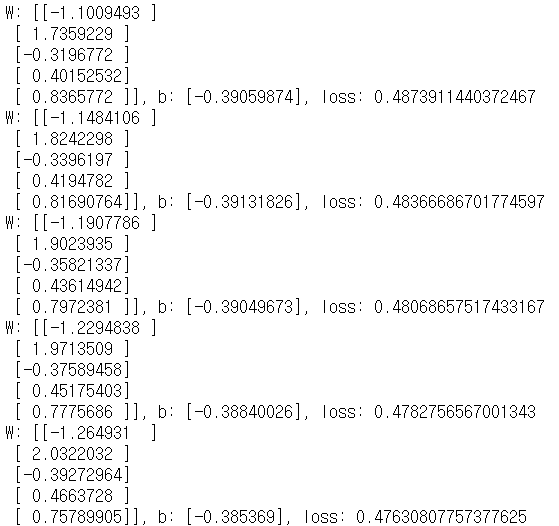
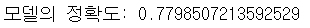
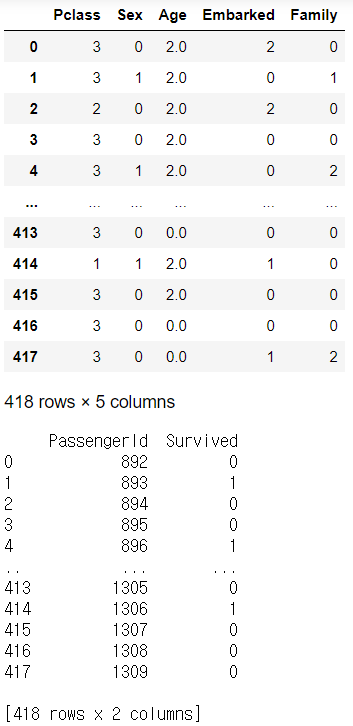
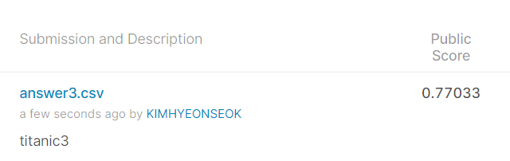

# Test05_Titanic


##### Training Data 전처리 및 학습

```python
import numpy as np
import pandas as pd
import tensorflow as tf

## Raw Data Loading
df = pd.read_csv('./data/titanic/train.csv')

# 학습에 필요없는 컬럼 삭제
df.drop(['PassengerId','Name','Ticket','Fare','Cabin'],
         axis=1, inplace=True)


# 성별 처리
gender_mapping = {'male': 0, 'female': 1}
df['Sex'] = df['Sex'].map(gender_mapping)

# 가족 처리
df['Family'] = df['SibSp'] + df['Parch']
df.drop(['SibSp','Parch'], axis=1, inplace=True)

# Embarked 결측치 처리
df['Embarked'] = df['Embarked'].fillna('Q')
# Embarked 문자를 숫자로 변환
embarked_mapping = {'S': 0, 'C': 1, 'Q': 2}
df['Embarked'] = df['Embarked'].map(embarked_mapping)

# Age 결측치 처리
df['Age'] = df['Age'].fillna(df['Age'].mean())
# Age Binning 처리 (범주화, Numerical -> Categorical)
df.loc[df['Age'] < 8, 'Age'] = 0 
df.loc[(df['Age'] >= 8) & (df['Age'] < 20), 'Age'] = 1 
df.loc[(df['Age'] >= 20) & (df['Age'] < 65), 'Age'] = 2 
df.loc[df['Age'] >= 65, 'Age'] = 3


## 학습과 validation을 수행
# validation data로 우리 모델을 검증하겠다
# 데이터를 7:3 비율로 Training과 Validation으로 분리
train_data = df.iloc[:int(df.shape[0]*0.7)] # 623 × 6
val_data = df.iloc[int(df.shape[0]*0.7):]   # 268 × 6


## Training Data Set
train_x_data = train_data.drop(['Survived'], axis=1).values
train_t_data = train_data['Survived'].values.reshape(-1,1)


## Validation Data Set
val_x_data = val_data.drop(['Survived'], axis=1).values
val_t_data = val_data['Survived'].values.reshape(-1,1)


## 정규화 (Normalization)
train_scaler_x = MinMaxScaler()
train_scaler_x.fit(train_x_data)
train_norm_x_data = train_scaler_x.transform(train_x_data)

val_scaler_x = MinMaxScaler()
val_scaler_x.fit(val_x_data)
val_norm_x_data = val_scaler_x.transform(val_x_data)


########## Tensorflow 구현

## Placeholder
X = tf.placeholder(shape=[None,5], dtype=tf.float32)
T = tf.placeholder(shape=[None,1], dtype=tf.float32)


## Weighht & bias
W = tf.Variable(tf.random.normal([5,1]), name='weight')
b = tf.Variable(tf.random.normal([1]), name='bias')


## Hypothesis
logit = tf.matmul(X,W) + b
H = tf.sigmoid(logit)


## loss function
loss = tf.reduce_mean(tf.nn.sigmoid_cross_entropy_with_logits(logits=logit,
                                                              labels=T))


## train
train = tf.train.GradientDescentOptimizer(learning_rate=1e-4).minimize(loss)


## session & 초기화
sess = tf.Session()
sess.run(tf.global_variables_initializer())


## 학습
for step in range(300000):
    _, W_val, b_val, loss_val = sess.run([train,W,b,loss],
                                         feed_dict={X: train_norm_x_data,
                                                    T: train_t_data})
    
    if step % 30000 == 0:
        print(f'W: {W_val}, b: {b_val}, loss: {loss_val}')
```




##### 모델의 정확도 측정

```python
# 정확도 측정(Accuracy) 측정
predict = tf.cast(H > 0.5, dtype=tf.float32)
correct = tf.equal(predict, T)
accuracy = tf.reduce_mean(tf.cast(correct,dtype=tf.float32))

accuracy_val = sess.run(accuracy, feed_dict={X: val_norm_x_data,
                                             T: val_t_data})

print(f'모델의 정확도: {accuracy_val}')

# 제출파일 만들고 제출
```




##### 테스트 데이터 전처리 및 결과 도출

```python
import numpy as np
import pandas as pd
import tensorflow as tf

## Raw Data Loading
org_t_df = pd.read_csv('./data/titanic/test.csv')
t_df = pd.read_csv('./data/titanic/test.csv')

# 학습에 필요없는 컬럼 삭제
t_df.drop(['PassengerId','Name','Ticket','Fare','Cabin'],
             axis=1, inplace=True)


# 성별 처리
gender_mapping = {'male': 0, 'female': 1}
t_df['Sex'] = t_df['Sex'].map(gender_mapping)

# 가족 처리
t_df['Family'] = t_df['SibSp'] + t_df['Parch']
t_df.drop(['SibSp','Parch'], axis=1, inplace=True)

# Embarked 결측치 처리
t_df['Embarked'] = t_df['Embarked'].fillna('Q')
# Embarked 문자를 숫자로 변환
embarked_mapping = {'S': 0, 'C': 1, 'Q': 2}
t_df['Embarked'] = t_df['Embarked'].map(embarked_mapping)

# Age 결측치 처리
t_df['Age'] = t_df['Age'].fillna(df['Age'].mean())
# Age Binning 처리 (범주화, Numerical -> Categorical)
t_df.loc[t_df['Age'] < 8, 'Age'] = 0 
t_df.loc[(t_df['Age'] >= 8) & (t_df['Age'] < 20), 'Age'] = 1 
t_df.loc[(t_df['Age'] >= 20) & (t_df['Age'] < 65), 'Age'] = 2 
t_df.loc[t_df['Age'] >= 65, 'Age'] = 3


## Training Data Set
test_data = t_df.values
display(test_data)
## 정규화 (Normalization)
scaled_test_data = train_scaler_x.transform(test_data.reshape(-1,5))

test_result = sess.run(H, feed_dict={X:scaled_test_data})

answer = pd.DataFrame({
    'PassengerId': org_t_df['PassengerId'].ravel(),
    'Survived': test_result.ravel()
})

answer.loc[answer['Survived']>=0.5,'Survived'] = 1
answer.loc[answer['Survived']<0.5,'Survived'] = 0
answer = answer.astype(int)
print(answer)


answer.to_csv('answer3.csv', index=False)
# 제출파일 만들고 제출
```




##### kaggle 제출 결과

