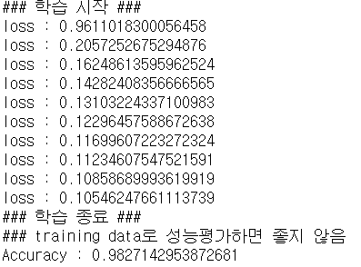
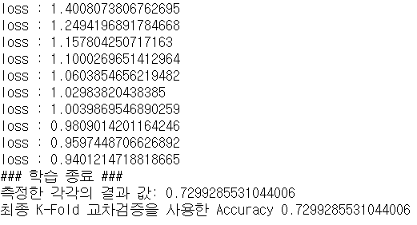
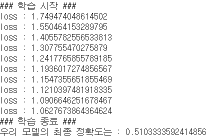

# Test07_BMI


```python
# BMI 예제
import numpy as np
import pandas as pd
import tensorflow as tf
from sklearn.preprocessing import MinMaxScaler
from sklearn.model_selection import train_test_split # train, test 분리
from sklearn.model_selection import KFold            # Cross Validation

# test data set은 우리의 최종 accuracy를 측정하기 위해 사용
# train data set은 K-Fold Cross validation을 이용해서 내부적인 평가를 진행


## Raw Data Loading
df = pd.read_csv('./data/bmi/bmi.csv', skiprows=3)
# display(df.head(), df.shape)


## 상관분석
# 종속변수(레이블)에 영향을 미치지 않는 feature(속성, 필드)를 제외하기 위해서
# -1 ~ 1 사이의 실수값이 나옴 pandas를 이용해 처리
# 필요치 않은 column을 제거


## 결측치 처리
# NaN이 있는 지 확인
# df.isnull() : DataFrame 안의 NaN에 대한 boolean mask 생성 (NaN이면 True)
# 결측치 존재시 다른 값으로 대체 -> KNN으로 예측
df.isnull().sum()


## 이상치 처리
# boxplot과 같은 graph를 이용해서 눈으로 확인
# turkey fense나 z-score 방식으로 이상치를 찾아내고 처리


## Data Split (Train Data와 Test Data로 구분)
x_data_train, x_data_test, t_data_train, t_data_test = \
train_test_split(df[['height','weight']],df['label'], 
                 test_size=0.3,
                 random_state=0)  # random_state : seed의 역할을 함


## Min-Max scaler로 정규화 진행
scaler = MinMaxScaler()
scaler.fit(x_data_train)
x_data_train_norm = scaler.transform(x_data_train)
x_data_test_norm = scaler.transform(x_data_test)

## 혼동을 줄이기 위한 변수 삭제
del x_data_train
del x_data_test


## Tensorflow 구현
sess = tf.Session()
t_data_train_onehot = sess.run(tf.one_hot(t_data_train, depth=3))
t_data_test_onehot = sess.run(tf.one_hot(t_data_test, depth=3))

del t_data_train
del t_data_test

# print(t_data_train_onehot)


## placeholder
X = tf.placeholder(shape=[None,2], dtype=tf.float32)
T = tf.placeholder(shape=[None,3], dtype=tf.float32)


## Weight & bias
W = tf.Variable(tf.random.normal([2,3]), name='weight')
b = tf.Variable(tf.random.normal([3]), name='bias')


## Hypothesis
logit = tf.matmul(X,W) + b
H = tf.nn.softmax(logit) # softmax


## loss function
loss = tf.reduce_mean(tf.nn.softmax_cross_entropy_with_logits_v2(logits=logit,
                                                                 labels=T))

## Train
train = tf.train.GradientDescentOptimizer(learning_rate=1e-4).minimize(loss)


## parameter
num_of_epoch = 1000
batch_size = 100

# 학습용 함수
def run_train(sess, train_x, train_t):
    print('### 학습 시작 ###')

    # 초기화
    sess.run(tf.global_variables_initializer())
    
    for step in range(num_of_epoch):
        total_batch = int(train_x.shape[0] / batch_size)
                        
        for i in range(total_batch):
            batch_x = train_x[i*batch_size:(i+1)*batch_size]
            batch_t = train_t[i*batch_size:(i+1)*batch_size]
            _,loss_val = sess.run([train,loss],
                                  feed_dict={X:batch_x,
                                             T:batch_t})
            
        if step % 100 == 0:
            print(f'loss : {loss_val}')
            
    print('### 학습 종료 ###')
    
    
# Accuracy 측정 (정확도)
# H => tf.argmax([0.1 0.3 0.6]) => 2
# P => tf.argmax([  0   0   1]) => 2
# argmax(제일 높은 값의 인덱스를 추출하는 함수)
predict = tf.argmax(H,1)
correct = tf.equal(predict, tf.argmax(T,1))
accuracy = tf.reduce_mean(tf.cast(correct, dtype=tf.float32))


# 학습
run_train(sess, x_data_train_norm, t_data_train_onehot)


# training data set을 이용해 성능 평가
print('### training data로 성능평가하면 좋지 않음')
result = sess.run(accuracy, feed_dict={X:x_data_train_norm,
                                       T:t_data_train_onehot})

print(f'Accuracy : {result}')
```




- K-fold 구현

```python
## K-Fold Cross Validation
cv = 5        # Fold의 수
results = []  # 각 Fold 당 학습과 성능평가가 진행되는데 
              # 이때 계산된 성능평가 값을 저장
kf = KFold(n_splits=cv, shuffle=True)

for training_idx, validation_idx in kf.split(x_data_train_norm):
    training_x = x_data_train_norm[training_idx]  # Fancy indexing
    training_t = t_data_train_onehot[training_idx]
    
    val_x = x_data_train_norm[validation_idx]
    val_t = t_data_train_onehot[validation_idx]
    
    run_train(sess,training_x, training_t)
    results.append(sess.run(accuracy, feed_dict={X:val_x, T:val_t}))
    
print(f'측정한 각각의 결과 값: {result}')
print(f'최종 K-Fold 교차검증을 사용한 Accuracy {np.mean(result)}')
```




- 최종 정확도 출력

```python
# Testing
run_train(sess,training_x, training_t)
final_accuracy = sess.run(accuracy, feed_dict={X:x_data_test_norm,
                                               T:t_data_test_onehot})
print(f'우리 모델의 최종 정확도는 : {final_accuracy}')
```

