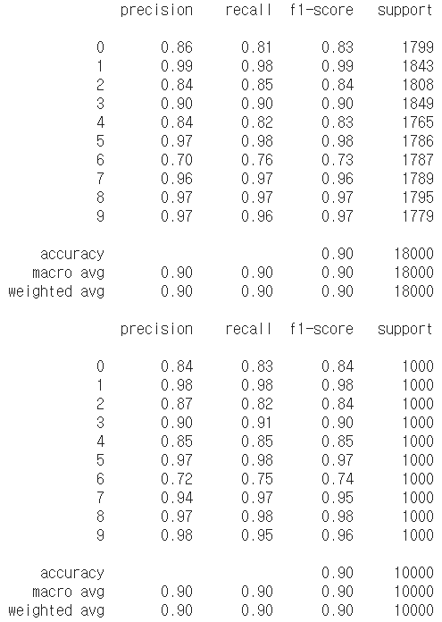
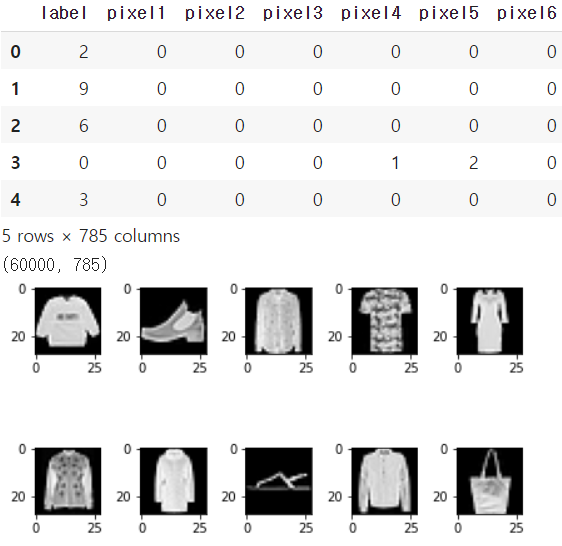

# Test08_Fashion_MNIST


##### 데이터 전처리

```python
import numpy as np
import pandas as pd
import tensorflow as tf
import matplotlib.pyplot as plt
from sklearn.preprocessing import MinMaxScaler
from sklearn.model_selection import train_test_split
from sklearn.model_selection import KFold
from sklearn.metrics import classification_report

# tf.reset_default_graph()

## Raw Data Loading
df = pd.read_csv('/content/drive/MyDrive/machine learning colab/archive/fashion-mnist_train.csv')
display(df.head(), df.shape)

## 데이터 확인
img_data = df.drop('label', axis=1, inplace=False).values

fig = plt.figure()
fig_arr = list()

for n in range(10):
    fig_arr.append(fig.add_subplot(2,5,n+1))
    fig_arr[n].imshow(img_data[n].reshape(28,28), cmap='gray')
    
plt.tight_layout()
plt.show()

## Data Split
x_data_train, x_data_test, t_data_train, t_data_test = \
train_test_split(df.drop('label', axis=1, inplace=False),
                 df['label'],
                 test_size=0.3,
                 random_state=0)

## Normalization
scaler = MinMaxScaler()
scaler.fit(x_data_train)
x_data_train_norm = scaler.transform(x_data_train)
x_data_test_norm = scaler.transform(x_data_test)

## one-hot encoding
sess = tf.Session()
t_data_train_onehot = sess.run(tf.one_hot(t_data_train, depth=10))
t_data_test_onehot = sess.run(tf.one_hot(t_data_test, depth=10))

```


##### Multinomial Classification

```python
# tensorflow 구현

## placeholder
X = tf.placeholder(shape=[None,784], dtype=tf.float32)
T = tf.placeholder(shape=[None,10], dtype=tf.float32)


## Weight & bias
W = tf.Variable(tf.random.normal([784,10]), name='weight')
b = tf.Variable(tf.random.normal([10]), name='bias')


## Hypothesis
logit = tf.matmul(X,W) + b
H = tf.nn.softmax(logit)


## loss function
loss = tf.reduce_mean(tf.nn.softmax_cross_entropy_with_logits_v2(logits=logit,
                                                                 labels=T))

## Train
train = tf.train.GradientDescentOptimizer(learning_rate=1e-1).minimize(loss)


## parameter
num_of_epoch = 100
batch_size = 10


## 학습용 함수
def run_train(sess, train_x, train_t):
    print('### 학습 시작 ###')
    sess.run(tf.global_variables_initializer())

    for step in range(num_of_epoch):
        total_batch = int(train_x.shape[0] / batch_size)

        for i in range(total_batch):
            batch_x = train_x[i*batch_size:(i+1)*batch_size]
            batch_t = train_t[i*batch_size:(i+1)*batch_size]
            _,loss_val = sess.run([train,loss],
                                  feed_dict={X:batch_x,
                                             T:batch_t})
            
        if step % 10 == 0:
            print(f'loss: {loss_val}')
    print('### 학습 종료 ###')


## Accuracy 측정
predict = tf.argmax(H,1)
correct = tf.equal(predict, tf.argmax(T,1))
accuracy = tf.reduce_mean(tf.cast(correct, dtype=tf.float32))

# run_train(sess, x_data_train_norm, t_data_train_onehot)


## K-Fold Cross validation
cv = 5
results = []

kf = KFold(n_splits=cv, shuffle=True)

for training_idx, validation_idx in kf.split(x_data_train_norm):
    training_x = x_data_train_norm[training_idx]
    training_t = t_data_train_onehot[training_idx]

    val_x = x_data_train_norm[validation_idx]
    val_t = t_data_train_onehot[validation_idx]

    run_train(sess, training_x, training_t)
    results.append(sess.run(accuracy, feed_dict={X:val_x,
                                                 T:val_t}))
    
print(f'측정한 각각의 결과 값: {results}')
print(f'최종 K-Fold 교차검증을 사용한 accuracy : {np.mean(results)}')
```


##### 예측

```python
# testing
run_train(sess, x_data_train_norm, t_data_train_onehot)
final_accurancy = sess.run(accuracy, feed_dict={X:x_data_test_norm,
                                                T:t_data_test_onehot})
print(f'우리 모델의 최종 정확도는 : {final_accurancy}')
```


##### DNN으로 구현

```python
# DNN 구현

# Placeholder
X = tf.placeholder(shape=[None,784], dtype=tf.float32)
T = tf.placeholder(shape=[None,10], dtype=tf.float32)

# Weight & bias
W2 = tf.get_variable('weight2', shape=[784,256],
                    initializer=tf.contrib.layers.variance_scaling_initializer())
b2 = tf.Variable(tf.random.normal([256]))
_layer2 = tf.nn.relu(tf.matmul(X,W2) + b2)
layer2 = tf.nn.dropout(_layer2, rate=0.4)

W3 = tf.get_variable('weight3', shape=[256,128],
                    initializer=tf.contrib.layers.variance_scaling_initializer())
b3 = tf.Variable(tf.random.normal([128]))
_layer3 = tf.nn.relu(tf.matmul(layer2,W3) + b3)
layer3 = tf.nn.dropout(_layer3, rate=0.4)

W4 = tf.get_variable('weight4', shape=[128,10],
                    initializer=tf.contrib.layers.variance_scaling_initializer())
b4 = tf.Variable(tf.random.normal([10]))

# Hypothesis
logit = tf.matmul(layer3,W4) + b4
H = tf.nn.softmax(logit)   

# loss
loss = tf.reduce_mean(tf.nn.softmax_cross_entropy_with_logits_v2(logits=logit,
                                                                 labels=T))

# train
train = tf.train.AdamOptimizer(learning_rate=1e-3).minimize(loss)

num_of_epoch = 1000
batch_size = 100

# session & 초기화
sess = tf.Session()
sess.run(tf.global_variables_initializer())

# 반복학습
for step in range(num_of_epoch):
    
    total_batch = int(x_data_train_norm.shape[0] / batch_size)
    
    for i in range(total_batch):
        batch_x = x_data_train_norm[i*batch_size:(i+1)*batch_size]
        batch_t = t_data_train_onehot[i*batch_size:(i+1)*batch_size]
        _, loss_val = sess.run([train, loss], feed_dict={X:batch_x,
                                                         T:batch_t})
    if step % 100 == 0:
        print('Loss : {}'.format(loss_val))
```


##### 예측

```python
# model의 정확도 구학기
predict = tf.argmax(H, 1)
print(classification_report(t_data_test,
                           sess.run(predict, feed_dict={X:x_data_test_norm})))

# test 데이터로 최종 결과 출력
final_df = pd.read_csv('/content/drive/MyDrive/Machine Learning Colab/Fashion-MNIST/fashion-mnist_test.csv')

final_x_data = final_df.drop('label', axis=1, inplace=False).values
final_t_data = final_df['label'].values

final_scaler = MinMaxScaler()
final_scaler.fit(final_x_data)
final_x_data_norm = final_scaler.transform(final_x_data)

print(classification_report(final_t_data,
                           sess.run(predict, feed_dict={X:final_x_data_norm})))
```


##### CNN으로 구현

```python
# CNN 구현

# Placeholder
X = tf.placeholder(shape=[None,784], dtype=tf.float32)
T = tf.placeholder(shape=[None,10], dtype=tf.float32)

# Convolution
# 입력데이터의 형태부터 수정해야 해요! 4차원으로.
# (이미지 개수, 높이, 너비, channel)
x_img = tf.reshape(X, [-1,28,28,1])
print(x_img.shape)   # (?, 28, 28, 1)

# filter(kernel) => (filter height, filter width, filter channel, filter 개수)
W1 = tf.Variable(tf.random.normal([3,3,1,32]))
L1 = tf.nn.conv2d(x_img,
                  W1,
                  strides=[1,1,1,1],
                  padding='SAME')
L1 = tf.nn.relu(L1)
print(L1.shape)   # (?, 28, 28, 32) 

P1 = tf.nn.max_pool(L1,
                    ksize=[1,2,2,1],
                    strides=[1,2,2,1],
                    padding='SAME')
print(P1.shape)   # (?, 14, 14, 32)

W2 = tf.Variable(tf.random.normal([3,3,32,64]))
L2 = tf.nn.conv2d(P1,
                  W2,
                  strides=[1,1,1,1],
                  padding='SAME')
L2 = tf.nn.relu(L2)
print(L2.shape)   # (?, 14, 14, 64)

P2 = tf.nn.max_pool(L2,
                    ksize=[1,2,2,1],
                    strides=[1,2,2,1],
                    padding='SAME')
print(P2.shape)   # (?, 7, 7, 64)

# P2의 shape은 4차원
P2 = tf.reshape(P2, [-1,7*7*64])

# Weight & bias
W3 = tf.get_variable('weight3', shape=[7*7*64,256],
                    initializer=tf.contrib.layers.variance_scaling_initializer())
b3 = tf.Variable(tf.random.normal([256]))
_layer3 = tf.nn.relu(tf.matmul(P2,W3) + b3)
layer3 = tf.nn.dropout(_layer3, rate=0.4)

W4 = tf.get_variable('weight4', shape=[256,10],
                    initializer=tf.contrib.layers.variance_scaling_initializer())
b4 = tf.Variable(tf.random.normal([10]))

# Hypothesis
logit = tf.matmul(layer3,W4) + b4
H = tf.nn.softmax(logit)    # softmax activation function

# # loss
loss = tf.reduce_mean(tf.nn.softmax_cross_entropy_with_logits_v2(logits=logit,
                                                                 labels=T))

# # train
train = tf.train.AdamOptimizer(learning_rate=1e-3).minimize(loss)

num_of_epoch = 1000
batch_size = 100

# session & 초기화
sess = tf.Session()
sess.run(tf.global_variables_initializer())

# 반복학습
for step in range(num_of_epoch):
    
    total_batch = int(x_data_train_norm.shape[0] / batch_size)
    
    for i in range(total_batch):
        batch_x = x_data_train_norm[i*batch_size:(i+1)*batch_size]
        batch_t = t_data_train_onehot[i*batch_size:(i+1)*batch_size]
        _, loss_val = sess.run([train, loss], feed_dict={X:batch_x,
                                                         T:batch_t})
    if step % 100 == 0:
        print('Loss : {}'.format(loss_val))
```


##### 예측

```python
# model의 정확도 구학기
predict = tf.argmax(H, 1)
print(classification_report(t_data_test,
                           sess.run(predict, feed_dict={X:x_data_test_norm})))

# test 데이터로 최종 결과 출력
final_df = pd.read_csv('/content/drive/MyDrive/machine learning colab/archive/fashion-mnist_test.csv')

final_x_data = final_df.drop('label', axis=1, inplace=False).values
final_t_data = final_df['label'].values

final_scaler = MinMaxScaler()
final_scaler.fit(final_x_data)
final_x_data_norm = final_scaler.transform(final_x_data)

print(classification_report(final_t_data,
                           sess.run(predict, feed_dict={X:final_x_data_norm})))
```




##### tf2_MNIST

```python
# 사용하는 모듈 import
import numpy as np
import pandas as pd
import tensorflow as tf
from tensorflow.keras.models import Sequential
from tensorflow.keras.layers import Conv2D, Flatten, Dense
from tensorflow.keras.layers import MaxPooling2D, Dropout
from tensorflow.keras.optimizers import Adam
import matplotlib.pyplot as plt
from sklearn.preprocessing import MinMaxScaler
from sklearn.model_selection import train_test_split
from sklearn.metrics import classification_report

## 1. Raw Data Loading ##
df = pd.read_csv('/content/drive/MyDrive/Machine Learning Colab/Fashion-MNIST/fashion-mnist_train.csv')
display(df.head(), df.shape)

## 2. 결측치, 이상치 처리 ##
##    우리데이터는 결측치와 이상치가 없어요!! ##

## 3. 데이터 확인(이미지인 경우) ##
img_data = df.drop('label', axis=1, inplace=False).values

fig = plt.figure()
fig_arr = list()

for n in range(10):
    fig_arr.append(fig.add_subplot(2,5,n+1))
    fig_arr[n].imshow(img_data[n].reshape(28,28), cmap='gray')
    
plt.tight_layout()
plt.show()

## 4. Data Split(Train Data와 Test Data를 분리) ##
x_data_train, x_data_test, t_data_train, t_data_test = \
train_test_split(df.drop('label', axis=1, inplace=False),
                 df['label'],
                 test_size=0.3,
                 random_state=0)

## 5. 정규화(Normalization) ##
scaler = MinMaxScaler()
scaler.fit(x_data_train)
x_data_train_norm = scaler.transform(x_data_train)
x_data_test_norm = scaler.transform(x_data_test)

## 데이터 전처리 끝!! ## 
```




##### 모델 구현

```python
## Tensorflow 2.x 구현 ##

model = Sequential()

# Conv2D (필터의 개수, filter의 크기, activation)
model.add(Conv2D(filters=32,
                 kernel_size=(3,3),
                 activation='relu',
                 input_shape=(28,28,1)))
model.add(MaxPooling2D(pool_size=(2,2)))

model.add(Conv2D(filters=64,
                 kernel_size=(3,3),
                 activation='relu'))
model.add(MaxPooling2D(pool_size=(2,2)))

model.add(Conv2D(filters=64,
                 kernel_size=(3,3),
                 activation='relu'))

model.add(Flatten())
model.add(Dense(units=256,
                activation='relu'))
model.add(Dropout(rate=0.5))
model.add(Dense(units=10,
                activation='softmax'))

print(model.summary())

model.compile(optimizer=Adam(learning_rate=1e-3),
              loss='sparse_categorical_crossentropy',
              metrics=['sparse_categorical_accuracy'])

history = model.fit(x_data_train_norm.reshape(-1,28,28,1),
                    t_data_train,
                    epochs=200,
                    batch_size=100,
                    verbose=1,
                    validation_split=0.3)
```


##### 예측

```python
model.evaluate(x_data_test_norm.reshape(-1,28,28,1),
               t_data_test)
```

