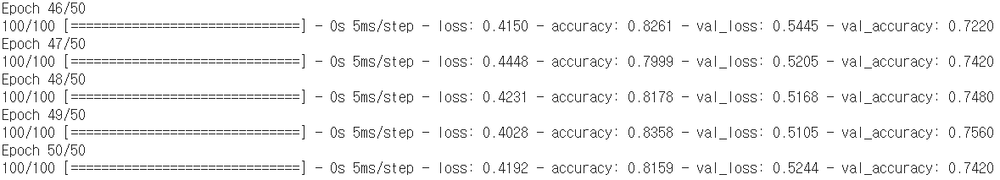
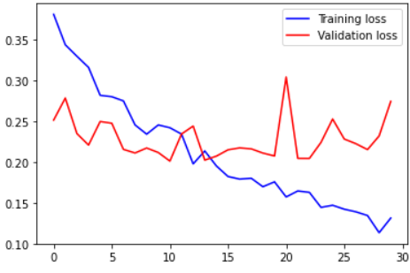

# Test09_cat_dog


#### 1. Dogs vs. Cats 분류문제 TF2.x로 구현후 정확도 측정  


##### 전처리

```python
import os
import numpy as np
import matplotlib.pyplot as plt
import pandas as pd
import keras

os.listdir()
# loading img
import PIL.Image as Image
p = '/content/drive/MyDrive/machine learning colab/cat_dog_small'
os.chdir(p)

def resize_img(img,size):
    return img.resize(size)

def load_img(file_path):
  data = []
  print(p + file_path[1:] + '/')
  for f in os.listdir(file_path):
    data.append(resize_img(Image.open(p + file_path[1:] + '/' + f) , (64,64)))
  return data

train_cats = load_img('./train/cats') # img_data_list / element is image not nparray
test_cats = load_img('./test/cats')
val_cats = load_img('./validation/cats')

train_dogs = load_img('./train/dogs')
test_dogs = load_img('./test/dogs')
val_dogs = load_img('./validation/dogs')
```


```python
print(len(train_cats),len(test_cats),len(val_cats),len(train_dogs),len(test_dogs),len(val_dogs))

# 결과 값
# (1000 500 500 1000 500 500)
```


```python
# We have to img -> array & labeling solution
def img_to_array(img):
    return np.array(img, dtype = 'float32')/255.0

train_dogs_arr,train_dogs_sol = np.array([img_to_array(dog) for dog in train_dogs]),np.array([1]*len(train_dogs))
test_dogs_arr,test_dogs_sol = np.array([img_to_array(dog) for dog in test_dogs]),np.array([1]*len(test_dogs))
val_dogs_arr,val_dogs_sol = np.array([img_to_array(dog) for dog in val_dogs]),np.array([1]*len(val_dogs))

train_cats_arr,train_cats_sol = np.array([img_to_array(cat) for cat in train_cats]),np.array([0]*len(train_cats))
test_cats_arr,test_cats_sol = np.array([img_to_array(cat) for cat in test_cats]),np.array([0]*len(test_cats))
val_cats_arr,val_cats_sol = np.array([img_to_array(cat) for cat in val_cats]),np.array([0]*len(val_cats))

train_img,train_sol = np.concatenate((train_dogs_arr,train_cats_arr)),np.concatenate((train_dogs_sol,train_cats_sol))
test_img,test_sol = np.concatenate((test_dogs_arr,test_cats_arr)),np.concatenate((test_dogs_sol,test_cats_sol))
val_img,val_sol = np.concatenate((val_dogs_arr,val_cats_arr)),np.concatenate((val_dogs_sol,val_cats_sol))
```


##### model 생성

```python
import numpy as np
import tensorflow as tf
from tensorflow.keras.models import Sequential
from tensorflow.keras.layers import Conv2D, Flatten, MaxPooling2D, Dense, Dropout
from tensorflow.keras.optimizers import Adam

model = Sequential()
model.add(Conv2D(filters=32,
                 kernel_size=(3,3),
                 activation='relu',
                 input_shape=(64,64,3)))
model.add(MaxPooling2D(pool_size=(2,2)))

model.add(Conv2D(filters=64,
                 kernel_size=(3,3),
                 activation='relu'))
model.add(MaxPooling2D(pool_size=(2,2)))

model.add(Conv2D(filters=128,
                 kernel_size=(3,3),
                 activation='relu'))
model.add(MaxPooling2D(pool_size=(2,2)))

model.add(Flatten())

model.add(Dropout(rate=0.5))

model.add(Dense(units=1,
                activation='sigmoid'))

print(model.summary())

model.compile(optimizer=Adam(learning_rate=1e-4),
              loss='binary_crossentropy',
              metrics=['accuracy'])

history = model.fit(x=train_img,
                    y=train_sol,
                    steps_per_epoch=100,
                    epochs=50,
                    validation_data=(val_img,val_sol),
                    validation_steps=50)
```





##### 그래프 출력

```python
# history 객체를 통해 과적합인지 확인할 수 있어요
print(type(history.history))
print(history.history.keys())

train_acc = history.history['accuracy']
val_acc = history.history['val_accuracy']

train_loss = history.history['loss']
val_loss = history.history['val_loss']

plt.plot(train_acc, color='r', label='training accuracy')
plt.plot(val_acc, color='b', label='validation accuracy')
plt.legend()
plt.show()

# plt.plot(train_loss, color='r', label='training loss')
# plt.plot(val_loss, color='b', label='validation loss')
# plt.legend()
# plt.show()
```


##### test 데이터로 성능 평가

```python
model.evaluate(test_img,test_sol,batch_size = 128)
# 최종 정확도는 72.5%
```


##### 실제 이미지로 예측

```python
import PIL.Image as Image


def resize_img(img,size):
    return img.resize(size)

def load_img(file_path):
  data = []
  print(p + file_path[1:] + '/')
  for f in os.listdir(file_path):
    data.append(resize_img(Image.open(p + file_path[1:] + '/' + f) , (64,64)))
  return data

def classify_model(arr):
    pre = model.predict(arr.reshape(1,64,64,3))
    if pre > 0.5:
        return 'dog'
    else:
        return 'cat'

img = '/content/drive/MyDrive/machine learning colab/test_cat1.jpg'

nd_img = Image.open(img)
plt.imshow(nd_img)
plt.show()
nd_img = resize_img(nd_img, (64,64))
print(nd_img)
nd_img = np.array(img_to_array(nd_img))

print(classify_model(nd_img))
```


#### 2. 전체 데이터(25,000개)에 ImageDataGenerator를 이용하여 모델 구현 후 Accuracy 측정


##### 전처리

```python
# %reset

import os
from tensorflow.keras.preprocessing.image import ImageDataGenerator
import matplotlib.pyplot as plt

train_dir = '/content/drive/MyDrive/machine learning colab/cat_dog_full/train'
validation_dir = '/content/drive/MyDrive/machine learning colab/cat_dog_full/validation'

# ImageDataGenerator 생성
train_datagen = ImageDataGenerator(rescale=1/255)
validation_datagen = ImageDataGenerator(rescale=1/255)

train_generator = train_datagen.flow_from_directory(
    train_dir,
    classes=['cats','dogs'],
    target_size=(150,150),
    batch_size=20,
    class_mode='binary'
)

validation_generator = validation_datagen.flow_from_directory(
    validation_dir,
    classes=['cats','dogs'],
    target_size=(150,150),
    batch_size=20,
    class_mode='binary'
)

for x_data, t_data in train_generator:
    print(x_data.shape)
    print(t_data.shape)
    break;

fig = plt.figure()
fig_arr = []

for i in range(20):
    fig_arr.append(fig.add_subplot(4,5,i+1))

for data_batch, label_batch in train_generator:
    for idx, img_data in enumerate(data_batch):
        fig_arr[idx].imshow(img_data)
    break;
fig.tight_layout()
plt.show()
```


##### 모델 구현 및 학습

```python

import numpy as np
import tensorflow as tf
from tensorflow.keras.models import Sequential
from tensorflow.keras.layers import Conv2D, Flatten, MaxPooling2D, Dense, Dropout
from tensorflow.keras.optimizers import Adam

model = Sequential()
model.add(Conv2D(filters=32,
                 kernel_size=(3,3),
                 activation='relu',
                 input_shape=(150,150,3)))
model.add(MaxPooling2D(pool_size=(2,2)))

model.add(Conv2D(filters=64,
                 kernel_size=(3,3),
                 activation='relu'))
model.add(MaxPooling2D(pool_size=(2,2)))

model.add(Conv2D(filters=128,
                 kernel_size=(3,3),
                 activation='relu'))
model.add(MaxPooling2D(pool_size=(2,2)))

model.add(Flatten())

model.add(Dropout(rate=0.5))

model.add(Dense(units=1,
                activation='sigmoid'))

print(model.summary())

model.compile(optimizer=Adam(learning_rate=1e-4),
              loss='binary_crossentropy',
              metrics=['accuracy'])

history = model.fit(train_generator,
                    steps_per_epoch=100,
                    epochs=50,
                    validation_data=validation_generator,
                    validation_steps=50)


model.save('/content/drive/MyDrive/machine learning colab/cat_dog_full_cnn_tf2.4.h5')
```


- 모델 불러오고 정확도 출력

```python
import os
from tensorflow.keras.preprocessing.image import ImageDataGenerator
import matplotlib.pyplot as plt
import numpy as np
import tensorflow as tf
from tensorflow.keras.models import Sequential
from tensorflow.keras.layers import Conv2D, Flatten, MaxPooling2D, Dense, Dropout
from tensorflow.keras.optimizers import Adam
from keras.models import load_model

model = load_model('/content/drive/MyDrive/machine learning colab/cat_dog_full_cnn_tf2.4.h5')

test_dir = '/content/drive/MyDrive/machine learning colab/cat_dog_full/test'

testGenerator = ImageDataGenerator(
    rescale=1./255
)

testGen = testGenerator.flow_from_directory(
    test_dir,
    target_size=(150, 150),
)

model.evaluate_generator(testGen)

```


#### 3. 일부데이터로 ImageDataGenerator 이용해 예측


##### 전처리

```python
## 3. 일부데이터를 ImageDataGenerator로 구현
# %reset
import os
from tensorflow.keras.preprocessing.image import ImageDataGenerator
import matplotlib.pyplot as plt

train_dir = '/content/drive/MyDrive/machine learning colab/cat_dog_small/train'
validation_dir = '/content/drive/MyDrive/machine learning colab/cat_dog_small/validation'

# ImageDataGenerator 생성
train_datagen = ImageDataGenerator(rescale=1/255)
validation_datagen = ImageDataGenerator(rescale=1/255)

train_generator = train_datagen.flow_from_directory(
    train_dir,
    classes=['cats','dogs'], 
    target_size=(150,150),   
    batch_size=20,           
    class_mode='binary')

validation_generator = validation_datagen.flow_from_directory(
    validation_dir,  
    classes=['cats','dogs'], 
    target_size=(150,150),  
    batch_size=20,           
    class_mode='binary')

# generator를 이용
for x_data, t_data in train_generator:
    print(x_data.shape) # (20,150,150,3)
    print(t_data.shape) # (20,)
    break;

# 그림 이미지를 matplotlib을 이용해서 출력
fig = plt.figure()
fig_arr = []

for i in range(20):
    fig_arr.append(fig.add_subplot(4,5,i+1))

for data_batch, label_batch in train_generator:
    for idx, img_data in enumerate(data_batch):
        fig_arr[idx].imshow(img_data)
    break;
fig.tight_layout()
plt.show()
```


##### 모델 생성 및 학습

```python
import numpy as np
import tensorflow as tf
from tensorflow.keras.models import Sequential
from tensorflow.keras.layers import Conv2D, Flatten, MaxPooling2D, Dense, Dropout
from tensorflow.keras.optimizers import Adam

model = Sequential()
model.add(Conv2D(filters=32,
                 kernel_size=(3,3),
                 activation='relu',
                 input_shape=(150,150,3)))
model.add(MaxPooling2D(pool_size=(2,2)))

model.add(Conv2D(filters=64,
                 kernel_size=(3,3),
                 activation='relu'))
model.add(MaxPooling2D(pool_size=(2,2)))

model.add(Conv2D(filters=128,
                 kernel_size=(3,3),
                 activation='relu'))
model.add(MaxPooling2D(pool_size=(2,2)))

model.add(Flatten())

model.add(Dropout(rate=0.5))

model.add(Dense(units=1,
                activation='sigmoid'))

print(model.summary())

model.compile(optimizer=Adam(learning_rate=1e-4),
              loss='binary_crossentropy',
              metrics=['accuracy'])

history = model.fit(train_generator,
                    steps_per_epoch=100,
                    epochs=50,
                    validation_data=validation_generator,
                    validation_steps=50)
```


- 모델의 정확도는 0.731


##### 그래프 출력

```python
# history 객체를 통해 과적합인지 확인할 수 있어요
print(type(history.history))
print(history.history.keys())

train_acc = history.history['accuracy']
val_acc = history.history['val_accuracy']

train_loss = history.history['loss']
val_loss = history.history['val_loss']

plt.plot(train_acc, color='r', label='training accuracy')
plt.plot(val_acc, color='b', label='validation accuracy')
plt.legend()
plt.show()

# plt.plot(train_loss, color='r', label='training loss')
# plt.plot(val_loss, color='b', label='validation loss')
# plt.legend()
# plt.show()
```


- 과적합이 발생


#### 4. overfitting을 피하기 위해 증식으로 모델 생성 후 예측


##### 증식을 이용한 전처리

```python
# %reset
# 증식을 이용한 코드

import os
from tensorflow.keras.preprocessing.image import ImageDataGenerator
import matplotlib.pyplot as plt

train_dir = '/content/drive/MyDrive/machine learning colab/cat_dog_small/train'
validation_dir = '/content/drive/MyDrive/machine learning colab/cat_dog_small/validation'

# ImageDataGenerator 생성

train_datagen = ImageDataGenerator(rescale=1/255,
                                   rotation_range=20,
                                   width_shift_range=0.1,
                                   zoom_range=0.1,    
                                   horizontal_flip=True,
                                   vertical_flip=True)

validation_datagen = ImageDataGenerator(rescale=1/255)

train_generator = train_datagen.flow_from_directory(
    train_dir,  
    classes=['cats','dogs'], 
    target_size=(150,150),   
    batch_size=20,          
    class_mode='binary'     
)

validation_generator = validation_datagen.flow_from_directory(
    validation_dir,  
    classes=['cats','dogs'], 
    target_size=(150,150),  
    batch_size=20,           
    class_mode='binary'      
)

# generator를 이용
for x_data, t_data in train_generator:
    print(x_data.shape) # (20,150,150,3)
    print(t_data.shape) # (20,)
    break;

# 그림 이미지를 matplotlib을 이용해서 출력
fig = plt.figure()
fig_arr = []

for i in range(20):
    fig_arr.append(fig.add_subplot(4,5,i+1))

for data_batch, label_batch in train_generator:
    for idx, img_data in enumerate(data_batch):
        fig_arr[idx].imshow(img_data)
    break;
fig.tight_layout()
plt.show()

# 다음 단계는 CNN을 구성하고 학습을 진행
# MNIST와 유사, Convolution Layer와 Pooling Layer 추가

```


##### 모델 생성 및 학습

```python
import numpy as np
import tensorflow as tf
from tensorflow.keras.models import Sequential
from tensorflow.keras.layers import Conv2D, Flatten, MaxPooling2D, Dense, Dropout
from tensorflow.keras.optimizers import Adam

model = Sequential()
model.add(Conv2D(filters=32,
                 kernel_size=(3,3),
                 activation='relu',
                 input_shape=(150,150,3)))
model.add(MaxPooling2D(pool_size=(2,2)))

model.add(Conv2D(filters=64,
                 kernel_size=(3,3),
                 activation='relu'))
model.add(MaxPooling2D(pool_size=(2,2)))

model.add(Conv2D(filters=128,
                 kernel_size=(3,3),
                 activation='relu'))
model.add(MaxPooling2D(pool_size=(2,2)))

model.add(Flatten())

model.add(Dropout(rate=0.5))

model.add(Dense(units=1,
                activation='sigmoid'))

print(model.summary())

model.compile(optimizer=Adam(learning_rate=1e-4),
              loss='binary_crossentropy',
              metrics=['accuracy'])

history = model.fit(train_generator,
                    steps_per_epoch=100,
                    epochs=50,
                    validation_data=validation_generator,
                    validation_steps=50)
```


- 모델의 정확도는 0.735
- 증식 사용하지 않았을 때랑 비교해서 정말 조금 오름


##### 그래프 출력

```python
# history 객체를 통해 과적합인지 확인할 수 있어요
print(type(history.history))
print(history.history.keys())

train_acc = history.history['accuracy']
val_acc = history.history['val_accuracy']

train_loss = history.history['loss']
val_loss = history.history['val_loss']

plt.plot(train_acc, color='r', label='training accuracy')
plt.plot(val_acc, color='b', label='validation accuracy')
plt.legend()
plt.show()

# plt.plot(train_loss, color='r', label='training loss')
# plt.plot(val_loss, color='b', label='validation loss')
# plt.legend()
# plt.show()
```


- 과적합 문제는 많이 개선됨


#### 5. Pretrained Network 


##### pretrained network 생성

```python
# %reset

# pretrained network 생성
from tensorflow.keras.applications import VGG16

model_base = VGG16(weights='imagenet',
                   include_top=False,
                   input_shape=(150,150,3))
model_base.summary()
```


##### feature map 추출

```python
# 개와 고양이 training data set에 대한 feature map을 추출

import os
import numpy as np
from tensorflow.keras.preprocessing.image import ImageDataGenerator

base_dir = '/content/drive/MyDrive/machine learning colab/cat_dog_small'
train_dir = os.path.join(base_dir,'train')
validation_dir = os.path.join(base_dir,'validation')

datagen = ImageDataGenerator(rescale=1/255)
batch_size=20

def extract_feature(directory, sample_count):
    features = np.zeros(shape=(sample_count,4,4,512))
    labels=np.zeros(shape=(sample_count,))

    generator = datagen.flow_from_directory(
        directory,
        target_size=(150,150),
        batch_size=batch_size,
        class_mode='binary'
    )
    
    i = 0

    for x_data_batch, t_data_batch in generator:
        feature_batch = model_base.predict(x_data_batch)
        features[i*batch_size:(i+1)*batch_size] = feature_batch
        labels[i*batch_size:(i+1)*batch_size] = t_data_batch

        i += 1
        if i*batch_size >= sample_count:
            break
    return features, labels

train_features, train_labels = extract_feature(train_dir, 2000)
validation_features, validation_labels = extract_feature(validation_dir, 1000)
```


##### 모델 생성 및 학습

```python
# classifier
train_features = np.reshape(train_features, (2000,4*4*512))
validation_features = np.reshape(validation_features, (1000,4*4*512))

from tensorflow.keras.models import Sequential
from tensorflow.keras.layers import Dense, Dropout
from tensorflow.keras.optimizers import Adam, RMSprop

model = Sequential()
model.add(Dense(256,
                activation='relu',
                input_shape=(4*4*512,)))
model.add(Dropout(0.5))
model.add(Dense(1,
                activation='sigmoid'))

model.compile(optimizer=RMSprop(learning_rate=2e-5),
              loss='binary_crossentropy',
              metrics=['accuracy'])

history = model.fit(train_features,
                    train_labels,
                    epochs=30,
                    batch_size=64,
                    validation_data=(validation_features,validation_labels))

```


- 정확도는 0.909


##### 그래프 출력

```python
import matplotlib.pyplot as plt

train_acc = history.history['accuracy']
val_acc = history.history['val_accuracy']

train_loss = history.history['loss']
val_loss = history.history['val_loss']

plt.plot(train_acc, color='b', label='Training Accuracy')
plt.plot(val_acc, color='r', label='Validation Accuracy')
plt.legend()
plt.show()

# plt.plot(train_loss, color='b', label='Training loss')
# plt.plot(val_loss, color='r', label='Validation loss')
# plt.legend()
# plt.show()
```


- 과적합이 의심됨 - 데이터가 적기 때문


##### 증식을 사용해서 재학습

```python
# 데이터가 많아지면 결과가 나아질 것
# 증식을 포함
# pretrained network와 classifier을 합쳐서 모델 생성
# 기학습된 모델을 따로 쓰는게 아니라 모델 안에 삽입 데이터가 많아지면 결과가 나아질 것

import os
import numpy as np
from tensorflow.keras.applications import VGG16
from tensorflow.keras.preprocessing.image import ImageDataGenerator
from tensorflow.keras.models import Sequential
from tensorflow.keras.layers import Dense, Dropout, Flatten
from tensorflow.keras.optimizers import RMSprop
import matplotlib.pyplot as plt

base_dir = '/content/drive/MyDrive/machine learning colab/cat_dog_small'
train_dir = os.path.join(base_dir,'train')
validation_dir = os.path.join(base_dir,'validation')

train_datagen = ImageDataGenerator(rescale=1/255,
                                   rotation_range=40,
                                   width_shift_range=0.1,
                                   height_shift_range=0.1,
                                   zoom_range=0.2,
                                   horizontal_flip=True,
                                   vertical_flip=True)

validation_datagen = ImageDataGenerator(rescale=1/255)

train_generator = train_datagen.flow_from_directory(
    train_dir,
    classes=['cats', 'dogs'],
    target_size=(150,150),
    batch_size=20,
    class_mode='binary'
)

validation_generator = validation_datagen.flow_from_directory(
    validation_dir,
    classes=['cats', 'dogs'],
    target_size=(150,150),
    batch_size=20,
    class_mode='binary'
)

# pretrained network
model_base = VGG16(weights='imagenet',
                   include_top=False,
                   input_shape=(150,150,3))

model_base.trainable=False # Convolution Layer를 동결

model = Sequential()

model.add(model_base)

model.add(Flatten(input_shape=(4*4*512,)))

model.add(Dense(units=256,
                activation='relu'))
model.add(Dropout(0.5))

model.add(Dense(units=1,
                activation='sigmoid'))
model.summary()

model.compile(optimizer=RMSprop(learning_rate=2e-5),
              loss='binary_crossentropy',
              metrics=['accuracy'])

history = model.fit(train_generator,
                    steps_per_epoch=100,
                    epochs=30,
                    validation_data=validation_generator,
                    validation_steps=50)
```


- 정확도는 0.87로 조금 감소한 모습


##### 그래프 출력

```python
import matplotlib.pyplot as plt

train_acc = history.history['accuracy']
val_acc = history.history['val_accuracy']

train_loss = history.history['loss']
val_loss = history.history['val_loss']

plt.plot(train_acc, color='b', label='Training Accuracy')
plt.plot(val_acc, color='r', label='Validation Accuracy')
plt.legend()
plt.show()

# plt.plot(train_loss, color='b', label='Training loss')
# plt.plot(val_loss, color='r', label='Validation loss')
# plt.legend()
# plt.show()
```


- 과적합은 확실히 개선된 모습


##### Fine Tuning 기법을 이용해 구현

```python
# fine tuning

import os
import numpy as np
from tensorflow.keras.applications import VGG16
from tensorflow.keras.preprocessing.image import ImageDataGenerator
from tensorflow.keras.models import Sequential
from tensorflow.keras.layers import Dense, Dropout, Flatten
from tensorflow.keras.optimizers import RMSprop
import matplotlib.pyplot as plt

base_dir = '/content/drive/MyDrive/machine learning colab/cat_dog_small'
train_dir = os.path.join(base_dir,'train')
validation_dir = os.path.join(base_dir,'validation')

train_datagen = ImageDataGenerator(rescale=1/255,
                                   rotation_range=40,
                                   width_shift_range=0.1,
                                   height_shift_range=0.1,
                                   zoom_range=0.2,
                                   horizontal_flip=True,
                                   vertical_flip=True)

validation_datagen = ImageDataGenerator(rescale=1/255)

train_generator = train_datagen.flow_from_directory(
    train_dir,
    classes=['cats', 'dogs'],
    target_size=(150,150),
    batch_size=20,
    class_mode='binary'
)

validation_generator = validation_datagen.flow_from_directory(
    validation_dir,
    classes=['cats', 'dogs'],
    target_size=(150,150),
    batch_size=20,
    class_mode='binary'
)

# pretrained network
model_base = VGG16(weights='imagenet',
                   include_top=False,
                   input_shape=(150,150,3))

model_base.trainable=False # Convolution Layer를 동결

model = Sequential()

model.add(model_base)

model.add(Flatten(input_shape=(4*4*512,)))

model.add(Dense(units=256,
                activation='relu'))
model.add(Dropout(0.5))

model.add(Dense(units=1,
                activation='sigmoid'))
model.summary()

model.compile(optimizer=RMSprop(learning_rate=2e-5),
              loss='binary_crossentropy',
              metrics=['accuracy'])

history = model.fit(train_generator,
                    steps_per_epoch=100,
                    epochs=30,
                    validation_data=validation_generator,
                    validation_steps=50)

model_base.trainable = True

for layer in model_base.layers:
    if layer.name in ['block5_conv1', 'block5_conv2', 'block5_conv3']:
        layer.trainable = True
    else:
        layer.trainable = False

# 일반적으로 러닝 레이트를 더 작게 설정
model.compile(optimizer=RMSprop(learning_rate=1e-5),
              loss='binary_crossentropy',
              metrics=['accuracy'])

history = model.fit(train_generator,
                    steps_per_epoch=100,
                    epochs=30,
                    validation_data=validation_generator,
                    validation_steps=50)
```


- 모델의 정확도는 0.909
- 증식을 사용하지 않은 feature map 추출 방식과 동일한 정확도


##### 그래프 출력

```python
import matplotlib.pyplot as plt

train_acc = history.history['accuracy']
val_acc = history.history['val_accuracy']

train_loss = history.history['loss']
val_loss = history.history['val_loss']

plt.plot(train_acc, color='b', label='Training Accuracy')
plt.plot(val_acc, color='r', label='Validation Accuracy')
plt.legend()
plt.show()

# plt.plot(train_loss, color='b', label='Training loss')
# plt.plot(val_loss, color='r', label='Validation loss')
# plt.legend()
# plt.show()

```





#### 6. EfficientNet 이용

##### pretrained network 생성

```python
%reset

# pretrained network 생성
from tensorflow.keras.applications import EfficientNetB0

model_base = EfficientNetB0(weights='imagenet',
                            include_top=False)
model_base.summary()
```


##### feature map 추출

```python
# 개와 고양이 training data set에 대한 feature map을 추출

import os
import numpy as np
from tensorflow.keras.preprocessing.image import ImageDataGenerator

base_dir = './data/cat_dog_small'
train_dir = os.path.join(base_dir,'train')
validation_dir = os.path.join(base_dir,'validation')

datagen = ImageDataGenerator()
batch_size=20

def extract_feature(directory, sample_count):
    features = np.zeros(shape=(sample_count,4,4,1280))
    labels=np.zeros(shape=(sample_count,))

    generator = datagen.flow_from_directory(
        directory,
        target_size=(150,150),
        batch_size=batch_size,
        class_mode='binary'
    )
    
    i = 0

    for x_data_batch, t_data_batch in generator:
        feature_batch = model_base.predict(x_data_batch)
        features[i*batch_size:(i+1)*batch_size] = feature_batch
        labels[i*batch_size:(i+1)*batch_size] = t_data_batch

        i += 1
        if i*batch_size >= sample_count:
            break
    return features, labels

train_features, train_labels = extract_feature(train_dir, 2000)
validation_features, validation_labels = extract_feature(validation_dir, 1000)
```


##### 학습 및 정확도 출력

```python
# classifier
train_features = np.reshape(train_features, (2000,4*4*1280))
validation_features = np.reshape(validation_features, (1000,4*4*1280))

from tensorflow.keras.models import Sequential
from tensorflow.keras.layers import Dense, Dropout
from tensorflow.keras.optimizers import Adam, RMSprop

model = Sequential()
model.add(Dense(256,
                activation='relu',
                input_shape=(4*4*1280,)))
model.add(Dropout(0.5))
model.add(Dense(1,
                activation='sigmoid'))

model.compile(optimizer=RMSprop(learning_rate=2e-5),
              loss='binary_crossentropy',
              metrics=['accuracy'])

history = model.fit(train_features,
                    train_labels,
                    epochs=30,
                    batch_size=64,
                    validation_data=(validation_features,validation_labels))

```


- 최종 정확도 0.976 
- EfficientNet 방식이 VCG16 방식보다 훨씬 더 높은 모습


##### fine tuning 방식으로 구현

```python
# fine tuning

import os
import numpy as np
from tensorflow.keras.applications import EfficientNetB0
from tensorflow.keras.preprocessing.image import ImageDataGenerator
from tensorflow.keras.models import Sequential
from tensorflow.keras.layers import Dense, Dropout, Flatten
from tensorflow.keras.optimizers import RMSprop
import matplotlib.pyplot as plt

base_dir = './data/cat_dog_small'
train_dir = os.path.join(base_dir,'train')
validation_dir = os.path.join(base_dir,'validation')

train_datagen = ImageDataGenerator(rotation_range=40,
                                   width_shift_range=0.1,
                                   height_shift_range=0.1,
                                   zoom_range=0.2,
                                   horizontal_flip=True,
                                   vertical_flip=True)

validation_datagen = ImageDataGenerator()

train_generator = train_datagen.flow_from_directory(
    train_dir,
    classes=['cats', 'dogs'],
    target_size=(150,150),
    batch_size=20,
    class_mode='binary'
)

validation_generator = validation_datagen.flow_from_directory(
    validation_dir,
    classes=['cats', 'dogs'],
    target_size=(150,150),
    batch_size=20,
    class_mode='binary'
)

# pretrained network
model_base = EfficientNetB0(weights='imagenet',
                            include_top=False,
                            input_shape=(150,150,3))

model_base.trainable=False # Convolution Layer를 동결

model = Sequential()

model.add(model_base)

model.add(Flatten(input_shape=(4*4*1280,)))

model.add(Dense(units=256,
                activation='relu'))
model.add(Dropout(0.5))

model.add(Dense(units=1,
                activation='sigmoid'))
model.summary()

model.compile(optimizer=RMSprop(learning_rate=2e-5),
              loss='binary_crossentropy',
              metrics=['accuracy'])

history = model.fit(train_generator,
                    steps_per_epoch=100,
                    epochs=30,
                    validation_data=validation_generator,
                    validation_steps=50)

model_base.trainable = True

for layer in model_base.layers:
    if layer.name in ['block5_conv1', 'block5_conv2', 'block5_conv3']:
        layer.trainable = True
    else:
        layer.trainable = False

# 일반적으로 러닝 레이트를 더 작게 설정
model.compile(optimizer=RMSprop(learning_rate=1e-5),
              loss='binary_crossentropy',
              metrics=['accuracy'])

history = model.fit(train_generator,
                    steps_per_epoch=100,
                    epochs=30,
                    validation_data=validation_generator,
                    validation_steps=50)
```


- 첫 싸이클 0.973


- 두번째 싸이클 0.976 
- fine tuning 안했을 때와 변함 없는 모습


#### 7. TF Record 이용

```python
# %reset
# 개와 고양이 binary classification 예제의 TF Record 버전

import os
import numpy as np
import pandas as pd
from sklearn.model_selection import train_test_split
import tensorflow as tf
from tqdm.notebook import tqdm
from PIL import Image
import io

############ Tensorflow에서 제공된 Type별 Feature 생성 코드 ############

def _bytes_feature(value):
    # string / byte 타입을 받아서 byte list를 리턴.
    if isinstance(value, type(tf.constant(0))):
        value = value.numpy() # BytesList won't unpack a string from an EagerTensor.
    return tf.train.Feature(bytes_list=tf.train.BytesList(value=[value]))

def _float_feature(value):
    # float / double 타입을 받아서 float list를 리턴
    return tf.train.Feature(float_list=tf.train.FloatList(value=[value]))

def _floatarray_feature(array):
    """Returns a float_list from a float / double."""
    return tf.train.Feature(float_list=tf.train.FloatList(value=array))

def _int64_feature(value):
    # bool / enum / int / uint 타입을 받아서 int64 list를 리턴
    return tf.train.Feature(int64_list=tf.train.Int64List(value=[value]))


def _validate_text(text):
    """If text is not str or unicode, then try to convert it to str."""
    if isinstance(text, str):
        return text
    elif isinstance(text, 'unicode'):
        return text.encode('utf8', 'ignore')
    else:
        return str(text)

# DataFrame 생성
# DataFrame의 column은 2개를 사용 (경로 포함한 filename, label)

src = '/content/drive/MyDrive/machine learning colab/cat_dog_tfrecord/'

df = pd.DataFrame(os.listdir(src),
                  columns=['filename'])
df['label'] = ~df['filename'].str.contains('cat')

df = df.astype({'label': 'int'})

df['filename'] = df['filename'].map(lambda x : src + x)

display(df)

# TFRecord 생성 함수

# id_list: 이미지 파일명을 가지고 있는 리스트
# label_list: 이미지 파일의 label을 가지고 있는 list
# tfrecords_name: tfrecords 파일의 이름(train, validation 용도로 따로 만들어야 함)

def to_tfrecords(id_list, label_list, tfrecords_name):
    print('### converting 시작!! ###')

    options = tf.io.TFRecordOptions(compression_type='GZIP')

    with tf.io.TFRecordWriter(path=os.path.join(tfrecords_name + '.tfrecords'),
                              options=options) as writer:
        
        for id_, label_ in tqdm(zip(id_list, label_list),
                                total=len(id_list),
                                position=0,
                                leave=True):
            image_path = id_ # 이미지의 경로
            _binary_image = tf.io.read_file(image_path) # 이미지 파일로부터 binary 데이터 추출

            # feature 들 가지고 features 만들기
            my_features = tf.train.Features(feature={
                'image_raw': _bytes_feature(_binary_image), # 이미지 raw 데이터
                'label': _int64_feature(label_),            # 이미지의 레이블
                'id': _bytes_feature(id_.encode())         # 이미지의 파일명
            })
            
            # features 가지고 Example 객체 만듬
            string_set = tf.train.Example(features=my_features)
            
            # Example 객체를 2진 문자열 형태로 변경
            # 한 줄씩 쓰는 것을 반복
            writer.write(string_set.SerializeToString())

train_ids, val_ids, train_label, val_label = \
train_test_split(df['filename'],
                 df['label'],
                 test_size=0.2,
                 random_state=0)

to_tfrecords(train_ids, train_label, 'cat_dog_train')
# to_tfrecords(val_ids, val_label, 'cat_dog_valid')

```


##### 전처리

```python
import os
import numpy as np
import tensorflow as tf
import matplotlib.pyplot as plt

# train, validation TFRecord 파일 경로
train_tfrecord_path = './cat_dog_train.tfrecords'


# TFRecord 파일을 불러와서 모델 학습 및 추론에 사용하기 위해서는 
# tf.data.Dataset 모듈과 유사한 기능을 가지는 tf.data.TFRecordDataset 모듈을 이용
# tf.data.Dataset 모듈은 여러 방식으로 데이터를 불러올 수 있는데 기본적으로는 
# generator로 부터 데이터를 불러온다. TFRecordDataset도 마찬가지임.
# 아래의 parameter는 TFRecordDataset를 사용할 때의 parameter

BUFFER_SIZE = 256     # 데이터 shuffle을 위한 buffer size
BATCH_SIZE = 64       # 배치 사이즈. 한번에 가져오는 이미지 데이터 개수 
NUM_CLASS = 2         # class의 개수. binary인 경우는 필요없으며 categorical인 경우 설정
IMAGE_SIZE = 150       


# TFRecord를 읽어서 데이터를 복원하기 위한 자료구조.
image_feature_description = {
    'image_raw': tf.io.FixedLenFeature([], tf.string),
    'label': tf.io.FixedLenFeature([], tf.int64),
    'id': tf.io.FixedLenFeature([], tf.string),
}

# 읽어들인 TFRecord를 다음의 형태(dict)로 변환하는 함수
# <ParallelMapDataset shapes: {id: (), image_raw: (), label: ()}, 
#                     types: {id: tf.string, image_raw: tf.string, label: tf.int64}>
def _parse_image_function(example_proto):
    return tf.io.parse_single_example(example_proto, 
                                      image_feature_description)

# 위에서 얻은 ParallelMapDataset를 다음의 형태(shape)로 변환하는 함수
# <ParallelMapDataset shapes: ((None, None, 3), ()), types: (tf.float32, tf.int64)>
def map_func(target_record):
    img = target_record['image_raw']
    label = target_record['label']
    img = tf.image.decode_jpeg(img, channels=3)
    img = tf.dtypes.cast(img, tf.float32)
    return img, label


# 전처리(resize & augmentation) 함수
# 이미지 데이터 normalization
# 이 처리를 하는 대신 tf.keras.applications.mobilenet.preprocess_input() 함수를 이용하는것이 좋음
# 우리예제는 TFRecord 생성 시 원본 size로 저장했기 때문에 image resize를 해야함.
def image_resize_func(image, label):
    # result_image = image / 255
    result_image = tf.image.resize(image, (IMAGE_SIZE,IMAGE_SIZE))   
    return result_image, label


# 각각의 pretrained network마다 
# tensorflow.keras.applications.mobilenet.preprocess_input(image) 작업을 수행해야 함.
# 이부분에 대해서는 조금 더 알아봐야 함.
# 만약 multinomial classification이기 때문에 one_hot처리도 필요함.
def post_process_func(image, label):

#     result_image = tf.keras.applications.mobilenet_v2.preprocess_input(image)
    result_image = tf.keras.applications.mobilenet.preprocess_input(image)    
#    onehot_label = tf.one_hot(label, depth=1049)    # binary인 경우 one_hot 사용안함.    
#     return result_image, onehot_label
    return result_image, label

    
    
dataset = tf.data.TFRecordDataset(train_tfrecord_path, 
                                  compression_type='GZIP')
dataset = dataset.map(_parse_image_function, 
                      num_parallel_calls=tf.data.experimental.AUTOTUNE)
dataset = dataset.map(map_func, 
                      num_parallel_calls=tf.data.experimental.AUTOTUNE)

dataset = dataset.cache()
# dataset shuffle 처리
dataset = dataset.shuffle(BUFFER_SIZE)

# 전처리(resize & auigmentation)
dataset = dataset.map(image_resize_func, 
                      num_parallel_calls=tf.data.experimental.AUTOTUNE)

# BatchDataset으로 변환
# <BatchDataset shapes: ((None, None, None, 3), (None,)), types: (tf.float32, tf.int64)>
# BatchDataset으로 변환하기 전에 image의 resize(전처리)가 일어나야 한다. 그렇지 않으면 
# shape이 달라 batch처리가 되지 않는다는 오류 발생.
dataset = dataset.batch(BATCH_SIZE)

# pretrained network의 preprocess_input() 호출
# one_hot encoding 처리
dataset = dataset.map(post_process_func, 
                      num_parallel_calls=tf.data.experimental.AUTOTUNE)

# prefetch처리
# prefetch는 전처리와 학습과정의 모델 실행을 오버랩.
# 모델이 s스텝 학습을 실행하는 동안 입력 파이프라인은 s+1스텝의 데이터를 읽어서 수행속도를 높임.
# <PrefetchDataset shapes: ((None, None, None, 3), (None,)), types: (tf.float32, tf.int64)>
dataset = dataset.prefetch(buffer_size=tf.data.experimental.AUTOTUNE)


# 아래의 코드는 데이터 확인을 위한 이미지 출력 코드.
# 1개의 batch만 얻어와서 그 중 첫번째 이미지만 출력
# 현재 batch size가 64이기 때문에 64개의 이미지를 가져온다.
# binary classification은 np.argmax()와 같은 처리가 필요없지만
# multinomial classification은 np.argmax()로 label 출력

for batch_x, batch_y in dataset:
    print(batch_x.shape, batch_y.shape)

    plt.figure()
    plt.imshow(batch_x[0].numpy())
    plt.title('label : {}'.format(np.argmax(batch_y[0])))
    plt.show()

    break
```

