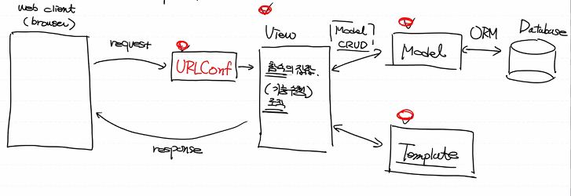
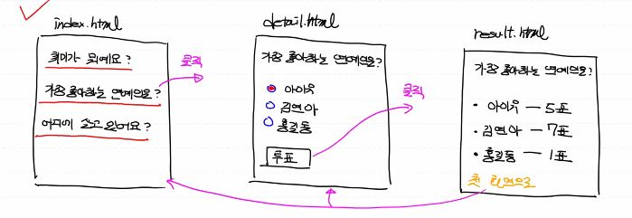

# day16_web_TIL

- web server : 인터넷을 통해 client의 request가 전달됐을 때 이 요청을 처리하는 hardware, software - 우리는 software 관점에서 공부
  - 정적 resource를 서비스

### CGI

> common Gateway Interface

- web server에서 application을 구현시키기 위한 규약(규칙)
- 정적인 기능을하는 web server에 동적 program을 수행시킬 수 있는 기능을 부여 ex) ( c, peal )

- 클라이언트 request -> 웹서버(Apache, NginX) -> 웹서버가 직접 프로그램을 실행

- 웹서버의 과부화, 부담 증가

### WAS

> web application server

- 일반적으로 web server와 web application을 동작시킬 수 있는 컨테이너를 분리
- 컨테이너(engine) : 몇몇개의 프로그램들의 집합

- 클라이언트 request -> 웹서버(Apache, NginX) -> WAS(tomcat,JBOse) -> 프로그램 실행(개발자가 구현)

### WSGI

> web server Gateway Interface

- python에 종속된 개념, WAS와 비슷
- python의 python script(web application)가 web server와 통신하기 위한 규약
- 클라이언트 request -> 웹서버 -> WSGI server(middleware) -> WSGI 규약을 준수하는 web application을 실행(Django framework로 생성)
- 클라이언트 request -> 웹서버(Apache, NginX) -> WSGI module과 WSGI process가 통신

### Django

- python으로 만들어진 open source web application Framework

- 특징:

  MVT 패턴을 이용 : Design pattern(singleton pattern, observer pattern, MVC pattern)

- MVC 패턴: M(model )- V(view) - C(controller)

  Model : data (database) - 데이터 제어

  VIew : UI (User Interface) - HTML 제어

  Controller : Business logic - 사용자 요청이나 데이터베이스 요청 관리

  데이터베이스와 화면 로직 쪽 코드를 다르게 구현

- MVT - MVC와 역할은 비슷하나 쓰이는 용어가 다르다

  Model : data

  View : business logic

  Template : UI

#### ORM

> Object relational Mapping (객체 관계 매핑)

- database 상식

- 계층형 database (Tree 구조)

  데이터 간의 연동이 쉽지 않아요

- Network database (Graph 구조)

  이론은 좋았으나 구현이 힘들어요

- relation database (Table 구조)
- 객체-관계형 database 
  
  - 정형 데이터 처리
- 몽고 DB
  
  - 비정형 데이터를 위한 database

#### Django 특징

- ORM (Object relational Mapping)

  python의 class, object를 이용해서 database를 제어

  내부적으로 SQL이 자동 생성되어 실행

- 관리자 page가 자동으로 생성됨

- Elegant URL(우아한 URL) :

  일반적으로 web program, URL Design이 직관적이고 쉽게 표현 가능

- MVT 패턴

#### Django 용어정리

- server - side web application

  project : 우리가 개발하는 전체 program (우리가 구현하는 site)

  application : 우리 프로젝트 내에서 모듈화된 단위 program들

#### MVT 패턴

- URLConf : 사용자가 원하는 동작을 인식

- View : 함수의 집합 (기능 수행)

- Model

- web client -> URLConf -> View -> CRUD -> Model -> ORM -> Database

  ​													  -> Template -> HTML -> View -> response -> web client

### 프로젝트 설계

> 설문조사 web program

##### 화면 설계

- index.html - 최종적으로 보는 화면, 3개의 하이퍼텍스트로 구성

  - 취미가 뭐에요?, 가장 좋아하는 연예인은?, 어디에 살고 있어요?

- detail.html - 가장 좋아하는 연예인은? 질문과, 레디오 버튼 칸

  - 아이유
  - 김연아
  - 홍길동

    '투표 버튼'

- result.html - 현재까지의 결과창

  - 아이유 - 5표
  - 김연아 - 7표
  - 홍길동 - 1표

     '첫 화면으로'

##### Database table 설계

1. Question table

   column - ID					  (숫자, 자동생성, PK, not null)

   ​				 question_text (문자열, not null)

   ​				 pub_date		 (날짜, not null)

2. Choice table

   column - ID					   (숫자, 자동생성, PK, not null)

   ​				 choice_text	   (문자열, not null)

   ​				 votes				  (투표수, 숫자)

   ​				 question_id	  (question table과 연결하기 위한 id, Foreign key)

##### anaconda prompt 

- django-admin startproject mysite(내 프로젝트 이름)

  프로젝트 생성

  MyFirstWeb : 내 프로젝트의 최상위 프로젝트 폴더

  mysite : 프로젝트 자체에 대한 설정이 들어있는 폴더

- python manage.py startapp polls

  앱 생성

##### project

- MyFirstWeb

  - db.sqlite3 (데이터베이스 파일)

  - manage.py

  - mysite (폴더, project 설정)

    - init.py 

    - settings.py (project의 전체 설정)

    - urls.py (project level의 URL pattern을 정의하는 URLConf 파일)

      ​	보통 application 내에도 하위 urls.py를 만들어서 계층구조로 이용

    - wsgi.py (Apache와 같은 web server와 연동하기 위한 설정-우리는 사용하지 않음)

  - polls (폴더, application)

    - admin.py (Admin site에 model class를 등록, database와 연동)
    - apps.py (application 설정 class를 정의하는 파일)
    - migrations (폴더, database 변경사항을 관리하기 위한 폴더)
    - models.py (database model class를 정의하는 파일)
    - views.py (view함수, logic처리를 정의하는 함수)

##### pycharm

- Time-zone : Asia/Seoul

- terminal 명령어:

  python manage.py migrate

  python manage.py runserver

