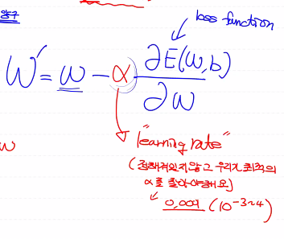
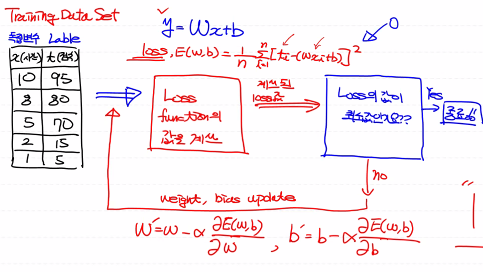
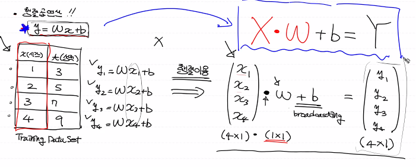

# day23_machine learning_TIL


##### 지도학습

- 학습데이터셋

  입력값(feature), label(정답)

- => 학습 진행

  예측모델 (predict model)

  미지의 데이터에 대한 예측

  

- 예측모델을 통해 어떤 것을 예측하냐에 따라 분류

  ###### Regression

  - Training Data Set을 이용해 학습하고 나온 predict model이 연속적인 값을 예측 (얼마나?)

  ###### classification

  - predict model이 어떤 부류에 속하는 지를 예측 (어떤 것?)


##### 학습

> Learning


###### Classical Linear Regression Model

- 고전적 선형 회귀모델


​	=> y = B0 +B1x1 => y = ax + b

​	=> y= Wx + b

​		W : weight (가중치)

​		b : bias

- 초기 W, b는 랜덤 -> 데이터를 가장 잘 표현하는 W, b를 찾아가는 과정 (Learning)


- 실제값 (t)

  가설에 의해 계산된 값 (y)

  

###### 오차 (error)

- error = t - y

  error = t - (Wx + b)

- 모델을 생성하기 위해 데이터의 error의 합이 최소가 되는 W와 b를 찾아야 함

  1. 절대값을 이용해서 error의 합 (오차가 있음!)

  2. error 값을 제곱한 뒤 평균을 구함 (평균제곱오차)

     이렇게하면 오차가 더 높은 값에 가중치를 줄 수 있음

     => 손실함수 (loss function)

- 평균제곱오차 (MSE)

  Mean squared error


##### loss function (손실 함수)

- cost function (비율 함수)

- Training Data Set의 정답 (t)와 입력 x에 대한 계산값 y (모델의 예측값)의 차이 (error)를 모두 더해(MSE) 수식으로 나타낸 식

  -> 최소제곱법을 이용해서 loss function을 만들고

  ​	우리가 만들 loss function의 값이 최소가 되게 하는 W와 b를 구하는 것


- loss function의 값이 최소가 되게하는 W를 찾기위해 경사하강법(Gradient Descent Algorithm)


- 특정 지점에서 미분값이 0이 되는 곳이 가장 최소값




##### 정리

- 우리의 예제는 Simple Linear Regression (독립변수가 1개)

  Hypothesis(가설), Predict model(예측 모델)

  y = Wx + b

  y: 예측값, x: 입력값

- 우리는 W와 b를 구해야 함

  loss function을 이용해서 최적의 W, b를 구함

  loss function은 최소제곱법으로 만든다

  

- 경사하강법(Gradient Descent Algorithm)을 이용해서 최적의 W와 b를 찾아요



- 1 epoch : 전체 데이터를 이용해서 1번 학습하는 것


##### 행렬곱연산

- 우리의 Predict Model(Hypothesis): y=Wx + b

- Training Data Set

  x(시간) / t(성적)

  1		/		3		y1 = Wx1 + b

  2		/		5		y2 = Wx2 + b

  3		/		7		y3 = Wx3 + b

  4		/		9		y4 = Wx4 + b

  원래는 이렇게 해야함 그런데 행렬곱 연산을 하면 쉽게 가능

  (4*1) * (1*1) 브드 캐스팅 이용: (x1, x2, x3, x4) * W + b = (y1, y2, y3, y4)

- X * W + b = Y




##### Tensorflow

- conda install tensorflow=1.15


- open source library

- numerical computation(수치 연산)

- data flow graph

- => Node와 Edge로 구성된 방향성 있는 Graph

  node: 수치연산과 데이터 입출력

  edge: data를 실어 나르는 역할 (동적 크기의 다차원 배열 Tensor)

- 그래프를 만들어서 실행: 그래프로 그리고 그래프(노드)로 실행


##### 정리

```python
import numpy as np
import pandas as pd
import matplotlib.pyplot as plt

my_dict = {
    '공부시간(x)' : [1,2,3,4,7,8,10,12,13,14,15,18,20,25,28,30],
    '시험점수(t)' : [5,7,20,31,40,44,45,46,49,60,70,82,85,91,97,99]
}

df = pd.DataFrame(my_dict)

display(df.head())

plt.scatter(df['공부시간(x)'], df['시험점수(t)'])

# 직선 그리기
# plt.plot(df['공부시간(x)'], df['공부시간(x)']*2 + 3, color='r')
# plt.plot(df['공부시간(x)'], df['공부시간(x)']*5 - 7, color='g')
# plt.plot(df['공부시간(x)'], df['공부시간(x)']*1 + 8, color='b')
plt.plot(df['공부시간(x)'], df['공부시간(x)']*5 - 10, color='magenta')


plt.show()
```


##### tensorflow

```python
import tensorflow as tf
print(tf.__version__)

node1 = tf.constant('hello world')

# 그래프를 실행하려면 1.x 버전에서는 session이 필요
# session은 그래프 안의 특정 노드를 실행시킬 수 있음
sess = tf.Session()

print(sess.run(node1).decode())

# print(node1)
```

```python
import tensorflow as tf

node1 = tf.constant(10, dtype=tf.float32)
node2 = tf.constant(30, dtype=tf.float32)

node3 = node1 + node2

# session은 tensorflow 그래프를 실행시키기 위해 필요
# 1.x버전에서만 사용됨 2.x버전에서는 삭제
sess = tf.Session()

print(sess.run([node3, node1]))
```

