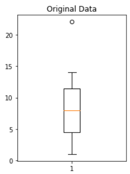
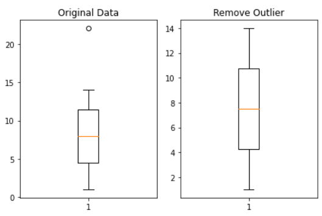
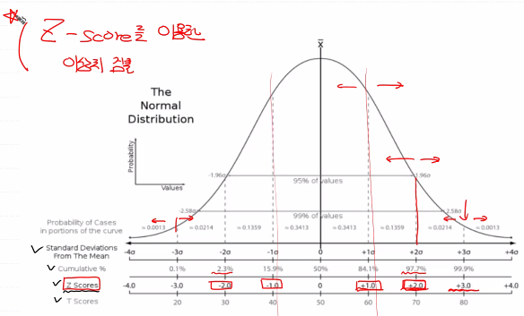
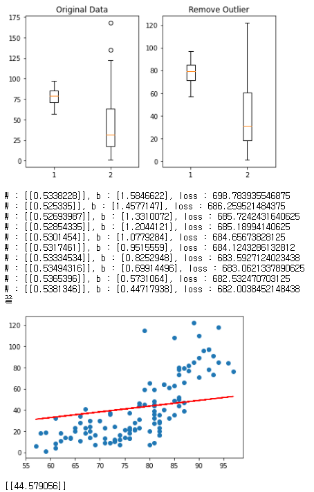

# day25_machine learning_TIL


### 리뷰

##### AI

##### Machine Learning

- Regression
- SVM
- Decision Tree
- Numerical Network

##### Deep Learning

- Numerical Network


##### Regression

###### Simple Linear Regression

- classical Linear Regression Model
- 독립변수가 1개
- loss function을 반복적으로 미분하면서 W, b를 update => 학습한다
- Gradient Descent Algorithm


###### loss function

- 초기의 W가 어떤 값이 설정되더라도 항상 최소값을 찾으려면 함수의 형태가 결정이 되야함

  => 볼록함수 


##### simple Linear Regression

- 제공된 data를 이용해서

  1. python 구현

  2. tensorflow 구현

  3. sklearn 구현


- 머신러닝에서 학습이 잘 되기 위해서는 '양질의 데이터'가 있어야 함

  데이터 전처리 (Data Preprocessing)

  - 이상치 처리
  - 정규화 (데이터 feature의 scale이 차이가 나는 경우)

###### 이상치

> outlier

- feature(속성) 안에 들어있는 값이 일반적인 값보다 편차가 큰 값을 지칭

- 독립변수 측에 있는 이상치 -> 지대점

  종속변수(lable)에 있는 이상치 -> 이상치(outlier)

- 이상치를 찾아야 처리할 수 있음

  이상치 검출 방식

  - Variance : 정규분포

  - Likelihood : 베이즈 정리를 이용(확률)

  - Nearest-Neighbor : 모든 데이터 상의 거리

  - Density : 카이제곱 분포 이용

    Boxplot을 이용해서 이상치를 graph에서 확인

  - Tokey Fence : 사분위 이용

  - Z-score : 정규분포, 표준편차

  우리가 사용할 것은 Tokey Fence, Z-score


##### boxplot



- 맨 밑 선 : Minimum
- 박스 밑 선 : 1사분위 (25%)
- 주황색 선 : 중위값 (Median), 2사분위 (50%)
- 박스 위 선 : 3사분위 (75%)
- 맨 위 선 : Maximum
- 원형 데이터 : 이상치 (outlier)

- 박스 영역 (1~3사분위) : IQR (Inter Quartile Range)

  

###### IQR value

- 3사분위 값 - 1사분위 값 => 숫자값

  이상치

  - 1사분위 값 - (IQR value * 1.5) 미만으로 작은 값들

  - 3사분위 값 + (IQR value *1.5) 초과로 큰 값들

    

- 이상치 제거 한 후




##### Z-score




### Ozone data 실습

##### sklearn 이용

```python
# 믿고쓰는 sklearn을 이용해서 해당 data 학습시키고 predict

import numpy as np
import pandas as pd
import matplotlib.pyplot as plt
from sklearn import linear_model

# 1. training data set
df = pd.read_csv('./ozone.csv')
training_data = df[['Temp', 'Ozone']]
training_data = training_data.dropna(how='any')   
x_data = training_data['Temp'].values.reshape(-1,1)
t_data = training_data['Ozone'].values.reshape(-1,1)

# 2. model 생성
model = linear_model.LinearRegression()

# 3. model 학습
model.fit(x_data, t_data)

# 4. Weight & bias 출력
# tensorflow 구현 - W : [[1.5811343]], b : [-80.024]
# sklearn 구현 - W: [[2.4287033]], b: [-146.99549097]
print(f'W: {model.coef_}, b: {model.intercept_}')

# predict
# tensorflow 구현 - [[49.839485]]
# sklearn 구현 - [[52.15818003]]
print(model.predict([[82]]))

plt.scatter(x_data, t_data)
plt.plot(x_data, x_data*W_val.ravel() + b_val, color='r')
plt.plot(x_data, x_data*model.coef_.ravel() + model.intercept_, color='b')
plt.show()
```


##### boxplot 이용 이상치 처리

```python
# Boxplot을 이용해서 이상치를 확인해 보야요
import numpy as np
import matplotlib.pyplot as plt

data = np.array([1,2,3,4,5,6,7,8,9,10,11,12,13,14,22.1])

fig = plt.figure()  # 새로운 figure 생성
fig_1 = fig.add_subplot(1,2,1)  # 1행 2열의 첫번째 칸
fig_2 = fig.add_subplot(1,2,2)  # 1행 2열의 두번째 칸

fig_1.set_title('Original Data')  # 이름 지정
fig_1.boxplot(data)

## numpy를 이용해서 사분위수를 구해보아요 percentile()
# print(np.median(data))         # 중위값 (2사분위) => 8.0
# print(np.percentile(data,25))  # 1사분위 => 4.5
# print(np.percentile(data,50))  # 2사분위 => 8.0
# print(np.percentile(data,75))  # 3사분위 => 11.5

## IQR value
iqr_value = np.percentile(data,75) - np.percentile(data,25)
# print(iqr_value) # 7.0

upper_fense = np.percentile(data,75) + (iqr_value * 1.5) # 22.0
lower_fense = np.percentile(data,25) - (iqr_value * 1.5) # -6.0
# print(upper_fense, lower_fense)

## 이상치를 알아보아요
# print(data[(data > upper_fense) | (data < lower_fense)]) # [22.1]

# 이상치 제거하기
result = data[(data < upper_fense) & (data > lower_fense)]
print(result)

fig_2.set_title('Remove Outlier')  # 이름 지정
fig_2.boxplot(result)

fig.tight_layout()   # 레이아웃 예쁘게 잡는 용도
plt.show()
```


##### z-score 이상치 처리

```python
# 이상치를 판별하는 두번째 방법
# Z-Score를 이용해서 처리하는 방식 => 정규분포와 표준편차를 이용해서
# 이상치를 검출하는 방식

import numpy as np
from scipy import stats

zscore_threshold = 1.8  # (2.0이 optimal value) => 
                        # 상위 95% 이상 하위 95% 이하 값

data = np.array([1,2,3,4,5,6,7,8,9,10,11,12,13,14,22.1])

# outlier 출력
outlier = data[np.abs(stats.zscore(data)) > zscore_threshold]

# 이상치를 제거한 데이터
data[np.isin(data, outlier, invert=True)]
```


##### Ozone 데이터에 boxplot 이용 이상치 처리


```python
import numpy as np
import pandas as pd
import tensorflow as tf
import matplotlib.pyplot as plt

# 1. training data set
df = pd.read_csv('./ozone.csv')
training_data = df[['Temp', 'Ozone']]

training_data = training_data.dropna(how='any')


## boxplot 이상치 처리
fig = plt.figure()  # 새로운 figure 생성
fig_1 = fig.add_subplot(1,2,1)  # 1행 2열의 첫번째 칸
fig_2 = fig.add_subplot(1,2,2)  # 1행 2열의 두번째 칸

fig_1.set_title('Original Data')  # 이름 지정
fig_1.boxplot(training_data)

iqr_value = np.percentile(training_data['Ozone'],75) - np.percentile(training_data['Ozone'],25)
upper_fense = np.percentile(training_data['Ozone'],75) + (iqr_value * 1.5)
lower_fense = np.percentile(training_data['Ozone'],25) - (iqr_value * 1.5)

# print(t_data[(t_data > t_upper_fense) | (t_data < t_lower_fense)])
result = training_data[(training_data['Ozone'] < upper_fense) & (training_data['Ozone'] > lower_fense)]


## data의 boxplot 출력
fig_2.set_title('Remove Outlier')  # 이름 지정
fig_2.boxplot(result)

fig.tight_layout()   # 레이아웃 예쁘게 잡는 용도
plt.show()


x_data = result['Temp'].values.reshape(-1,1)
t_data = result['Ozone'].values.reshape(-1,1)


## 2. placeholder
X = tf.placeholder(shape=[None,1], dtype=tf.float32)
T = tf.placeholder(shape=[None,1], dtype=tf.float32)

## 3. Weight & bias
W = tf.Variable(tf.random.normal([1,1]), name='weight')
b = tf.Variable(tf.random.normal([1]), name='bias')

## 4. Hypothesis (predict model)
H = tf.matmul(X,W) + b

## 5.loss function
loss = tf.reduce_mean(tf.square(H - T))

## 6. train
train = tf.train.GradientDescentOptimizer(learning_rate=1e-4).minimize(loss)

## 7. session, 초기화
sess = tf.Session()
sess.run(tf.global_variables_initializer())

## 8. 학습
for step in range(3000):
    
    _, W_val, b_val, loss_val = sess.run([train, W, b, loss],
                                         feed_dict={X: x_data, T: t_data})
    
    if step % 300 == 0:
        print(f'W : {W_val}, b : {b_val}, loss : {loss_val}')
print('끝')


## 9. 그래프 출력
plt.scatter(x_data, t_data)
plt.plot(x_data, x_data*W_val.ravel() + b_val, color='r')
plt.show()

# predict
result = sess.run(H, feed_dict={X: [[82]]})
print(result)
```

##### 


