# day27_machine learning_TIL


### Machine Learning

- 지도학습

- 비지도학습

- 준지도학습

- 강화학습

  

##### 지도학습

> supervised Learning

- 회귀 : Model의 결과한테 연속적인 숫자값 (Regression)

  Regression

  ###### Classical Linear Regression Model

  - Simple Linear Regression (단순선형회귀)
  - Multiple Linear Regression (다중선형회귀)


- 분류 : 어떤 부류에 속하는 지 알려주는 (classification)

  - binary classification

    둘 중 하나

  - Multinomial classification

    여러개 중 하나


##### Classification (분류)

- Training Data Set의 특징과 분포를 이용하여 학습한 후 미지의 데이터에 대해서 결과가 어떤 종류의 값으로 분류될 수 있는지 예측하는 작업
  - Email spam 판별
  - 주식의 주가가 오를지 떨어질지
  - MRI 사진으로 악성 종양 판단
  - 신용카드 사용시 도난카드인지 여부


- Training Data Set -> classification machine learning system으로 학습 진행 ->

- 5시간 Fail, 8시간 pass일 경우 -> 7시간 공부하면? : 0~1 사이의 실수값 => 0.63

  0.5 이상이면 1, True, Pass

  0.5 미만이면 0, False, Fail


- 분류 종류

  - Logistic Regression
  - KNN
  - Naive Bayes
  - Decision Tree(Random Forest)
  - ...

  주로 분류할 때 사용하나 Regression도 할 수 있긴 하다


##### Logistic Regression

- classification 알고리즘 중에 정확도가 상당히 높은 알고리즘

  -> Deep Learning의 기본 컴포넌트로 사용

- Training Data Set(X, T)

  -> Logistic Regression(linear Regression -> classification)

  -> Prediction (실수값을 일정 기준으로 True, False로 분류)

  

- linear Regression으론 할 수 없나요?

  -> Training Data Set에 따라 정확하지 않은 model 도출될 수 있음

  -> Prediction이 안됨


- Training Data Set(X,T)

  -> Logistic Regression(linear Regression(Wx+b) -> classification(sigmoid))

  -> model : y = sigmoid(Wx + b)

  - sigmoid : S자 모양의 곡선

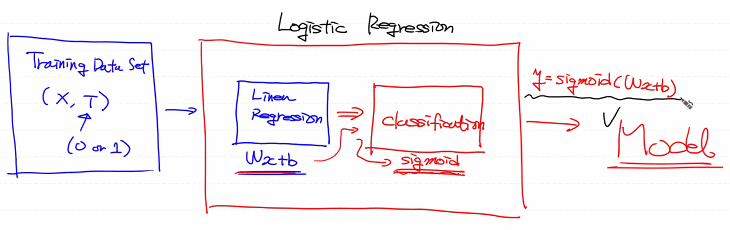


- sigmoid 함수

  - 데이터 값이 아무리 떨어져도 0보다 작지 않음

    데이터 값이 아무리 올라도 1을 넘지 않음

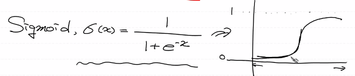


- Logistic Model

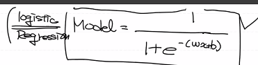


- Linear Regression의 출력 model (Wx + b)가 어떠한 값을 가지더라도 

  출력함수로 sigmoid 함수를 이용하면

  -> 0~1 사이의 실수값이 도출 (0.5 이상이면 1, 0.5 미만이면 0 출력)

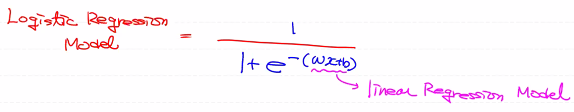

- 최적의 W, b를 구하기 위해

  -> loss 함수를 정의 (최소제곱법 이용)

  -> loss를 반복적으로 미분하면서 W, b 갱신


###### Linear Regression model

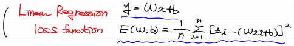


###### Logistic Regression model

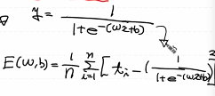

- local minimal
- global minimal

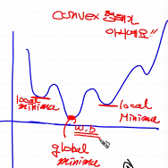


##### Cross Entropy (Log Loss)

- Logistic Regression의 loss function을 재정의

- model : y = 1 / 1 + e^-(Wx + b), ti=0 or 1
- cross entropy : 시그마 i는 1부터 n까지 {tilogyi + (1-ti)log(1-yi)}

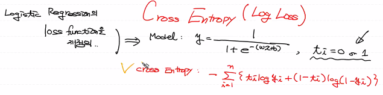

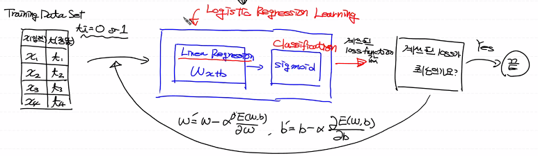


```python
# Logistic Regression

import numpy as np
from sklearn import linear_model
import mglearn  # Data Set을 가져오기 위한 Utility Model
import warnings # warning을 출력하지 않도록 처리
import matplotlib.pyplot as plt # 그래프 그리기 위해 필요

# warning off
warnings.filterwarnings(action='ignore')

# Training Data Set
x,y = mglearn.datasets.make_forge()
# print(x) # 좌표값을 들고 있어요 (x축 좌표, y축 좌표)
# print(y) # 해당 좌표의 결과값을 들고 있어요 (True, False)
mglearn.discrete_scatter(x[:,0], x[:,1], y) # x좌표, y좌표, 찍을 값 주기

# Linear Regression
# 가장 잘 표현하는 직선 그리기
model = linear_model.LinearRegression()
model.fit(x[:,0].reshape(-1,1), x[:,1].reshape(-1,1))
print(model.coef_)       # Weight
print(model.intercept_)  # bias
plt.plot(x[:,0], x[:,0] * model.coef_.ravel() + model.intercept_)
```

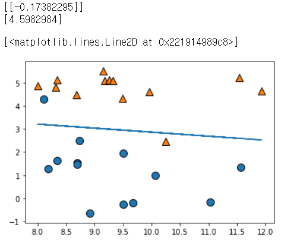


##### linear regression

- classification 문제에 linear regression을 쓸 경우 데이터에 이상치가 없다면 정상 작동

```python
# logistic regression 대신 linear regression을 이용해도 되나요?

import numpy as np
from sklearn import linear_model
import matplotlib.pyplot as plt

# Training Data Set
x_data = np.array([1, 2, 5, 8, 10])  # 공부시간
t_data = np.array([0, 0, 0, 1, 1])   # 합격여부 (0: Fail, 1: Pass)

model = linear_model.LinearRegression()
model.fit(x_data.reshape(-1,1),
          t_data.reshape(-1,1))

print(f'기울기 : {model.coef_}, 절편 : {model.intercept_}')

plt.scatter(x_data, t_data)
plt.plot(x_data, x_data * model.coef_.ravel() + model.intercept_)
plt.show()

print(model.predict([[7]])) # [[0.63265306]] => 0.5 보다 크기 때문에 Pass

# 그러면 시험에 통과하려면 적어도 몇시간을 공부해야 하나요
print((0.5 - model.intercept_) / model.coef_.ravel())  # [5.97368421]

print(model.predict([[5.97368421]]))
```

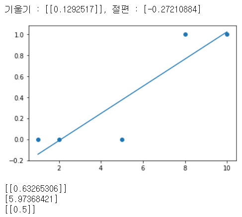


- 데이터에 이상치가 있는 경우

  실제 이상치가 아니라 의미 있는 값이라도 차이가 많이 나는 값이 들어가면 제대로 작동하지 않음 그래서 logistic regression으로 해야함

```python
# logistic regression 대신 linear regression을 이용해도 되나요?
# 왜 안되는지 알아보아요

import numpy as np
from sklearn import linear_model
import matplotlib.pyplot as plt

# Training Data Set
x_data = np.array([1, 2, 5, 8, 10, 30])  # 공부시간
t_data = np.array([0, 0, 0, 1, 1, 1])   # 합격여부 (0: Fail, 1: Pass)

model = linear_model.LinearRegression()
model.fit(x_data.reshape(-1,1),
          t_data.reshape(-1,1))

print(f'기울기 : {model.coef_}, 절편 : {model.intercept_}')

plt.scatter(x_data, t_data)
plt.plot(x_data, x_data * model.coef_.ravel() + model.intercept_)
plt.show()

print(model.predict([[7]])) # [[0.41831972]] => 0.5 보다 작기 때문에 Fail

# 그러면 시험에 통과하려면 적어도 몇시간을 공부해야 하나요
print((0.5 - model.intercept_) / model.coef_.ravel())  # [9.33333333]

print(model.predict([[5.97368421]]))
```

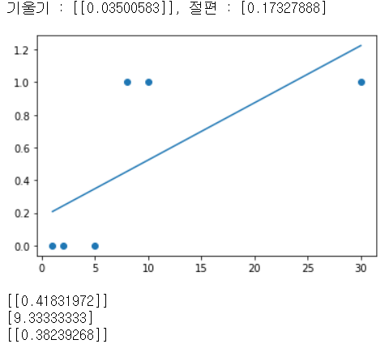


##### sigmoid

- sigmoid 코드로 구현

```python
# sigmoid

import numpy as np
import matplotlib.pyplot as plt

x_data = np.arange(-7,8)
sigmoid_t_data = 1 / (1 + np.exp(-1 * x_data))

plt.plot(x_data, sigmoid_t_data)
plt.show()
```

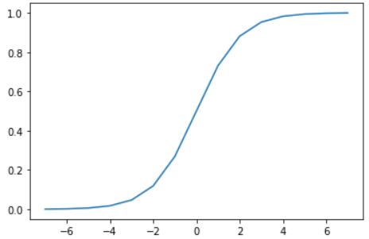


##### Logistic Regression

###### python으로 구현

```python
# 간단하게 Logistic Regression을 순수 python과 tensorflow를 이용해서 구현

# 공부시간에 따른 시험 합격여부에 대한 데이터로 학습 후 prediction 하기
# 독립변수는 공부시간 1개만 사용 Simple Linear Regression

# %reset
import numpy as np
import tensorflow as tf
from sklearn import linear_model

# 수치미분함수(for python)
def numerical_derivative(f, x):
    # f: 미분하려고 하는 다변수 함수(loss 함수)
    # x: 모든 값을 포함하는 numpy array  => [W, b]
    delta_x = 1e-4
    derivative_x = np.zeros_like(x)     
    it = np.nditer(x, flags=['multi_index'])
    while not it.finished:
        idx = it.multi_index # 현재의 iterator의 index를 추출 => tuple형태 
        tmp = x[idx] 
        x[idx] = tmp + delta_x
        fx_plus_delta = f(x)    # f([1.00001, 2.0]) => f(x + delta_x)
        x[idx] = tmp - delta_x
        fx_minus_delta = f(x)    # f([0.99999, 2.0]) => f(x - delta_x)
        derivative_x[idx] = (fx_plus_delta - fx_minus_delta) / (2 * delta_x)
        x[idx] = tmp
        it.iternext()
    return derivative_x

# Training Data 
x_data = np.arange(2,21,2).reshape(-1,1) # 공부시간(독립변수)
t_data = np.array([0,0,0,0,0,0,1,1,1,1]).reshape(-1,1) # 합격여부(14시간부터 1)
                                         # 13시간 공부하면 ??
    
# python 구현
# Weight & bias
W = np.random.rand(1,1) # 행렬곱 연산을 위해 matrix 형태로 생성
b = np.random.rand(1)

# loss function
def loss_func(input_obj): # W와 b가 입력으로 들어감
                          # [W, b]
    
    input_W = input_obj[0].reshape(-1,1)
    input_b = input_obj[1]
    
    # linear regression의 hypothesis
    z = np.dot(x_data,input_W) + input_b # Wx + b
    # logistic regression의 hypothesis
    y = 1 / (1 + np.exp(-1 * z)) 

    delta = 1e-7    # log연산시 무한대로 발산하는 것을 방지하기 위한 수치처리방식
    
    # cross entropy
    return -np.sum(t_data*np.log(y+delta) + (1-t_data)*np.log(1-y+delta))

# learning rate
learning_rate = 1e-4

# 학습(Gradient Descent Algorithm을 수행)
for step in range(300000):
    input_param = np.concatenate((W.ravel(), b.ravel()), axis=0) # [W b]
    derivative_result = learning_rate * numerical_derivative(loss_func, input_param)
    
    W = W - derivative_result[0].reshape(-1,1)
    b = b - derivative_result[1]
    
    if step % 30000 == 0:
        input_param = np.concatenate((W.ravel(), b.ravel()), axis=0)
        print(f'W : {W.ravel()}, b : {b}, loss : {loss_func(input_param)}')
```

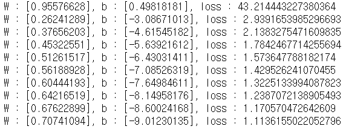


- prediction

```python
# prediction
def logistic_predict(x):  # [[13]] => 13시간 공부하면?
    z = np.dot(x, W) + b
    y = 1 / (1 + np.exp(-1 * z))
    
    if y < 0.5:
        result = 0
    else:
        result = 1
    return result, y      # result는 결과값, y는 확률값

study_hour = np.array([[13]])
print(logistic_predict(study_hour))  # 결과 : 1(합격), 확률 : 0.54444023
```

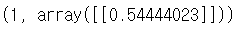


###### sklearn으로 구현

```python
# 같은 내용을 sklearn으로 구현
model = linear_model.LogisticRegression()

model.fit(x_data, t_data.ravel())

study_hour = np.array([[13]])
print(model.predict(study_hour))
result_pro = model.predict_proba(study_hour)
print(result_pro)  # 아주 근소하게 불합격
```

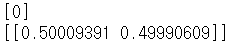


###### Tensorflow로 구현

```python
# Tensorflow 구현

# Training Data Set 
x_data = np.arange(2,21,2)
t_data = np.array([0,0,0,0,0,0,1,1,1,1])


# placeholder (1.x 버전에서만 존재, 2.x 버전에서는 삭제)
X = tf.placeholder(dtype=tf.float32)
T = tf.placeholder(dtype=tf.float32)

# Weight & bias
W = tf.Variable(tf.random.normal([1,1]), name='weight')
b = tf.Variable(tf.random.normal([1]), name='bias')

# Hypothesis
logit = W * X + b  # Wx + b
H = tf.sigmoid(logit)

# loss function(Cross Entropy)
loss = tf.reduce_mean(tf.nn.sigmoid_cross_entropy_with_logits(logits=logit,
                                                              labels=T))
# tensorflow의 뉴럴링크 중에 시그모이드 크로스 엔트로피 함수

# train
train = tf.train.GradientDescentOptimizer(learning_rate=1e-4).minimize(loss)

# session, 초기화
sess = tf.Session()
sess.run(tf.global_variables_initializer())

# 학습
for step in range(300000):
    _, W_val, b_val, loss_val = sess.run([train, W, b, loss],
                                         feed_dict={X: x_data,
                                                    T: t_data})
    
    if step % 30000 == 0:
        print(f'W : {W_val}, b : {b_val}, loss : {loss_val}')
        
study_hour = np.array([[13]])
result = sess.run(H, feed_dict={X: study_hour})
```

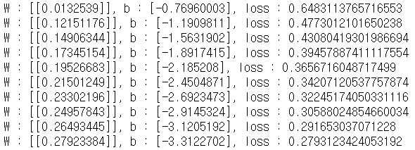


- prediction

```python
print(result)
```


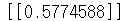