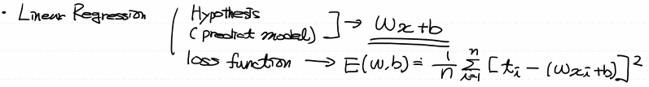
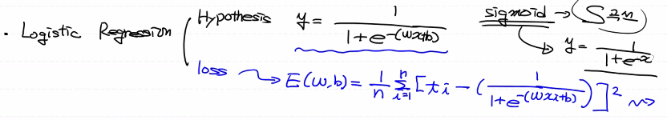
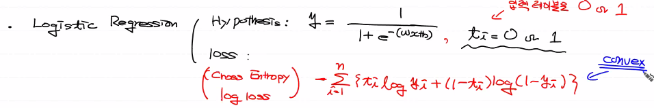
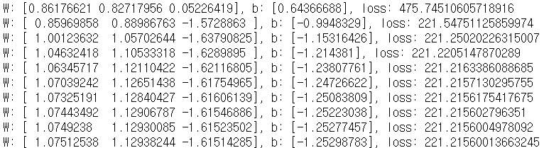
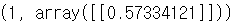
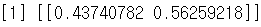
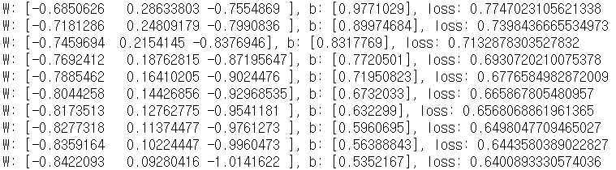
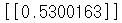
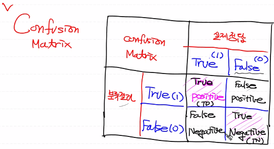

# day28_machine learning_TIL


### 리뷰

##### 지도학습

###### Regression(회귀)

- 연속적인 숫자값을 prediction -> Linear Regression(선형회귀)


###### Classification(분류)

- 입력값이 0 or 1 중 어디에 속하느냐 (binary classification) -> logistic Regression


- 알고리즘 종류

  - logistic Regression
  - KNN
  - Decision Tree
  - Naive Bayes

  분류용 알고리즘으로 회귀도 가능


##### Linear Regression




##### Logistic Regression

- 최소제곱법으로 logistic regression 구현시 convex 함수가 아니다
  - convex 함수가 아니면 경사하강법(Gradient Algorithm)을 사용할 수 없다
  - loss를 최소제곱법으로 구할 수 없음




- cross entropy  log loss적용
  - 이렇게 하면 convex 함수가 됨




### 0303

##### 간단한 문제 구현

- GRE - 성적?
- GPA - 
- RANK - 학교순위
- 이 3개로 합격여부를 얻을 수 있음

- 이를 기반으로 학습을 시키고 predictions
- python, Tensorflow, sklearn 구현


- admit : 합격 여부 1은 합, 0은 탈


##### admission 예제

- python으로 구현

```python
# admission 예제

import numpy as np
import pandas as pd
import tensorflow as tf
from scipy import stats  # 이상치 제거
from sklearn.preprocessing import MinMaxScaler  # 정규화
from sklearn import linear_model
import matplotlib.pyplot as plt

# %reset

## python 구현

# 수치미분함수(for python)
def numerical_derivative(f, x):
    # f: 미분하려고 하는 다변수 함수(loss 함수)
    # x: 모든 값을 포함하는 numpy array  => [W, b]
    delta_x = 1e-4
    derivative_x = np.zeros_like(x)     
    it = np.nditer(x, flags=['multi_index'])
    while not it.finished:
        idx = it.multi_index # 현재의 iterator의 index를 추출 => tuple형태 
        tmp = x[idx] 
        x[idx] = tmp + delta_x
        fx_plus_delta = f(x)    # f([1.00001, 2.0]) => f(x + delta_x)
        x[idx] = tmp - delta_x
        fx_minus_delta = f(x)    # f([0.99999, 2.0]) => f(x - delta_x)
        derivative_x[idx] = (fx_plus_delta - fx_minus_delta) / (2 * delta_x)
        x[idx] = tmp
        it.iternext()
    return derivative_x


## Raw Data Loading 
df = pd.read_csv('./admission.csv')
# display(df)


## 데이터 전처리
# 1. 결측치 처리
# print(df.isnull().sum()) # 결측치는 없음

# 2. 이상치 처리
# 이상치가 있는지 그래프로 확인
# fig = plt.figure()
# fig_gre = fig.add_subplot(1,3,1)
# fig_gpa = fig.add_subplot(1,3,2)
# fig_rank = fig.add_subplot(1,3,3)

# fig_gre.boxplot(df['gre'])
# fig_gpa.boxplot(df['gpa'])
# fig_rank.boxplot(df['rank'])

# fig.tight_layout()
# plt.show()

# 이상치가 존재하므로 Z-score 방식으로 이상치 제거
zscore_threshold = 2.0 # 2.0 이하로 설정하는게 optimal

for col in df.columns:
    # np.abs : 절대값 구하는 함수
    # stats : 정규분포 상에서 이상치 제거
    outlier = df[col][np.abs(stats.zscore(df[col])) > zscore_threshold]
    df = df.loc[~df[col].isin(outlier)]
    
# display(df) # 382 rows × 4 columns


# 3. 정규화
# 이상치를 제거햇으니 정규화 Nomalization 실행
x_data = df.drop('admit', axis=1).values
t_data = df['admit'].values.reshape(-1,1)

# sklearn은 정규화하지 않은 데이터를 이용
# python과 tensorflow는 데이터를 정규화해서 사용
scaler_x = MinMaxScaler()
scaler_x.fit(x_data)
norm_x_data = scaler_x.transform(x_data) # for python, tensorflow


## python 구현


## Weight & bias 정의
W = np.random.rand(3,1)  # 3 : 행렬곱을 위해 입력데이터 x의 열의 수
                         # 1 : 예측값이 t_data와 연산이 되야 함
                         #     t_data의 column 수와 동일
b = np.random.rand(1)


## loss function
def loss_func(input_obj):   # input_obj : [w1,w2,w3,b]
    
    input_W = input_obj[:-1].reshape(-1,1)
    input_b = input_obj[-1]
    
    delta = 1e-7  # log 연산시 무한대로 발산하는 것을 방지하기 위한 수치처리
    
    z = np.dot(norm_x_data,input_W) + input_b
    y = 1 / (1 + np.exp(-1 * z))
    
    # cross entropy
    return -np.sum(t_data*np.log(y+delta) + (1-t_data)*np.log(1-y+delta))


# learning rate 정의
learning_rate = 1e-4

for step in range(30000):
    input_param = np.concatenate((W.ravel(), b.ravel()), axis=0)
    # [w1,w2,w3,b]
    derivative_result = learning_rate * numerical_derivative(loss_func, input_param)
    
    W = W - derivative_result[:-1].reshape(-1,1) # W 갱신 (w1,w2,w3)
    b = b - derivative_result[-1]  # bias 갱신
    
    if step % 3000 == 0:
        input_param = np.concatenate((W.ravel(), b.ravel()), axis=0)
        print(f'W: {W.ravel()}, b: {b}, loss: {loss_func(input_param)}')
```




- prediction

```python
# predict
def logistic_predict(x):
    z = np.dot(x,W) + b
    y = 1 / (1 + np.exp(-1*z))
    
    if y < 0.5:
        result = 0
    else:
        result = 1
    
    return result, y

my_score = np.array([600, 3.8, 1])
scaled_my_score = scaler_x.transform(my_score.reshape(-1,3))
result = logistic_predict(scaled_my_score)

print(result)
```




- sklearn

```python
# sklearn 구현

model = linear_model.LogisticRegression()

model.fit(x_data, t_data.ravel())

my_score = np.array([600, 3.8, 1]).reshape(1,3)
predict_result = model.predict(my_score)
predict_proba = model.predict_proba(my_score)

print(predict_result, predict_proba)
```




- Tensorflow로 구현

```python
## Tensorflow 구현

## placeholder
X = tf.placeholder(shape=[None,3], dtype=tf.float32)
T = tf.placeholder(shape=[None,1], dtype=tf.float32)


## Weight & bias
W = tf.Variable(tf.random.normal([3,1]), name='weight')
b = tf.Variable(tf.random.normal([1]), name='bias')


## Hypothesis
logit = tf.matmul(X,W) + b
H = tf.sigmoid(logit)


## loss function(cross entropy)
loss = tf.reduce_mean(tf.nn.sigmoid_cross_entropy_with_logits(logits=logit,
                                                              labels=T))


## train
train = tf.train.GradientDescentOptimizer(learning_rate=1e-4).minimize(loss)


## session & 초기화
sess = tf.Session()
sess.run(tf.global_variables_initializer())


## 학습
for step in range(30000):
    
    _, W_val, b_val, loss_val = sess.run([train,W,b,loss], 
                                          feed_dict={X:norm_x_data,
                                          T :t_data})
    
    if step % 3000 == 0:
        print(f'W: {W_val.ravel()}, b: {b_val}, loss: {loss_val}')
```




- prediction

```python
my_score = np.array([600, 3.8, 1])
scaled_my_score = scaler_x.transform(my_score.reshape(-1,3))
result = sess.run(H, feed_dict={X:scaled_my_score})

print(result)
```




##### 코드 맹점

- 초기값을 랜덤으로 잡는 것
- 성능평가


##### 이진분류

> binary classification

- logistic Regression : 이진분류를 하기위한 기법 중 하나


- 분류성능 평가지표(Metrics)

  우리가 구현한 logistic Regression model이 잘 만들어진 모델인지 확인하기 위한 기준


##### Confusion Matrix



- TP, TN, FP, FN

1. Precision (정밀도)

   -> 우리의 모델이 True로 분류한 것 중 정말로 True인 것의 비율

   Precision =  TP / (TP + FP) 

   => Positive 정답률 : PPV(Positive Predictive value), 정확도

   

2. Recall (재현율)

   -> 실제 True인 것 중에 우리 모델이 True로 분류한 것의 비율

   Recall = TP / (TP + FN)

   => sensitivity (민감도), hit rate (정답을 맞췄다)

###### 예제

- A라는 회사 -> 소프트웨어 개발 -> 사진을 입력 받아서 그 안에 고양이가 있는지를 검출하는

  홍보 

  -> 이 기술의 고양이 검출율은 99.9%에요 : 하나의 전제를 깔고 생각하는데 이 기술은 '오검출'을 하지 않는다

  -> 이 기술의 고양이 검출율은 63.7%에요 : 

  Recall : 'A' 기술 99.9%의 검출율 + 그림 1장 당 평균 5건의 오검출, 재현율

  Precision : 'B' 기술 63.7%의 검출율 + 오검출이 거의 x

- Recall : 고양이를 빠뜨리지 않고 얼마나 잘 검출해 내는가

- Precision : 검출한 결과가 얼마나 정확한지를 나타내는 지표

  => Recall과 Precision은 반비례 관계

- Precision - Recall graph

  

3. Accuracy (정확도)

- Precision, Recall -> True를 True로 옳게 예측한 경우
- Accuracy는 False를 False로 예측하는 경우도 포함
- Accuracy = (TP + TN) / (TP + FN + FP + TN)
- domain의 bias를 반드시 고려