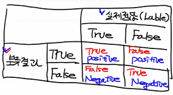
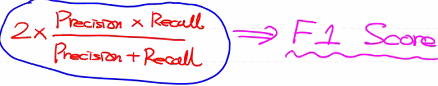
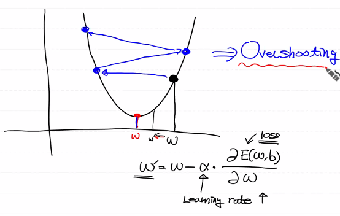
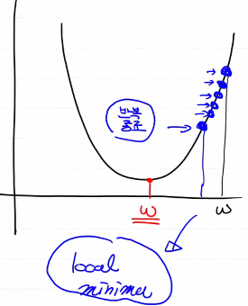
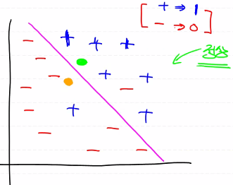
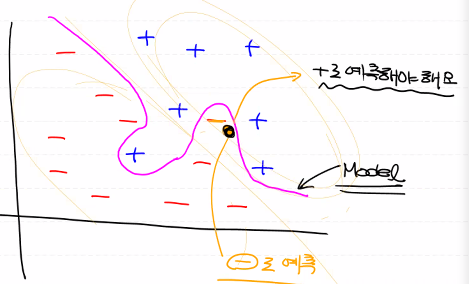
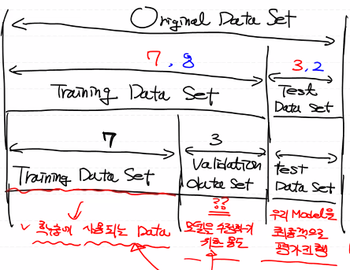

# day29_machine learning_TIL

- regression(회귀)

  연속적인 숫자값 예측

- classification(분류)

  0 or 1 어느 쪽인지 예측 + 성능평가(Metric)

##### confusion Matrix

1. Precision (정밀도)

- 우리 모델이 True로 분류한 것 중 정말 True인 것의 비율
- precision = TP / (TP + FP)
- False를 고려하지 않음

2. Recall (재현율), hit rate

- 실제 True인 것 중에서 우리의 모델이 True라고 예측한 비율

- recall = TP / (TP + FN)

3. Accuracy (정확도)

- 실패까지 고려한 확률
- accuracy = (TP + TN) / (TP + TN + FP + FN)

- bias (데이터 분포)를 반드시 고려해야함

  ###### 예제

  - 우리 model은 휘귀병을 검출 1/10000000 확률
  - model이 무조건 휘귀병이 아니다라고 결과를 도출해도 정확도가 99.9% 
  - 데이터에 편향이 존재, 고려해야함

- Precision, Recall은 해결하려는 문제에 따라 둘 중 어느 것을 사용할 지 결정 

- -> 일반적으로 precision과 recall은 반비례 관계

  

4. F1 Score

- -> Precision과 Recall의 조화평균

- F1 Score = 2 * Precision * Recall / (Precision + Recall)

5. Fall - Out

- 실제 값은 Negative인데 우리 모델이 True로 잘못 예측한 비율
- Fall - Out = FP / (TN + FP)

6. ROC curve

- Recall & Fall-Out을 그래프로 표현

##### Learning Rate

- W와 b를 갱신할 때 사용되는 customizing 상수 (1e-4)
- 만약 Learning rate를 필요 이상으로 크게 설정하면 => Overshooting

- 만약 Learning rate를 필요이상으로 작게 설정하면 => local minimal
- 최적의 결과를 내지 못하고 도중에 끝남

##### 과적합

- Data를 이용해서 학습이 끝난 후 우리 model의 상태를 지칭하는 용어

- 과대적합 / 과소적합

  ###### 정상적인 직선

##### Overfitting (과대적합)

- 일반적인 과적합

  ###### Overfitting 직선

###### 

- 우리 Model이 training data set에 너무 집착해서 training data set에 딱 들어맞는 형태로 생성 => Overfitting이 발생

- Overfitting

  - 너무 많은 epoch 수를 가져가면 영향 (적절히)

  - Data의 양 : 많은 Data 량이 필요

    -> 가진 데이터가 별로 없을 경우 어떻게? -> 데이터 증식 or 노답

  - Feature의 개수를 줄여야 함(중복되는 feature은 제외, 필요치 않은 feature 제거)

##### Underfitting (과소적합)

- 충분한 학습을 하지 않아서 model 자체가 비완성인 경우

##### Evaluation (성능평가)

- Training Data Set으로 성능평가를 하면 안됨
- -> 거의 100% Accuracy를 도출

- 이렇게 쪼개서 사용하려면 전체 Data의 양이 많아야 함

- epoch 당 model이 갱신

  - Training Data Set으로 평가

    Overfitting이 발생되고 정확도는 점점 늘어남

  - Validation Data Set

    Overfitting이 발생하는 순간 정확도가 더이상 늘어나지 않음

    Validation Data Set의 정확도가 더이상 늘어나지 않는 순간이 **최적의 epoch 수 기준점**

##### CV

> K-fold Cross Validation

- 총 데이터의 수가 작은 경우

### 타이타닉 예제

##### Titanic

- Data는 Kaggle에서 Training  Data Set과 Test Data Set 받아 사용
- 구현은 Tensorflow 이용