# day30_machine learning_TIL


#### Logistic Regression

> Binary Classification(이진 분류)

- 0, False / 1, True

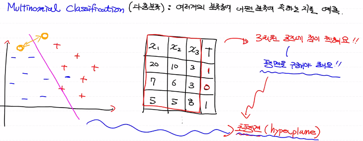


#### Multinomial Classification

> 다중 분류

- 여러 개의 분류 중에 어떤 분류에 속하는 지를 예측

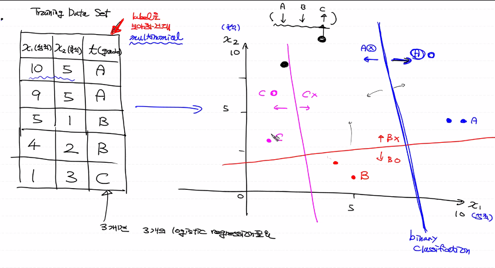


- 레이블이 세개면 3개의 logistic regression이 필요

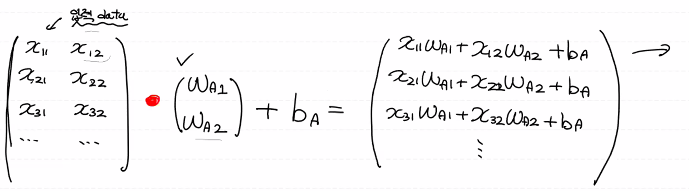

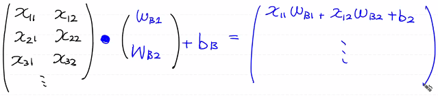


- 이 세개를 합치면 

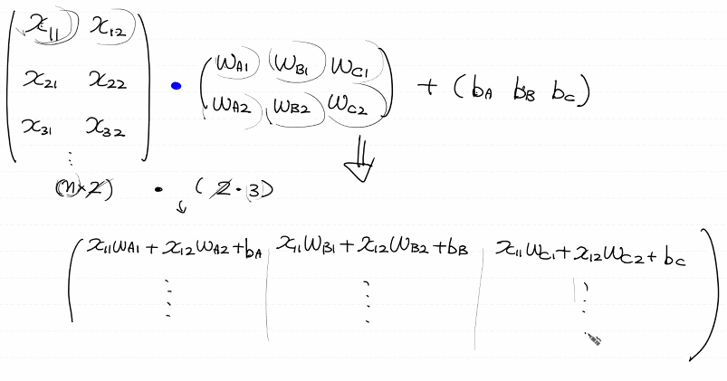

- 학습이 끝난 후 얻게 되는 결과

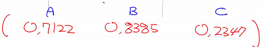


- 학습 루틴

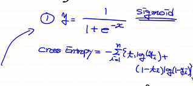

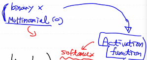


###### softmax

- softmax는 결과로 나온 확률 값들 (3개)의 합이 1이 되도록 하는 함수

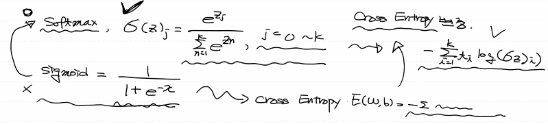

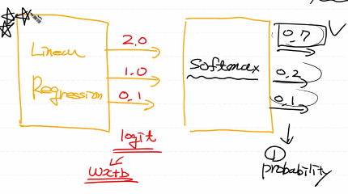


###### One-hot Encoding

- 레이블 데이터를 숫자로 이용하기 위해 행렬로 표현하는 것

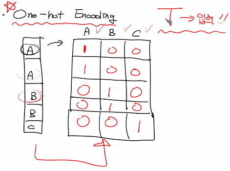


### BMI 예제

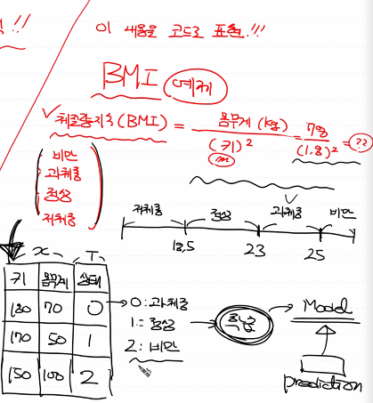


- skiprows= : 파일을 읽어올때 관련없는 부분 빼고 읽어올수 있음

```python
# %reset
# Multinomial Classification

import numpy as np
import pandas as pd
import tensorflow as tf
from scipy import stats
from sklearn.preprocessing import MinMaxScaler
import matplotlib.pyplot as plt

## Raw Data Loading
df = pd.read_csv('./data/bmi/bmi.csv', skiprows=3)
# display(df.head(), df.shape)


## 결측치 처리
# print(df.isnull().sum()) # 결측치가 없음


## 이상치 처리
# fig = plt.figure()
# fig_1 = fig.add_subplot(1,3,1)
# fig_2 = fig.add_subplot(1,3,2)
# fig_3 = fig.add_subplot(1,3,3)

# fig_1.boxplot(df['label'])
# fig_2.boxplot(df['height'])
# fig_3.boxplot(df['weight'])

# fig.tight_layout()
# plt.show()
# 이상치가 없음


## Training Data Set
x_data = df[['height', 'weight']].values
t_data = df['label'].values  # Oneg-hot encoding으로 추후 변환
# [0 1 2 0]  -> 기존 데이터
#   0 1 2    -> One-hot encoding
# [[1 0 0]
#  [0 1 0]
#  [0 0 1]
#  [1 0 0]]


## 정규화 
scaler_x = MinMaxScaler()
scaler_x.fit(x_data)
norm_x_data = scaler_x.transform(x_data)
# print(norm_x_data)


## One-hot encoding
sess = tf.Session()
norm_t_data = sess.run(tf.one_hot(t_data, depth=3))
# print(norm_t_data)


## Placeholder
X = tf.placeholder(shape=[None,2], dtype=tf.float32)
T = tf.placeholder(shape=[None,3], dtype=tf.float32)


## Weight & bias
W = tf.Variable(tf.random.normal([2,3]), name='weight')
b = tf.Variable(tf.random.normal([3]), name='bias')


## Hypothesis
logit = tf.matmul(X,W) + b
H = tf.nn.softmax(logit)  # softmax Activation function 이용


## loss function
loss = tf.reduce_mean(tf.nn.softmax_cross_entropy_with_logits_v2(logits=logit,
                                                                 labels=T))

## train
train = tf.train.GradientDescentOptimizer(learning_rate=1e-4).minimize(loss)


## 초기화
sess.run(tf.global_variables_initializer())


## 학습
for step in range(30000):
    
    _,W_val,b_val,loss_val = sess.run([train,W,b,loss],
                                      feed_dict={X: norm_x_data,
                                                 T: norm_t_data})
    
    if step % 3000 == 0:
        print(f'W: {W_val}, b: {b_val}, loss: {loss_val}')
```

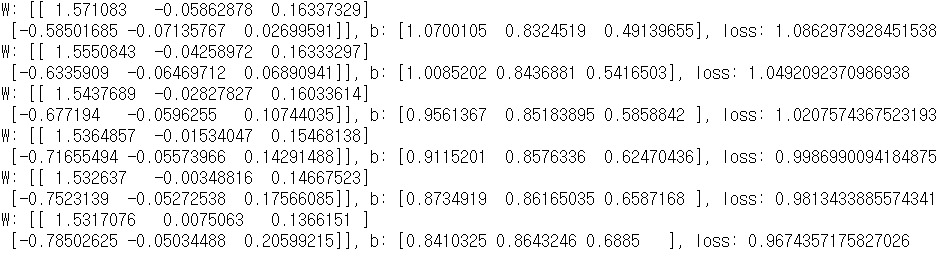


```python
# 잘 만들어진 모델인지 확인 하기

# prediction
height = 187
weight = 78
my_state = [[height,weight]]

result = sess.run(H, feed_dict={X:scaler_x.transform(my_state)})
print(result) 
```

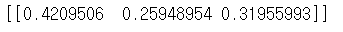