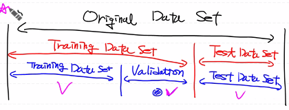
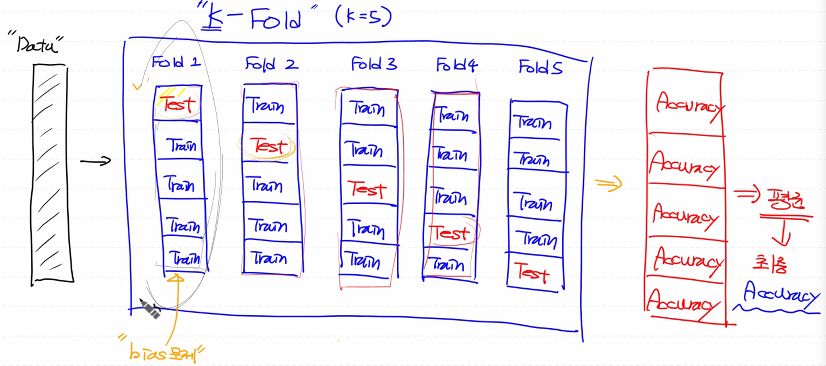
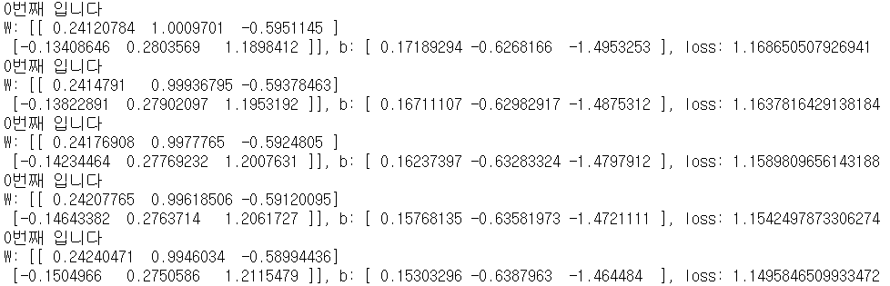
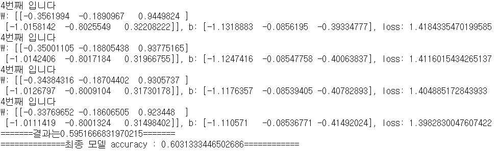
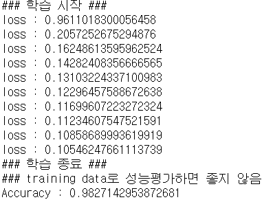

# day31_machine learning_TIL


##### Linear Regression

- sigmoid


##### Logistic Regression

- softmax


##### 머신러닝 기본 조건

1. 많은 양의 양질의 데이터

- 데이터 전처리
  - 결치 처리

  - 이상치 처리

  - 정규화 처리

    - Min-Max scaling(이상치에 민감함) - 0~1 사이의 실수로 스케일링

    - Standardization(표준화) - 동일한 척도로 스케일링 할 수 없음, 상대적으로 이상치에 둔감

    - Student's T 분포

      

2. Model 만들기
   - python (속도가 느림)
   - sklearn (정답 확인용)
   - tensorflow (구글)
   - pytouch (페이스북)

 

3. Evaluation(평가)

- Metric
  1. Precision
  2. Recall
  3. Accuracy(중요)
  4. F1
  5. Fall-out

- 성능 평가 시에 Training Data Set을 이용해서 Accuracy를 평가하면 안 됨


##### 성능평가 Data Set

###### Original Data Set

- Training Data Set: 학습 용도
- validation Data Set: 학습 도중 모델을 개선하기 위한 용도의 test용 Data Set
- Test Data Set: 최종 성능 평가




- Data Set 충분히 많지 않은 경우 문제

  -> Training Data Set이 작아짐 -> Underfitting(과소적합)  -> epoch을 늘려서 학습

  -> 우리 모델이 해당 Data만 잘 표현하고 일반적인 Data에 대해서는 적용이 안되는 현상

  -> Overfitting(과대적합) 


#### K-fold Cross Validation




##### BMI 예제 적용하기

- 내 풀이

```python
import numpy as np
import pandas as pd
from matplotlib import pyplot as plt
from sklearn.preprocessing import MinMaxScaler
import tensorflow as tf


# %reset
df = pd.read_csv('./data/bmi/bmi.csv', skiprows=3)

display(df)

# 결측치 없음
# df.isnull().sum()


# 이상치 없음
# fig = plt.figure()
# fig1 = fig.add_subplot(1,3,1)
# fig2 = fig.add_subplot(1,3,2)
# fig3 = fig.add_subplot(1,3,3)

# fig1.boxplot(df['label'])
# fig2.boxplot(df['height'])
# fig3.boxplot(df['weight'])

# fig.tight_layout()
# plt.show()


## placeholder
X = tf.placeholder(shape=[None,2], dtype=tf.float32)
T = tf.placeholder(shape=[None,3], dtype=tf.float32)


## Weight & bias
W = tf.Variable(tf.random.normal([2,3]), name='Weight')
b = tf.Variable(tf.random.normal([3]), name='bias')


## Hypothesis
logit = tf.matmul(X,W) + b
H = tf.nn.softmax(logit)


## loss function
loss = tf.reduce_mean(tf.nn.softmax_cross_entropy_with_logits_v2(logits=logit,
                                                                 labels=T))


## Train
train = tf.train.GradientDescentOptimizer(learning_rate=1e-4).minimize(loss)


# for문에서 x, t 데이터 나누고 for문 하나 더 열어서 학습
# 1. x,t 데이터 나누기
# 2. 정규화
# 3. one-hot encoding
# 4. 초기화
# 5. 학습

## k-fold (k=5)
fold_1 = df[:len(df)//5]
fold_2 = df[len(df)//5:len(df)//5*2]
fold_3 = df[len(df)//5*2:len(df)//5*3]
fold_4 = df[len(df)//5*3:len(df)//5*4]
fold_5 = df[len(df)//5*4:len(df)//5*5]


r = [fold_1, fold_2, fold_3, fold_4, fold_5]
# result = pd.concat(r[4:])
# display(result)
predict = tf.cast(H > 0.5, dtype=tf.float32)
correct = tf.equal(predict, T)
accuracy = tf.reduce_mean(tf.cast(correct, dtype=tf.float32))
acc_list = []
for i in range(0, len(r)):
    if i == 0:
        training_data = pd.concat(r[1:])
    elif i == len(r)-1:
        training_data = pd.concat(r[:i])
    else:
        r_f = pd.concat(r[:i])
        r_e = pd.concat(r[i+1:])
        training_data = pd.concat([r_f, r_e])
    test_x_data = r[i][['height','weight']].values
    tets_t_data = r[i]['label'].values
    
    x_data = training_data[['height','weight']].values
    t_data = training_data['label'].values
    
    
    # 정규화
    scaler_x = MinMaxScaler()
    scaler_x.fit(x_data)
    norm_x_data = scaler_x.transform(x_data)
    
    # one-hot encoding
    sess = tf.Session()
    norm_t_data = sess.run(tf.one_hot(t_data, depth=3))
    
    # 초기화
    sess.run(tf.global_variables_initializer())
    
    # 학습
    for step in range(3000):
        _,W_val,b_val,loss_val = sess.run([train,W,b,loss],
                                          feed_dict={X: norm_x_data,
                                                     T: norm_t_data})
        
        if step % 300 == 0:
            print(f'{i}번째 입니다')
            print(f'W: {W_val}, b: {b_val}, loss: {loss_val}')
    
    accuracy_val = sess.run(accuracy, feed_dict={X:scaler_x.transform(test_x_data),
                                                 T:sess.run(tf.one_hot(tets_t_data,depth=3))})
    print(f'=======결과는{accuracy_val}=======')
    acc_list.append(accuracy_val)
    
acc_result = sum(acc_list) / len(acc_list)
print(f'==============최종 모델 accuracy : {acc_result}============')

```






- 모범답안

```python
# BMI 예제
import numpy as np
import pandas as pd
import tensorflow as tf
from sklearn.preprocessing import MinMaxScaler
from sklearn.model_selection import train_test_split # train, test 분리
from sklearn.model_selection import KFold            # Cross Validation

# test data set은 우리의 최종 accuracy를 측정하기 위해 사용
# train data set은 K-Fold Cross validation을 이용해서 내부적인 평가를 진행


## Raw Data Loading
df = pd.read_csv('./data/bmi/bmi.csv', skiprows=3)
# display(df.head(), df.shape)


## 상관분석
# 종속변수(레이블)에 영향을 미치지 않는 feature(속성, 필드)를 제외하기 위해서
# -1 ~ 1 사이의 실수값이 나옴 pandas를 이용해 처리
# 필요치 않은 column을 제거


## 결측치 처리
# NaN이 있는 지 확인
# df.isnull() : DataFrame 안의 NaN에 대한 boolean mask 생성 (NaN이면 True)
# 결측치 존재시 다른 값으로 대체 -> KNN으로 예측
df.isnull().sum()


## 이상치 처리
# boxplot과 같은 graph를 이용해서 눈으로 확인
# turkey fense나 z-score 방식으로 이상치를 찾아내고 처리


## Data Split (Train Data와 Test Data로 구분)
x_data_train, x_data_test, t_data_train, t_data_test = \
train_test_split(df[['height','weight']],df['label'], 
                 test_size=0.3,
                 random_state=0)  # random_state : seed의 역할을 함


## Min-Max scaler로 정규화 진행
scaler = MinMaxScaler()
scaler.fit(x_data_train)
x_data_train_norm = scaler.transform(x_data_train)
x_data_test_norm = scaler.transform(x_data_test)

## 혼동을 줄이기 위한 변수 삭제
del x_data_train
del x_data_test


## Tensorflow 구현
sess = tf.Session()
t_data_train_onehot = sess.run(tf.one_hot(t_data_train, depth=3))
t_data_test_onehot = sess.run(tf.one_hot(t_data_test, depth=3))

del t_data_train
del t_data_test

# print(t_data_train_onehot)


## placeholder
X = tf.placeholder(shape=[None,2], dtype=tf.float32)
T = tf.placeholder(shape=[None,3], dtype=tf.float32)


## Weight & bias
W = tf.Variable(tf.random.normal([2,3]), name='weight')
b = tf.Variable(tf.random.normal([3]), name='bias')


## Hypothesis
logit = tf.matmul(X,W) + b
H = tf.nn.softmax(logit) # softmax


## loss function
loss = tf.reduce_mean(tf.nn.softmax_cross_entropy_with_logits_v2(logits=logit,
                                                                 labels=T))

## Train
train = tf.train.GradientDescentOptimizer(learning_rate=1e-4).minimize(loss)


## parameter
num_of_epoch = 1000
batch_size = 100

# 학습용 함수
def run_train(sess, train_x, train_t):
    print('### 학습 시작 ###')

    # 초기화
    sess.run(tf.global_variables_initializer())
    
    for step in range(num_of_epoch):
        total_batch = int(train_x.shape[0] / batch_size)
                        
        for i in range(total_batch):
            batch_x = train_x[i*batch_size:(i+1)*batch_size]
            batch_t = train_t[i*batch_size:(i+1)*batch_size]
            _,loss_val = sess.run([train,loss],
                                  feed_dict={X:batch_x,
                                             T:batch_t})
            
        if step % 100 == 0:
            print(f'loss : {loss_val}')
            
    print('### 학습 종료 ###')
    
    
# Accuracy 측정 (정확도)
# H => tf.argmax([0.1 0.3 0.6]) => 2
# P => tf.argmax([  0   0   1]) => 2
# argmax(제일 높은 값의 인덱스를 추출하는 함수)
predict = tf.argmax(H,1)
correct = tf.equal(predict, tf.argmax(T,1))
accuracy = tf.reduce_mean(tf.cast(correct, dtype=tf.float32))


# 학습
run_train(sess, x_data_train_norm, t_data_train_onehot)


# training data set을 이용해 성능 평가
print('### training data로 성능평가하면 좋지 않음')
result = sess.run(accuracy, feed_dict={X:x_data_train_norm,
                                       T:t_data_train_onehot})

print(f'Accuracy : {result}')
```

