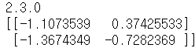

# day33_machine learning_Tensorflow 2.0


##### tensorflow 2.x

- 지금까지는 tf1.15버전 이용 - low level API를 이용해서 코딩

  내용을 이해하기 좋다

- 2.x 버전으로 넘어오면서 많은 변경점이 생김


- tensorflow는 google이 만든 Deep Learning용 Library
  - Tensorflow - google
  - pytouch - Facebook
  - kera - 프랑소와 솔레
  - MxNet


- TF2.0 '2019.09.30' 출시, 현재 2.4.1 출시
  - Eager Execution(즉시 실행) -> 코드의 직관성이 높아짐
    - session 삭제
    - 초기화 삭제
    - placeholder 삭제
  - keras가 High-level API로 공식적으로 지원


##### ML의 raise and fall (흥망성쇠)

- 1986년 제프리 힌트

- Back propagation (오차역전파) - 알고리즘에 의해 ML(Neural Network)이 다시 각광

- 2010년부터 Deep Learning이 본격적으로 발전 시작 

  대학 연구실과 기업 중심으로 Deep Learning library가 만들어지기 시작

  2010 벤지오의 'Theano' - 역사에 기록된 최초의 여성수학자 (피타고라스 아내) -> 2017년도 개발 중지

- 2013 버클리대학 중국 유학생(가양정) - caffe

- 2014 로난 touch3

- 2015 카네기멜로대학 MXNet

  google Tensorflow

  프랑소와 솔레 keras

- 2016 MS CNTK
- 2019 TF 2.0으로 개발

```python
import tensorflow as tf

print(tf.__version__)

# Weight & bias
W = tf.Variable(tf.random.normal([2,2], dtype=tf.float32))

# 1.15 버전은 session 필요
# 초기화 코드 필요


# 2.x 버전에서는
print(W.numpy())
```




```python
import tensorflow as tf

a = 50
b = 70

def my_sum(x,y):
    t1 = tf.convert_to_tensor(x)
    t2 = tf.convert_to_tensor(y)
    
    return t1 + t2

result = my_sum(a,b)

print(f'결과: {result.numpy()}') # 결과: 120


# placeholder를 더이상 사용하지 않음
```


##### Simple Linear Regression


##### Multiple Linear Regression


##### Multiple Logistic Regression


##### Multinomial Classification


##### Logistic Regression을 keras의 model을 이용해 표현


###### 코드로 표현

```python
# Keras를 이용한 코드
import tensorflow as tf
from tensorflow.keras.models import Sequential
from tensorflow.keras.layers import Flatten, Dense
# Flatten: 입력데이터를 1차원으로 변경(Input layer의 역할)
# Dense: 이전 레이어와 이후 레이어가 완벽하게 연결된 상태
from tensorflow.keras.optimizers import SGD, Adam

model = Sequential()  # 모델 생성
model.add(Flatten(input_shape=(1,)))
# Flatten을 이용해서 입력데이터가 몇차원이건 1차원으로 변경 후 넣겠다
model.add(Dense(2, activation='sigmoid'))
# Dense 안에 수가 로지스틱 수를 지칭

model.compile(optimizers=SGD(learning_rate=1e-3),
              loss='mse')

model.fit(x_data_train,
          t_data_train,
          epochs=10,
          batch_size=200,
          validation_split=0.2)

model.evaluate(x_data_test, t_data_test)
model.predict(x_data_predict)
model.save('./myModel.h5')
model = tf.keras.models.load_model('./myModel.h5')
```


### Ozone을 keras로 구현


```python
# Linear Regression
# Ozone data를 이용해서 학습 후 예측
# sklearn과 tensorflow 2.x버전으로 구현
# 결측치와 이상치 처리를 단순히 삭제하지 않고 적절한 값으로 대치

# 결측치 처리부터 알아보아요
# 데이터 분석 초기 단계, 예측 프로젝트 초기 단계에서 가장 힘든 일
# 결측치가 전체 데이터에서 비중이 얼마나 되는가?
# 결측치가 독립변수인지 종속변수인지

# 결측치 처리 방법 2가지
# 1. Deletion(결측치 제거)
#    결측지 제거 안에서도 LIstwise 삭제방식, Pairwise 삭제방식으로 나뉨
#    손쉽게 접근하는 방법 Listwise 삭제방식
#    => NaN이 존재할 시 행 자체를 삭제
#    => NaN을 제외한 다른 의미있는 데이터가 같이 삭제 된다는 게 문제
#    => 데이터가 충분히 많고 삭제되는 양이 적을 경우 최상의 방법
#    Pairwise는 의미있는 데이터가 삭제되는 것을 막기위해 행 전체를
#    => 삭제하지 않고 해당 값만 모든 처리에서 제외
#    => 오히려 문제가 발생할 여지가 있음, 비추
# 2. imputation(결측치 보간)
#    결측치 보간 안에서도 평균화 기법, 예측 기법이 있음
#    평균화 기법 => 평균(mean), 중앙값(median), 최빈값(mode)
#    => 장점: 쉽고 빠름, 단점: 통계분석에 영향을 많이 미침
#    예측기법은 결측치들이 완전히 무작위적으로 관찰되지 않았다는 것을 
#    가정 - 결측치들이 종속변수일 때 사용
#    우리 예제에서는 머신러닝 기법 중 KNN을 이용해서 Imputation을 
#    진행할 거에요. 일반적인 평균화 기법보다 조금 더 나은 결측치 보간법

# KNN(최근접이웃 알고리즘)
```


##### KNN(K-Nearest Neighbor)

> K 최근접이웃 알고리즘

- 장점: 상당히 간단한 모델


- Regression 기반으로 KNN을 활용 가능

  연속값들인 K들의 평균으로 결측치를 메울 수 있음

- KNN은 딱히 학습이라는 절차가 필요하지 않음

  새로운 데이터가 들어왔을 때 기존 데이터들과의 거리를 계산

- Instance-based Learning / Lazy Model

- KNN의 두개의 hyperparameter 존재

  1. 이웃의 수 (k)
     - k가 작을 경우: 지역적 특성을 너무 반영하는 과적합(overfitting)의 우려
     - k가 너무 클 경우: underfitting 학습이 덜 되는 문제, 평균값 구하는 것 내지 정규화 하는 것과 동일해짐
  2. 거리 측정 방식
     1. Euclidean distance(유클라디안 거리): 직선거리 구하는 것, 가장 많이 사용
     2. Manhattan distance(맨하탄 거리): 좌표축 방향으로만 이동
     3. Mahalnanobis distance(마할나노비스 거리): 분산과 공분산을 거리에 반영 

- KNN은 반드시 정규화

  장점: 데이터 수가 많으면 상당히 정확한 결과를 도출

  단점: 데이터 수가 많으면 모든 거리를 재야하기 때문에 시간이 오래 걸림

- K=1일 때

  1-NN의 오차범위가 이상적인 오차범위의 2배보다 같거나 작음

  => 어느정도의 성능이 보장 된다

```python
# KNN을 알아보았어요
# sklearn을 이용해서 BMI 예제를 가지고 Logistic Regression을 이용한
# accuracy값과 KNN을 이용한 accuracy 값을 비교해보아요

import numpy as np
import pandas as pd
from sklearn.preprocessing import MinMaxScaler
from sklearn.model_selection import train_test_split
from sklearn.linear_model import LogisticRegression
from sklearn.neighbors import KNeighborsClassifier

# Raw Data Loading
df = pd.read_csv('./data/bmi/bmi.csv', skiprows=3)

# data split
x_data_train, x_data_test, t_data_train, t_data_test = \
train_test_split(df[['height', 'weight']], # x_data
                 df['label'],              # t_data
                 test_size=0.3,
                 random_state=0)

# 정규화
scaler = MinMaxScaler()
scaler.fit(x_data_train)
x_data_train_norm = scaler.transform(x_data_train)
x_data_test_norm = scaler.transform(x_data_test)

# Logistic Regression
model = LogisticRegression()
model.fit(x_data_train_norm, t_data_train) # onehot encoding 안해도 됨
print(model.score(x_data_test_norm,t_data_test)) # 0.9845


## KNeighborClassifier
knn_classifier = KNeighborsClassifier(n_neighbors=3)
knn_classifier.fit(x_data_train_norm, t_data_train)
print(knn_classifier.score(x_data_test_norm, t_data_test)) # 0.998
```