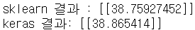

# day34_machine learning_Tensorflow 2.0


### Tensorflow 2.0


#### Linear Regression

##### Ozone data를 이용해서 구현

- 결측치 처리

  - deletion

  - imputation(결측치 보간) 

    - 평균화 기법(mean, median, mode)

      독립변수, 종속변수가 결측치일 때 사용

    - 예측기법(KNN)

      종속변수가 결측치일 때 사용

###### KNN

- 최근접이웃 알고리즘
  - hyperparameter
    - k
    - 거리계산 방식


###### Ozone 예제 전처리 과정

1. 독립변수(solar, wind, temp)에 대한 결측치를 찾아서 -> median으로 처리

   mean을 이용하지 않는 이유는 이상치 때문

2. 독립변수에 대한 이상치를 검출해서 mean으로 처리
3. 종속변수에 대한 이상치를 검출해서 mean으로 처리
4. 정규화 진행
5. 종속변수에 대한 결측치 처리를 KNN을 이용해서 Imputation

```python
import numpy as np
import pandas as pd
from scipy import stats # 이상치 처리
from sklearn.preprocessing import MinMaxScaler # 정규화 처리
from sklearn.neighbors import KNeighborsRegressor # KNN
import warnings

warnings.filterwarnings(action='ignore')

# Raw Data Loading
df = pd.read_csv('./data/ozone/ozone.csv')
display(df)

# 독립변수 & 종속변수
x_data = df[['Solar.R', 'Wind', 'Temp']]
t_data = df['Ozone']

# 1. 독립변수에 대한 결측치를 검출한 후 Imputation 진행(median)
for col in x_data.columns:
    col_median = np.nanmedian(x_data[col]) #nanmedian(nan 제외 중앙값)
    x_data[col].loc[x_data[col].isnull()] = col_median
    
# 2. 독립변수에 대한 이상치를 검출한 후 mean 값으로 처리
zscore_threshold = 1.8

for col in x_data.columns:
    outlier = x_data[col][(np.abs(stats.zscore(x_data[col])) > zscore_threshold)]
    col_mean = np.mean(x_data.loc[~x_data[col].isin(outlier),col])
    x_data.loc[x_data[col].isin(outlier),col] = col_mean
    
# 3. 종속변수에 대한 이상치를 검출한 후 mean값 처리
outlier = t_data[(np.abs(stats.zscore(t_data)) > zscore_threshold)]
col_mean = np.mean(t_data[~t_data.isin(outlier)])
t_data[t_data.isin(outlier)] = col_mean

# 4. 정규화
scaler_x = MinMaxScaler()
scaler_t = MinMaxScaler()

scaler_x.fit(x_data.values)
scaler_t.fit(t_data.values.reshape(-1,1))

x_data_norm = scaler_x.transform(x_data.values)
t_data_norm = scaler_t.transform(t_data.values.reshape(-1,1)).ravel()

# 5. 종속변수에 대한 결측치를 KNN을 이용하여 Imputation 처리
# KNN 학습에 사용될 x_data와 t_data를 추려내야 해요
# 종속변수가 nan인 값들을 제거한 후 변수에 저장
x_data_train_norm = x_data_norm[~np.isnan(t_data_norm)]
t_data_train_norm = t_data_norm[~np.isnan(t_data_norm)]

# model 생성
knn_regressor = KNeighborsRegressor(n_neighbors=2)
knn_regressor.fit(x_data_train_norm, t_data_train_norm)

# knn 분석 결과를 종속변수 nan값에 저장
knn_predict = knn_regressor.predict(x_data_norm[np.isnan(t_data_norm)])
t_data_norm[np.isnan(t_data_norm)] = knn_predict

## 최종적으로 얻은 데이터
# 독립변수 : x_data_norm
# 종속변수 : t_data_norm

# 이 데이터로 sklearn과 tensorflow 2.x로 구현 진행
```


##### sklearn과 tensorflow 2.x 비교

```python
from sklearn.linear_model import LinearRegression
from tensorflow.keras.models import Sequential
from tensorflow.keras.layers import Flatten, Dense
from tensorflow.keras.optimizers import SGD

test_data = [[310, 15, 80]] # 모델 생성 후 prediction할 데이터

# sklearn
model = LinearRegression()
model.fit(x_data_norm, t_data_norm)
result = model.predict(scaler_x.transform(test_data))
print(f'sklearn 결과 : {scaler_t.inverse_transform(result.reshape(-1,1))}')

# tensorflow 2.x 구현
keras_model = Sequential()

# Flatten은 들어오는 값을 1차원으로 바꿈
# => 이유는 그렇게 해야만 이러한 값이 여러개 들어왔을 때 2차원이 되어
# => 행렬곱연산이 가능해진다
keras_model.add(Flatten(input_shape=(3,)))
keras_model.add(Dense(1, activation='linear'))

keras_model.compile(optimizer=SGD(learning_rate=1e-2), loss='mse')

keras_model.fit(x_data_norm,
                t_data_norm,
                epochs=5000,
                verbose=0)

keras_result = keras_model.predict(scaler_x.transform(test_data))

print(f'keras 결과: {scaler_t.inverse_transform(keras_result.reshape(-1,1))}')

```




#### titanic 구현

```python
# titanic
# sklearn으로 accuracy 측정
# tensorflow로 accuracy 측정해서 비교
# Logistic Regression을 이용해서 Binary Classification 수행

import numpy as np
import pandas as pd
import tensorflow as tf
from tensorflow.keras.models import Sequential
from tensorflow.keras.layers import Flatten, Dense
from tensorflow.keras.optimizers import SGD
from sklearn.preprocessing import MinMaxScaler
from sklearn.model_selection import train_test_split
from sklearn.linear_model import LogisticRegression
from scipy import stats

# Raw Data Loading
df = pd.read_csv('./data/titanic/train.csv')
# display(df)
# Feature Engineering

# 필요없는 column은 삭제
df = df.drop(['PassengerId','Name','Ticket','Fare','Cabin'],
             axis=1, inplace=False)
# display(df)
df['Family'] = df['SibSp'] + df['Parch']
df.drop(['SibSp','Parch'], axis=1, inplace=True)
# display(df)

sex_dict = {'male': 0, 'female': 1}
df['Sex'] = df['Sex'].map(sex_dict)
# display(df)

embarked_dict = {'S':0, 'C':1, 'Q':2}
df['Embarked'] = df['Embarked'].map(embarked_dict)
# display(df)

# 결측치 처리
# 'Age'에 결측치가 존재, 'Embarked'에도 결측치가 있음
# 'Age'는 median으로 'Embarked'는 최빈값(mode)로 결측치 처리
df.loc[df['Age'].isnull(),'Age'] = np.nanmedian(df['Age'].values)
# print(stats.mode(df['Embarked'], nan_policy='omit')[0])
df.loc[df['Embarked'].isnull(),'Embarked'] = 0


# 이상치 처리
# 실데이터이기 때문에 이상치 처리는 하지 않음

# Age를 categorical value로 변경
def age_category(age):
    if (age >= 0) & (age < 25):
        return 0
    elif (age >= 25) & (age < 50):
        return 1
    else:
        return 2
    
df['Age'] = df['Age'].map(age_category)
display(df)

# 정규화 처리

# train test split

x_data_train, x_data_test, t_data_train, t_data_test = \
train_test_split(df.drop('Survived', axis=1, inplace=False),
                 df['Survived'],
                 test_size=0.3,
                 random_state=0)

# 정규화
scaler = MinMaxScaler()
scaler.fit(x_data_train)

x_data_train_norm = scaler.transform(x_data_train)
x_data_test_norm = scaler.transform(x_data_test)

#####
model = LogisticRegression()
model.fit(x_data_train_norm, t_data_train)
result = model.score(x_data_test_norm, t_data_test)
print(f'sklearn의 accuracy : {result}') # 0.7947761194029851

#####
keras_model = Sequential()

keras_model.add(Flatten(input_shape=(x_data_train_norm.shape[1],)))
keras_model.add(Dense(1, activation='sigmoid'))

keras_model.compile(optimizer=SGD(learning_rate=1e-2),
                    loss='binary_crossentropy',
                    metrics=['accuracy'])

keras_model.fit(x_data_train_norm,
                t_data_train,
                epochs=1000,
                verbose=0)

keras_result = keras_model.evaluate(x_data_test_norm, t_data_test)
print(f'keras 결과 : {keras_result}') # 0.7910447716712952
```

