# day35_machine learning_Tensorflow 2.0


##### sklearn MNIST 구현

```python
import numpy as np
import pandas as pd
from sklearn.preprocessing import MinMaxScaler
from sklearn.linear_model import LogisticRegression
from sklearn.model_selection import train_test_split
from sklearn.metrics import classification_report
import warnings

warnings.filterwarnings(action='ignore')

# Raw Data Loading
df = pd.read_csv('./data/digit-recognizer/train.csv')

# 결측치와 이상치 처리
# feature engineering
# 학습에 필요없는 column을 삭제
# 기존 column들을 이용해서 새로운 column 생성
# Binning 처리(연속적인 숫자값을 categorical value로 변환)

# display(df.head(), df.shape)

# 독립변수와 종속변수 분리
x_data = df.drop('label', axis=1, inplace=False)
t_data = df['label']  # one_hot 처리 안해도 됨

# 정규화 처리
scaler = MinMaxScaler()
scaler.fit(x_data)
x_data_norm = scaler.transform(x_data)

# Data Split
x_data_train, x_data_test, t_data_train, t_data_test = \
train_test_split(x_data_norm, t_data, test_size=0.3, random_state=0)

# sklearn 구현
# Logistic Regression은 solver 지정
# default로 사용되는 solver는 lbfgs라는 solver -> 작은 데이터에 최적화
# 데이터량이 많아지면 performance가 좋지 않음
# 일반적으로 데이터량이 많은 경우 sag(stochastic Average Gradient Descent)
# 이 sag의 확장판이 => saga

sklearn_model = LogisticRegression(solver='saga')
sklearn_model.fit(x_data_train, t_data_train)
print('sklearn result : ')
print(classification_report(t_data_test, sklearn_model.predict(x_data_test)))
```

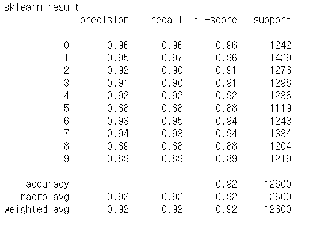


##### tensorflow 2.x로 구현

```python
# tensorflow 2.x으로 구현

# %reset

import numpy as np
import pandas as pd
import tensorflow as tf
from tensorflow.keras.models import Sequential
from tensorflow.keras.layers import Flatten, Dense
from tensorflow.keras.optimizers import SGD
from sklearn.preprocessing import MinMaxScaler
from sklearn.model_selection import train_test_split
from sklearn.metrics import classification_report
from matplotlib import pyplot as plt
import warnings

# Raw Data Loading
df = pd.read_csv('./data/digit-recognizer/train.csv')

# 독립변수와 종속변수 분리
x_data = df.drop('label', axis=1, inplace=False)
t_data = df['label']  # 설정만 하면 one_hot 처리 안해도 됨

# 정규화 처리
scaler = MinMaxScaler()
scaler.fit(x_data)
x_data_norm = scaler.transform(x_data)

# Data Split
x_data_train, x_data_test, t_data_train, t_data_test = \
train_test_split(x_data_norm, t_data, test_size=0.3, random_state=0)

# Tensorflow 2.x 구현
keras_model = Sequential()
keras_model.add(Flatten(input_shape=(x_data_train.shape[1],)))
keras_model.add(Dense(10, activation='softmax'))

# 값을 어떤 알고리즘으로 갱신해나갈 거니? - 옵티마이저
keras_model.compile(optimizer=SGD(learning_rate=1e-1),
                    loss='sparse_categorical_crossentropy',
                    metrics=['sparse_categorical_accuracy'])
                    # sparse: onehot 인코딩 안했을때 사용
    
history = keras_model.fit(x_data_train,
                          t_data_train,
                          epochs=100, # 추후에 history를 이용해서 조절
                          batch_size=512,
                          verbose=0,
                          validation_split=0.2)

print(keras_model.evaluate(x_data_test,t_data_test))
```

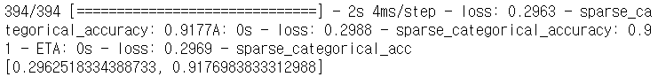


##### 예측

```python
# history 객체 내에 history 속성 => dict
print(type(history.history))
print(history.history.keys())
plt.plot(history.history['sparse_categorical_accuracy'], color='r')
# epoch 당 training data를 이용한 accuracy

plt.plot(history.history['val_sparse_categorical_accuracy'], color='b')
# epoch 당 validation data를 이용한 accuracy

plt.show()
```

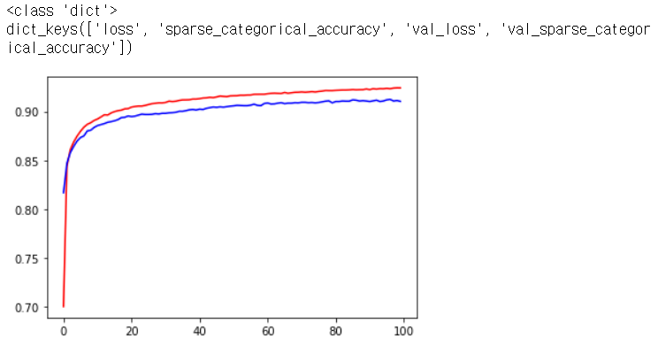


### 정리

#### Machine Learning


##### Regression

- linear Regression

- logistic Regression
  - binary classification (sklearn, tensorflow 구현)
  - Multinomial classification

- KNN
- SVM(support vector machine)
- Decision Tree
- Neural Network(신경망)
  - Deep Learning
- 기타 등등(강화학습, Naive Bayes)


#### Neural Network

- AI를 구현하기 위해 초창기에 사람의 뇌를 연구

  'neuron' (뉴런)이라고 불리는 뇌의 신경세포의 동작으로 '사고' 과정이 일어남

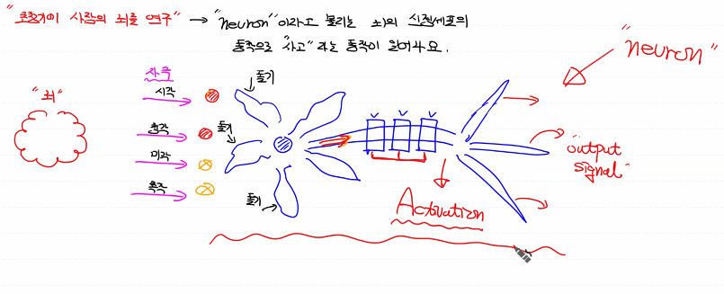

- 시각, 청각, 미각, 촉각 등 중요한 것에 가중치를 두고 activation


- 로지스틱과 동일하게 동작

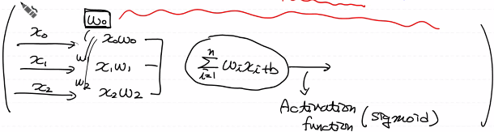


- 이런 내용을 가지고 1960년에 '로잰 블렛' -> 'Perceptron' (인공신경망)

  다수의 신호를 입력 받아서 하나의 신호를 출력하는 구조

- Single - Layer Perceptron Network

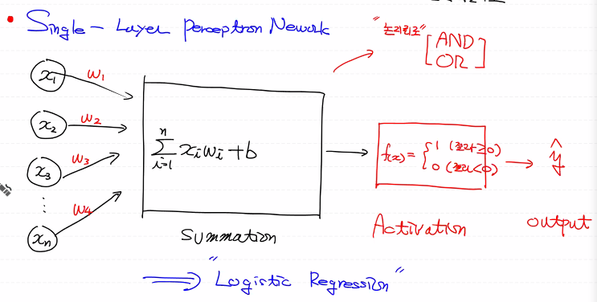

- perceptron 하나가 로지스틱 하나라고 생각하면 됨

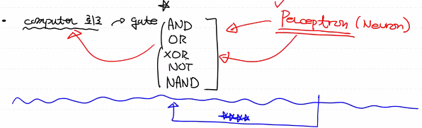


- perceptron(logistic Regression)

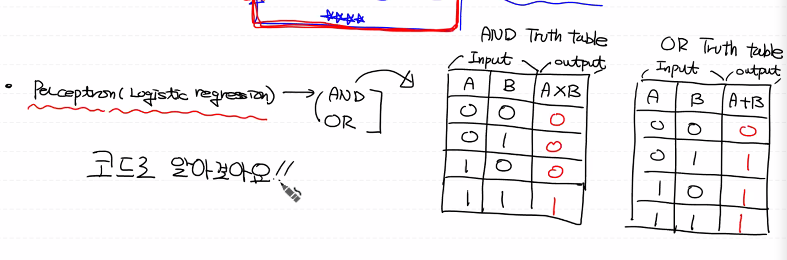

- logistic Regression으로 and, or 진리표 학습

  

##### Tensorflow 1.15 버전으로 구현

```python
# Logistic Regression(Perceptron)
# AND, OR Gate를 학습시켜서 Prediction 할 수 있는가
# Tensorflow 1.15로 구현
# 진리표(Truth Table)를 학습하고 예측을 정확하게 하는지 알아보아요

import numpy as np
import tensorflow as tf
from sklearn.metrics import classification_report

# training data set
x_data = np.array([[0,0],
                   [0,1],
                   [1,0],
                   [1,1]], dtype=np.float32)
# AND t_data
t_data = np.array([[0], [0], [0], [1]], dtype=np.float32)

# placeholder
X = tf.placeholder(shape=[None,2], dtype=tf.float32)
T = tf.placeholder(shape=[None,1], dtype=tf.float32)

# Weight & bias
W = tf.Variable(tf.random.normal([2,1]))
b = tf.Variable(tf.random.normal([1]))

# Hypothesis
logit = tf.matmul(X,W) + b
H = tf.sigmoid(logit)

# loss
loss = tf.reduce_mean(tf.nn.sigmoid_cross_entropy_with_logits(logits=logit,
                                                              labels=T))

# Train
train = tf.train.GradientDescentOptimizer(learning_rate=1e-2).minimize(loss)

# Session & 초기화
sess = tf.Session()
sess.run(tf.global_variables_initializer())

for step in range(30000):
    _, loss_val = sess.run([train, loss], feed_dict={X:x_data,
                                                     T:t_data})
    
    if step % 3000 == 0:
        print(f'loss : {loss_val}')
```

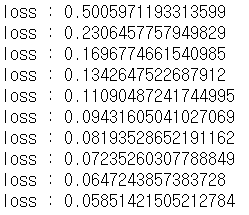

- 예측

```python
# Accuracy
accuracy = tf.cast(H >= 0.5, dtype=tf.float32)
result = sess.run(accuracy, feed_dict={X:x_data})

print(classification_report(t_data.ravel(), result.ravel()))
```

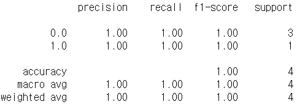

- accuracy 값이 1이 나오므로 AND 게이트 진리표를 제대로 학습할 수 있구나

```python
# OR t_data
t_data = np.array([[0], [1], [1], [1]], dtype=np.float32)
```

- t_data만 변경 후 실행했더니 OR 진리표도 제대로 학습할 수 있구나 


- XOR 진리표를 학습할 수 없음

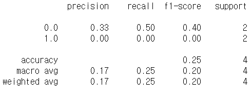

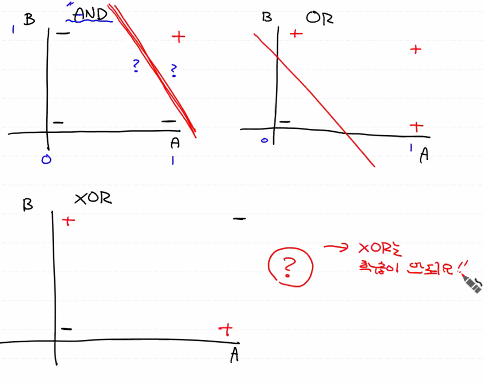

- 데이터를 구분 수 있는 선을 그을 수가 없다


- 어떻게 하면 XOR을 학습시켜서 prediction할 수 있을까

- 1969년 MIT AI Lab founder '민스키'

  - single layer perceptron은 불가

  - MLP(multi layer perceptron)은 가능 - 수학적 증명

    수학적으로 증명했으나 구현하기가 쉽지 않다

