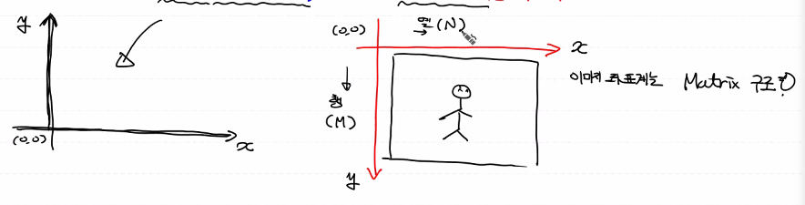
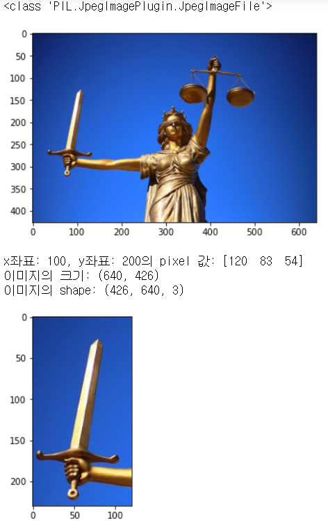
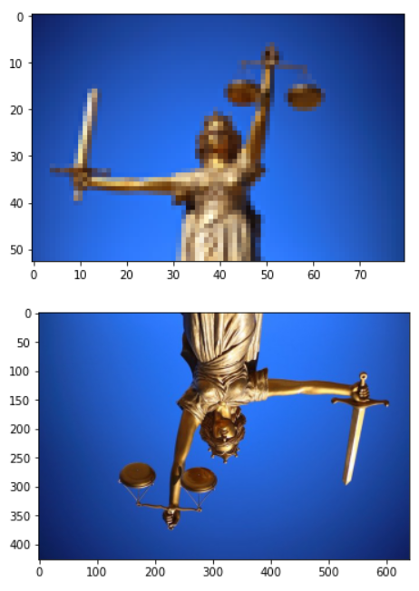
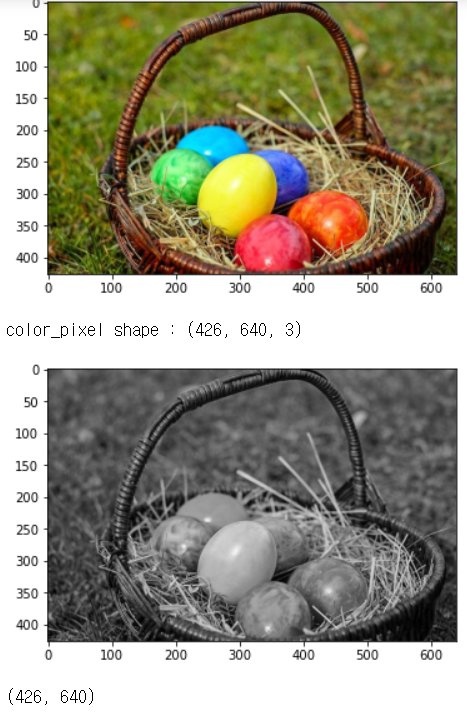
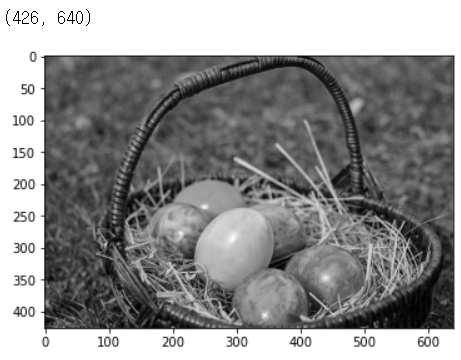
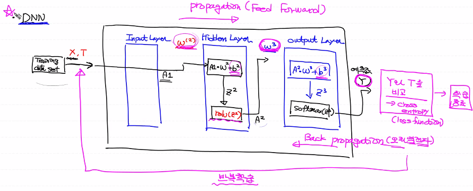

# day37_deep learning_CNN


#### CNN

- 이미지 학습 및 예측

  데이터 이미지에 대한 기본적인 이해


- 이미지를 이루고 있는 가장 기본적인 단위 -> pixel

  해상도 -> pixel의 개수

- 이미지는 우리가 사용하는 데카르트 좌표계(2차원)과 다른 이미지 좌표계를 사용



- 2차원 이미지를 ndarray로 표현

  pixel[행(M), 열(N)]  


##### Digital Image의 형태

- binary image(이진 이미지): 

  각 pixel의 값을 0(어두움)과 1(밝음)로 표현

  각 pixel을 1 bit만 있으면 표현이 가능

  '실제로는 1개의 pixel을 8 bit로 사용' 사용 안 한 7비트는 낭비

  이걸 사용할 필요가 없음


- gray-scale Image(흑백 이미지):

  각 pixel의 값을 0~255의 값으로 표현

  1 pixel에 8 bit 2^8 = 256개


- color image(컬러 이미지):

  3차원, 크기 가장 큼

  각 pixel에 3개의 채널이 포함

  각 채널은 빛의 3원색 (red, green, blue 색상값으로 표현)

  각 색상값마다 8 bit씩 사용 24 bit -> True color

  - JPG file : 3채널 (RGB)
  - PNG file: 4채널 (RGBA)


##### 이미지 처리 코드

```python
import numpy as np
from PIL import Image
import matplotlib.pyplot as plt

# ./data/img/
img = Image.open('./data/img/justice.jpg')
print(type(img)) # <class 'PIL.JpegImagePlugin.JpegImageFile'>

plt.imshow(img)
plt.show()

pixel = np.array(img)
# pixel = (y좌표, x좌표)
# 이미지는 기본적으로 3차원 (y축, x축, RGB값)
print(f'x좌표: {100}, y좌표: {200}의 pixel 값: {pixel[200,100]}')

print(f'이미지의 크기: {img.size}') # (640, 426)
print(f'이미지의 shape: {pixel.shape}') # (426, 640, 3)

# 이미지에 대한 기본 처리

# 이미지 저장
img.save('./data/img/my_img.jpg')

# 이미지 잘라내기 (좌상 우하)
crom_img = img.crop((30,100,150,330))
plt.imshow(crom_img)
plt.show()

# 이미지 크기 변경
resize_img = img.resize((int(img.size[0]/8),int(img.size[1]/8)))
plt.imshow(resize_img)
plt.show()

# 이미지 회전
rotate_img = img.rotate(180)
plt.imshow(rotate_img)
plt.show()

```






###### color Image -> gray-scale로 변환

```python
# color image를 gray-scale image로 변환
# %reset

import numpy as np
from PIL import Image
import matplotlib.pyplot as plt

color_img = Image.open('./data/img/fruits.jpg')
plt.imshow(color_img)
plt.show()

color_pixel = np.array(color_img) # 3차원 ndarray 생성
print(f'color_pixel shape : {color_pixel.shape}') # (426, 640, 3)

# 흑백이미지로 변경
# 흑백이미지를 3차원 데이터로 표현
# 각 pixel의 RGB값의 평균을 구해서 각각의 R,G,B값으로 설정
gray_pixel = color_pixel.copy()

for y in range(gray_pixel.shape[0]):
    for x in range(gray_pixel.shape[1]):
        gray_pixel[y,x] = int(np.mean(gray_pixel[y,x]))
        
plt.imshow(gray_pixel)
plt.show()

# 흑백 이미지는 2차원으로 표현 가능
gray_2d_pixel = gray_pixel[:,:,0]
print(gray_2d_pixel.shape) # (426, 640)
plt.imshow(gray_2d_pixel, cmap='gray')
plt.show()

# 지금 우리가 가지고 있는 건 흑백처리된 ndarray
# 이 데이터를 이용해서 이미지를 파일로 저장
gray_2d_image = Image.fromarray(gray_2d_pixel)
gray_2d_image.save('./data/img/my_gray_img.jpg')

```






##### CNN

> Convolutional Neural Network

- convnet (컨브넷), '합성곱 신경망'


- ###### DNN (Deep Neural Network)

  일반적인 deep learning의 구조

  

- FC Layer(Fully Connected Layer)

  일반적으로 DNN과 같은 의미로 사용 X


##### Image 학습

- image의 데이터를 있는 그대로 학습하는 방식은 좋지 않음


##### CNN

- 이미지를 분류하기 위해 이미지의 패턴을 이용하는 deep learning 방법론
- 이미지의 패턴을 수동으로 추출하지 않음, 알고리즘을 이용해서 추출 

- FC Layer로만 구성된 DNN의 입력데이터는 1차원으로 한정

  입력데이터: 입력데이터 1개, 이미지 1장

  - CNN이 나오기 전에는 이미지 인식을 우리가 했던 MNIST 처럼 Flatten()을 사용해서 1차원으로 변형 후 FC Layer에 입력
  - 이는 이미지의 형상(feature)는 고려하지 않고 많은 양의 데이터를 직접 이용해서 학습 -> 시간이 오래걸림


##### DNN




##### CNN

