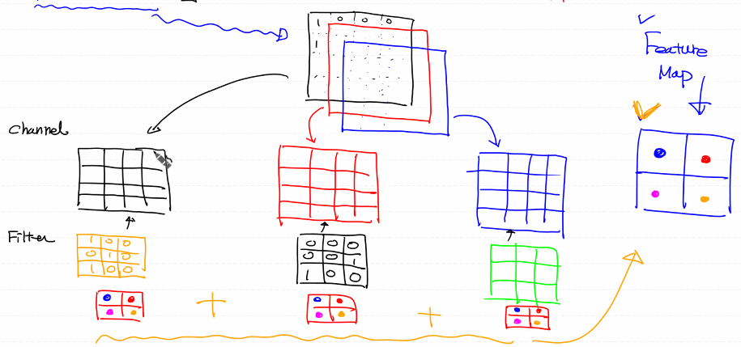
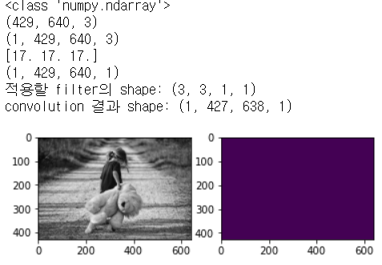
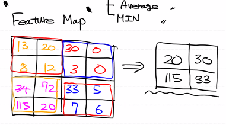

# day38_deep learning_CNN


#### CNN

> Convolutional Neural Network

- 기존 DNN을 이용해서 이미지를 학습하는데는 여러가지 한계점이 존재
- 사람이 그림을 판별하듯 이미지의 특징을 추출해서 학습, 예측하는 방법인 CNN 등장


- pooling layer가 순차적으로 나오진 않음


##### Convolution

> 합성곱

- 합성곱 연산은 두 함수 f,g가 존재할 때 하나의 함수를 반전(reverse), 전이(shift) 시킨 후 다른 함수와 곱함 => 이 결과를 적분
- 같은 위치에 있는 요소끼리 곱한 후 그 결과값들의 합


##### Channel

- 이미지 pixel의 하나하나는 실수값

  color인 경우 각 pixel을 RGB 3개의 실수로 표현

  -> color 이미지를 3차원으로 표현 (R, G, B 3개의 Channel로 구성)

  -> gray-scale(흑백) 이미지는 2차원 데이터로 표현이 가능

  ​	-> (height, width, 1) -> 3차원 (Channel : 1)

  ​	-> (height, width, 3) -> 3차원 (Channel : 3)

  ​	-> (height, width) -> 2차원

- 일반적으로 이미지를 처리할 때 전처리 과정을 통해 gray-scale 이미지로 변환 후 처리

  즉, Channel을 '1'로 만들어서 처리


##### Filter & Stride

- CNN에서 Filter -> 이미지의 특징을 찾아내기 위한 공용 parameter

  이 Filter를 다른 말로 Kernel이라고 부름

  -> 일반적으로 3x3, 4x4와 같은 정방형 형태로 정의

  ​	이 Filter 안의 구성요소들이 CNN에서 학습의 대상이 됨

- 이런 Filter를 하나만 사용하나요?

  -> 이미지의 특징들을 다양하게 추출하기 위해 여러개의 Filter를 사용

  ​	이런 Filter를 크기가 큰 Filter보다 크기가 작은 Filter와 여러개를 사용하는 게 좋음

  ​	-> 결국 3x3 size Filter를 이용


- Filter를 이미지 위에서 지정된 간격만큼 이동하면 convolution 수행


- 이미지의 크기 (4x4)

  이미지의 Channel : 3 를 입력으로 Feature Map을 생성

  Filter (3 Channel)

  Stride



- Filter가 여러개면 Feature Map도 여러개


##### Padding

- 입력이미지 - Stride, Filter -> Feature Map

  이 과정을 거치면서 입력데이터보다 크기가 계속해서 작아짐

  지속적으로 작아지는 걸 방지하기 위해 Padding 처리

- Padding 입력데이터 외곽에 '0'을 채워서 처리


- code로 padding 처리할 때 2가지 옵션

  VALID: padding x, 입력보다 출력결과가 크기가 작음

  SAME: padding o, 입력과 출력 결과 크기가 같음

```python
import numpy as np
import tensorflow as tf

# 입력 이미지의 형태
# (이미지의 개수, height, widht, channel) => 4차원 데이터
# (1, 3, 3, 1)
# 위와 같은 shape을 가지는 ndarray 생성
# image = np.array([
#     [
#         [
#             [1],[2],[3]
#         ],
#         [
#             [1],[2],[3]
#         ],
#         [
#             [1],[2],[3]
#         ]
#     ]
# ], dtype=np.float32)

image = np.array([[[[1],[2],[3]],
                   [[4],[5],[6]],
                   [[7],[8],[9]]]], dtype=np.float32)

print(image.shape)

# filter(kernel)의 형태
# (filter height, filter width, channel, filter의 개수)
# (2, 2, 1, 1)
weight = np.array([[[[1]],[[1]]],
                   [[[1]],[[1]]]], dtype=np.float32)
print(weight.shape)

# stride: 1 (가로 1, 세로 1)
# padding 처리: VALID (padding 처리 안할거)

conv2d = tf.nn.conv2d(image,
                      weight,
                      strides=[1,1,1,1],
                      padding='VALID')
sess = tf.Session()
result = sess.run(conv2d)
print(f'feature map : \n{result}')
print(result.shape)
# convolution의 결과
# (이미지의 개수, height, width, channel)
# channel은 filter의 개수와 같음
# (1, 2, 2, 1)
```

```python
import numpy as np
import tensorflow as tf

# 입력 이미지의 형태
# (이미지의 개수, height, widht, channel) => 4차원 데이터
# (1, 3, 3, 3) - 컬러 이미지

image = np.array([[[[1,2,3],[1,2,3],[1,2,3]],
                   [[1,2,3],[1,2,3],[1,2,3]],
                   [[1,2,3],[1,2,3],[1,2,3]]]], dtype=np.float32)

print(image.shape)

# filter(kernel)의 형태
# (filter height, filter width, channel, filter의 개수)
# (2, 2, 3, 2)
weight = np.array([[[[1,1],[1,1],[1,1]],
                    [[1,1],[1,1],[1,1]]],
                   [[[1,1],[1,1],[1,1]],
                    [[1,1],[1,1],[1,1]]]], dtype=np.float32)
print(weight.shape)

# stride: 1 (가로 1, 세로 1)
# padding 처리: VALID (padding 처리 안할거)

conv2d = tf.nn.conv2d(image,
                      weight,
                      strides=[1,1,1,1],
                      padding='VALID')
sess = tf.Session()
result = sess.run(conv2d)
print(f'feature map : \n{result}')
print(result.shape)
# convolution의 결과
# (이미지의 개수, height, width, channel)
# channel은 filter의 개수와 같음
# (1, 2, 2, 2)
```


- 실제 이미지로 테스트

```python
# 실제 이미지로 테스트
import numpy as np
import tensorflow as tf
import matplotlib.pyplot as plt
import matplotlib.image as img

figure = plt.figure()
fig_1 = figure.add_subplot(1,2,1)
fig_2 = figure.add_subplot(1,2,2)

ori_image = img.imread('./data/img/girl-teddy.jpg')
fig_1.imshow(ori_image)


print(type(ori_image)) # <class 'numpy.ndarray'>
print(ori_image.shape) # (429, 640, 3)
# (429, 640, 3) => (1, 429, 640, 3)
input_image = ori_image.reshape((1,) + ori_image.shape)
print(input_image.shape) # (1, 429, 640, 3)

input_image = input_image.astype(np.float32) # 실수데이터로 전환
print(input_image[0,0,0,:])
channel_1_input_image = input_image[:,:,:,0:1]
print(channel_1_input_image.shape) # (1, 429, 640, 1)

# filter
# (3, 3, 1, 1)
weight = np.array([[[[0]],[[0]],[[0]]],
                   [[[0]],[[0]],[[0]]],
                   [[[0]],[[0]],[[0]]]])
print(f'적용할 filter의 shape: {weight.shape}') # (3, 3, 1, 1)

# stride: 1
# padding: VALID

conv2d = tf.nn.conv2d(channel_1_input_image,
                      weight,
                      strides=[1,1,1,1],
                      padding='VALID')
sess = tf.Session()
result = sess.run(conv2d)
print(f'convolution 결과 shape: {result.shape}')
# (1, 427, 638, 1)
result_image = result[0,:,:,:]
fig_2.imshow(result_image)
plt.show()
```




##### pooling

- Stride와 Kernel size에 따라서 Feature Map의 size가 결정

  일반적으로 크기가 줄어듬(no padding) 

  만약 filter를 여러개 사용하면 Feature Map에 개수가 증가(Channel이 증가)

  => 실제 학습해야 하는 데이터 양도 상당히 많아지게 됨

  ​	특정 Feature를 강조 + 데이터 양을 줄이기 위해 pooling을 사용

  

- Max pooling -> CNN의 기본 pooling 방법

  Average pooling

  Min pooling

  - Max pooling



- 의미 있는 pooling은 Max, average pooling