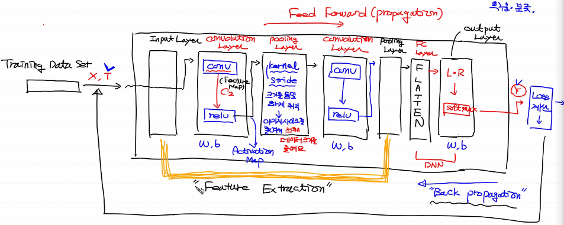

# day39_deep learning_CNN


#### 리뷰

###### DNN

- Deep Neural Network -> Deep Learning

###### CNN

- Convolutional Neural Network -> 합성곱신경망
- 이미지를 추출해서 그 특징을 학습 분류




#### 0323

##### Pooling Layer

- Kernel size -> 2

  Stride -> 2

- convolution Layer

  kernel 크기와 stride 크기에 따라 출력되는 feature map의 크기가 줄어요

  하지만 filter를 여러개 사용하기 때문에 전체적인 데이터량은 상당히 커짐

  -> 이 데이터를 줄이기 위해 사용하는 기법이 pooling

- MAX pooling

  CNN에서 일반적으로 사용하는 pooling 기법

- Average pooling

- MIN pooling

```python
import numpy as np
import tensorflow as tf

# 입력이미지(feature map)
# (이미지 개수, 이미지 height, 이미지 width, channel)
# (1, 4, 4, 1)
image = np.array([[[[13],[20],[30],[0]],
                   [[8],[12],[3],[0]],
                   [[34],[70],[33],[5]],
                   [[111],[80],[10],[23]]]], dtype=np.float32)
print(image.shape) # (1, 4, 4, 1)

# ksize = 2
# stride = 2
pooling = tf.nn.max_pool(image,
                         ksize=[1,2,2,1],
                         strides=[1,2,2,1],
                         padding='VALID')
sess = tf.Session()
result = sess.run(pooling)
print(f'pooling한 결과 : \n{result}')
'''
[[[[ 20.]
   [ 30.]]

  [[111.]
   [ 33.]]]]
'''
print(result.shape) # (1, 2, 2, 1)
```


```python
# gray-scale 이미지를 이용해서 convolution처리와 pooling 처리 하기

import numpy as np
import tensorflow as tf
import matplotlib.pyplot as plt
import matplotlib.image as img

fig = plt.figure()
fig_1 = fig.add_subplot(1,3,1)
fig_2 = fig.add_subplot(1,3,2)
fig_3 = fig.add_subplot(1,3,3)

ori_image = img.imread('./data/img/girl-teddy.jpg')
fig_1.imshow(ori_image)
print(ori_image.shape) # (429, 640, 3)

# 해당 이미지를 convolution 처리 => 4차원 데이터로 표현
# (이미지 개수, height, width, color(channel))
input_image = ori_image.reshape((1,) + ori_image.shape)
print(input_image.shape) # (1, 429, 640, 3)

channel_1_input_image = input_image[:,:,:,0:1]
channel_1_input_image = channel_1_input_image.astype(np.float32)
print(channel_1_input_image.shape) # (1, 429, 640, 1)

# filter (filter의 height, filter width, filter channel, filter 개수)
# (3, 3, 1, 1)
weight = np.array([[[[-1]],[[0]],[[1]]],
                   [[[-1]],[[0]],[[1]]],
                   [[[-1]],[[0]],[[1]]]])

# stride: 1
# padding: VALID
sess = tf.Session()
conv2d = tf.nn.conv2d(channel_1_input_image,
                      weight,
                      strides=[1,1,1,1],
                      padding='VALID')
conv2d_result = sess.run(conv2d)
print(conv2d_result.shape) # (1, 427, 638, 1)

t_img = conv2d_result[0,:,:,:]
fig_2.imshow(t_img)

# pooling 처리

# ksize = 3
# stride = 3
pooling = tf.nn.max_pool(conv2d_result,
                         ksize=[1,3,3,1],
                         strides=[1,3,3,1],
                         padding='VALID')

pooling_result = sess.run(pooling)
print(pooling_result.shape) # (1, 142, 212, 1)
p_img = pooling_result[0,:,:,:]

fig_3.imshow(p_img)

plt.show()


```


##### MNIST로 CNN 구현

```python
# %reset
import numpy as np
import pandas as pd
import tensorflow as tf
import matplotlib.pyplot as plt
import matplotlib.image as img

fig = plt.figure()

fig_list = list() # 이 안에 각각의 subplot을 저장할 거

for i in range(5):
    fig_list.append(fig.add_subplot(1,5,i+1))
    
# Raw Data Loading
df = pd.read_csv('./data/digit-recognizer/train.csv')

# values 를 사용하면 2차원 ndarray로 도출됨
img_data = df.drop('label', axis=1, inplace=False).values
print(img_data.shape) # (42000, 784)

# 샘플 이미지 하나 선택
ori_image = img_data[5:6].reshape(28,28)
fig_list[0].imshow(ori_image, cmap='gray')

# convolution 처리
# 입력이미지 : (1, 28, 28, 1)
print(ori_image.shape) # (28, 28)
input_image = ori_image.reshape((1,) + ori_image.shape + (1,))
print(input_image.shape) # (1, 28, 28, 1)
input_image = input_image.astype(np.float32)

# kernel(filter) => (3, 3, 1, 4)
weight = np.random.rand(3,3,1,4)

# stride : 1
# padding : VALID

sess = tf.Session()

conv2d = tf.nn.conv2d(input_image,
                      weight,
                      strides=[1,1,1,1],
                      padding='VALID')
conv2d_result = sess.run(conv2d)

# ReLU (Rectified Linear Unit)
relu_ = tf.nn.relu(conv2d_result)
relu_result = sess.run(relu_)

# pooling 처리
# ksize = stride = 2
pooling = tf.nn.max_pool(relu_result,
                         ksize=[1,2,2,1],
                         strides=[1,2,2,1],
                         padding='VALID')
pooling_result = sess.run(pooling)

print(pooling_result.shape) # (1, 13, 13, 4)
# (4, 13, 13, 1)
# swapaxes는 축을 교체하는 함수
i = np.swapaxes(pooling_result,0,3) 
print(i.shape) # (4, 13, 13, 1)

# enumerate는 가장 앞부분을 인덱스로 뒷부분을 데이터로 사용
for filter_idx, t_img in enumerate(i):
    fig_list[filter_idx+1].imshow(t_img, cmap='gray')
```


##### CNN

- 이미지의 특징을 추출(feature extraction) 

  -> filter를 사용해서 이미지의 특징을 추출

  -> pooling을 통해 이 특징을 강화하고 크기를 줄이는 작업

- 학습 후 분류 (classification)

  -> 특징을 뽑아낸 데이터를 Flatten

  -> softmax를 이용해서 분류

- CNN의 특징 -> filter를 학습

  DNN과 비교했을때 parameter의 수가 20~30%5 수준


##### Fashion-MNIST

- CNN , DNN, multi 노미얼