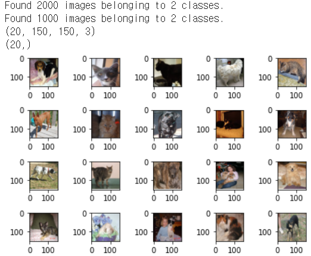
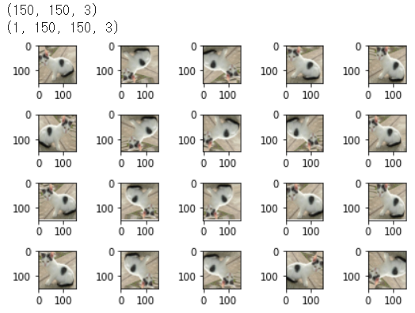
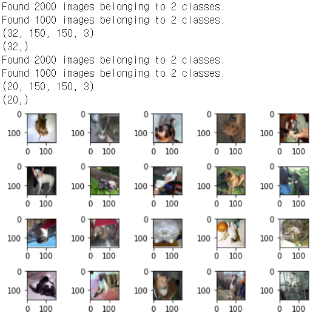
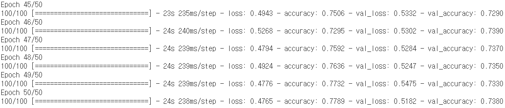
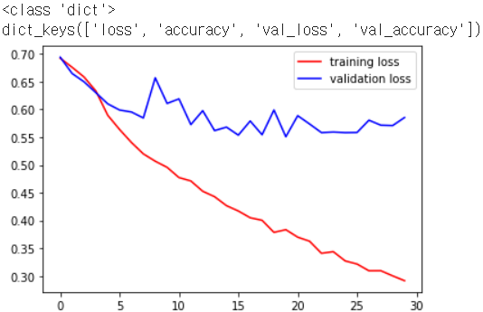

# day41_deep learning_CNN


#### 0326

- Deep Learning은 데이터가 많아야 학습이 잘되고 accuracy가 높게 나옴

  현실적으론 적은 양의 데이터로 학습 및 예측해야하는 경우가 대부분

- 만약 데이터 정제가 잘 되어있다면(비교적 간단한 학습의 경우)

  적은 양의 데이터로도 학습이 가능

- 일반적으로 데이터량이 '작다'라고 하는 경우는  (100,000개 이하)

 

##### 데이터 전처리

1. 원초적인 데이터 전처리 방법

- 사진 file을 읽음
- RGB 값을 decoding(3차원) -> 3채널이 아닌 1채널로 변경
- size를 동일하게 처리해야 함 -> 정규화
- 데이터셋을 만들고 학습을 진행 -> accuracy -> 85%


2. ImageDataGenerator (keras 안에 포함)

- 특정 데이터프레임(폴더) 안에 있는 이미지들을 우리가 필요한 픽셀 데이터로 만들어줌
- 문제점: I/O Latency (인풋, 아웃풋 지연시간 존재)


3. TF Record

- 텐서플로우의 기본 자료구조
- 코드가 어려움


### ImageDataGenerator 구현

##### 전처리

```python
import os
from tensorflow.keras.preprocessing.image import ImageDataGenerator
import matplotlib.pyplot as plt

train_dir = '/content/drive/MyDrive/machine learning colab/cat_dog_small/train'
validation_dir = '/content/drive/MyDrive/machine learning colab/cat_dog_small/validation'

# ImageDataGenerator 생성
# train과 validation 두 개의 ImageDataGenerator 생성
# 정규화(MinMaxScaling 이용)
train_datagen = ImageDataGenerator(rescale=1/255)
validation_datagen = ImageDataGenerator(rescale=1/255)

train_generator = train_datagen.flow_from_directory(
    train_dir,  # target directory
    classes=['cats','dogs'], # cats, dogs 순서로 label이 0, 1로 설정
                             # 만약 classes 속성을 생략하면 폴더 순서로 label이 결정
    target_size=(150,150),   # 일반적으로 정사각형 형태로 resize 
                             # (resize 크기는 CNN의 구조에 따라 다름)
    batch_size=20,           # 한번에 20개의 image 파일을 가져와서 pixel 데이터로 변환
                             # label에 상관없이 가져옴
    class_mode='binary'      # 고양이와 멍멍이 2개의 label만 존재하기 때문에
                             # 2진분류이고 binary classification 사용
                             # 다중분류인 경우 'categorical'을 이용 (default 값) - (one-hot encoding 처리)
                             # 'sparse'도 이용 가능 (one-hot encoding 처리 안하는 것) 
)

validation_generator = validation_datagen.flow_from_directory(
    validation_dir,  
    classes=['cats','dogs'], 
    target_size=(150,150),  
    batch_size=20,           
    class_mode='binary'      
)

# generator를 이용
for x_data, t_data in train_generator:
    print(x_data.shape) # (20,150,150,3)
    print(t_data.shape) # (20,)
    break;

# 그림 이미지를 matplotlib을 이용해서 출력
fig = plt.figure()
fig_arr = []

for i in range(20):
    fig_arr.append(fig.add_subplot(4,5,i+1))

for data_batch, label_batch in train_generator:
    for idx, img_data in enumerate(data_batch):
        fig_arr[idx].imshow(img_data)
    break;
fig.tight_layout()
plt.show()

# 다음 단계는 CNN을 구성하고 학습을 진행
# MNIST와 유사, Convolution Layer와 Pooling Layer 추가
```




##### 증식

```python
# Computer Vision 이미지를 다룰 때 일반적으로 사용하는 과대적합 감소방법
# 데이터 증식(Data Augementation):
# 기존 데이터에 약간의 변형을 주어서 데이터를 추가적으로 만들어내는 기법

# %reset
from tensorflow.keras.preprocessing import image
from tensorflow.keras.preprocessing.image import ImageDataGenerator
import matplotlib.pyplot as plt

datagen = ImageDataGenerator(rotation_range=20, # 지정된 각도 범위 내에서 임의로 원본 이미지를 회전
                             width_shift_range=0.1,
                             zoom_range=0.1,    # 1-수치 혹은 1+수치만큼 확대 및 축소
                             horizontal_flip=True,
                             vertical_flip=True)

img = image.load_img('/content/drive/MyDrive/machine learning colab/cat_dog_small/train/cats/cat.3.jpg',
                     target_size=(150,150))

# 증식시킬 원본 이미지 하나를 4차원으로 표현
x = image.img_to_array(img)
print(x.shape)
x = x.reshape((1,) + x.shape) # (1, 150, 150, 3)
print(x.shape)

fig = plt.figure()
fig_arr = []

for i in range(20):
    fig_arr.append(fig.add_subplot(4,5,i+1))

idx = 0
for batch in datagen.flow(x, batch_size=1):
    fig_arr[idx].imshow(image.array_to_img(batch[0]))
    idx += 1
    if idx % 20 == 0:
        break

fig.tight_layout()
plt.show()
```




##### 증식을 이용한 전처리

```python
# 증식을 이용한 코드에요

import os
from tensorflow.keras.preprocessing.image import ImageDataGenerator
import matplotlib.pyplot as plt

train_dir = '/content/drive/MyDrive/machine learning colab/cat_dog_small/train'
validation_dir = '/content/drive/MyDrive/machine learning colab/cat_dog_small/validation'

# ImageDataGenerator 생성
# train과 validation 두 개의 ImageDataGenerator 생성
# 정규화(MinMaxScaling 이용)
train_datagen = ImageDataGenerator(rescale=1/255,
                                   rotation_range=20,
                                   width_shift_range=0.1,
                                   zoom_range=0.1,    
                                   horizontal_flip=True,
                                   vertical_flip=True)

validation_datagen = ImageDataGenerator(rescale=1/255)

train_generator = train_datagen.flow_from_directory(
    train_dir,  # target directory
    classes=['cats','dogs'], # cats, dogs 순서로 label이 0, 1로 설정
                             # 만약 classes 속성을 생략하면 폴더 순서로 label이 결정
    target_size=(150,150),   # 일반적으로 정사각형 형태로 resize 
                             # (resize 크기는 CNN의 구조에 따라 다름)
    batch_size=20,           # 한번에 20개의 image 파일을 가져와서 pixel 데이터로 변환
                             # label에 상관없이 가져옴
    class_mode='binary'      # 고양이와 멍멍이 2개의 label만 존재하기 때문에
                             # 2진분류이고 binary classification 사용
                             # 다중분류인 경우 'categorical'을 이용 (default 값) - (one-hot encoding 처리)
                             # 'sparse'도 이용 가능 (one-hot encoding 처리 안하는 것) 
)

validation_generator = validation_datagen.flow_from_directory(
    validation_dir,  
    classes=['cats','dogs'], 
    target_size=(150,150),  
    batch_size=20,           
    class_mode='binary'      
)

# generator를 이용
for x_data, t_data in train_generator:
    print(x_data.shape) # (20,150,150,3)
    print(t_data.shape) # (20,)
    break;

# 그림 이미지를 matplotlib을 이용해서 출력
fig = plt.figure()
fig_arr = []

for i in range(20):
    fig_arr.append(fig.add_subplot(4,5,i+1))

for data_batch, label_batch in train_generator:
    for idx, img_data in enumerate(data_batch):
        fig_arr[idx].imshow(img_data)
    break;
fig.tight_layout()
plt.show()

# 다음 단계는 CNN을 구성하고 학습을 진행
# MNIST와 유사, Convolution Layer와 Pooling Layer 추가

```




##### 모델 구현

```python

import numpy as np
import tensorflow as tf
from tensorflow.keras.models import Sequential
from tensorflow.keras.layers import Conv2D, Flatten, MaxPooling2D, Dense, Dropout
from tensorflow.keras.optimizers import Adam

model = Sequential()
model.add(Conv2D(filters=32,
                 kernel_size=(3,3),
                 activation='relu',
                 input_shape=(150,150,3)))
model.add(MaxPooling2D(pool_size=(2,2)))

model.add(Conv2D(filters=64,
                 kernel_size=(3,3),
                 activation='relu'))
model.add(MaxPooling2D(pool_size=(2,2)))

model.add(Conv2D(filters=128,
                 kernel_size=(3,3),
                 activation='relu'))
model.add(MaxPooling2D(pool_size=(2,2)))

# model.add(Conv2D(filters=128,
#                  kernel_size=(3,3),
#                  activation='relu'))
# model.add(MaxPooling2D(pool_size=(2,2)))

model.add(Flatten())

# model.add(Dense(units=512,
#                 activation='relu'))

model.add(Dropout(rate=0.5))

# 로지스틱이니까 sigmoid
model.add(Dense(units=1,
                activation='sigmoid'))

print(model.summary())

model.compile(optimizer=Adam(learning_rate=1e-4),
              loss='binary_crossentropy',
              metrics=['accuracy'])

history = model.fit(train_generator,
                    steps_per_epoch=100,
                    epochs=50,
                    validation_data=validation_generator,
                    validation_steps=50)
```




##### 학습 결과 저장

```python
# 학습이 종료된 후 모델을 저장할 수 있음
model.save('/content/drive/MyDrive/machine learning colab/cat_dog_small_cnn_tf2.4.h5')
```


##### 그래프 출력

```python
# history 객체를 통해 과적합인지 확인할 수 있어요
print(type(history.history))
print(history.history.keys())

train_acc = history.history['accuracy']
val_acc = history.history['val_accuracy']

train_loss = history.history['loss']
val_loss = history.history['val_loss']

# plt.plot(train_acc, color='r', label='training accuracy')
# plt.plot(val_acc, color='b', label='validation accuracy')
# plt.legend()
# plt.show()

plt.plot(train_loss, color='r', label='training loss')
plt.plot(val_loss, color='b', label='validation loss')
plt.legend()
plt.show()
```

