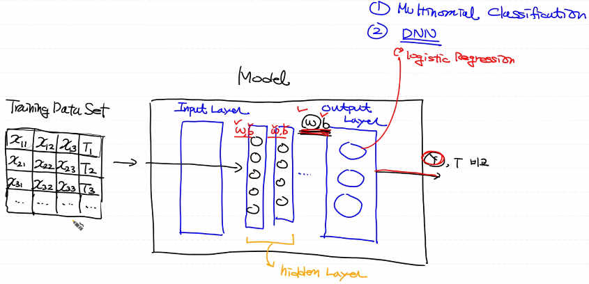
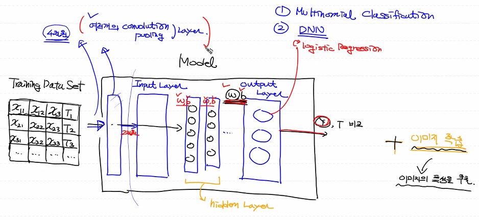
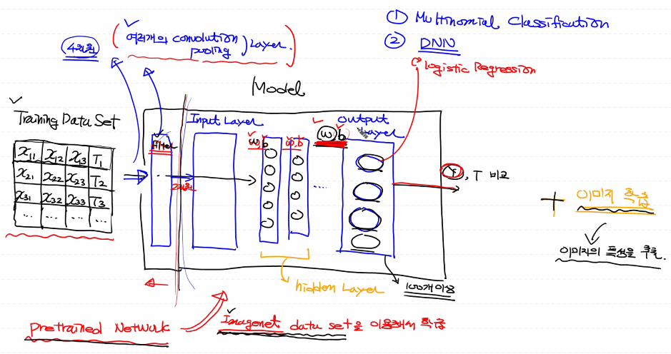
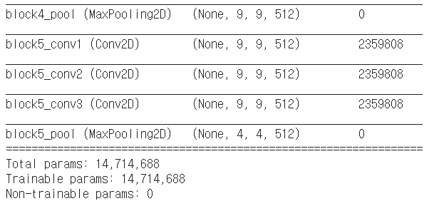

# day42_deep learning_CNN


#### Machine Learning

1. Regression

   - linear Regression (선형 회귀)

     연속적인 숫자값 예측

   - logistic Regression (binary classification)

     분류, sigmoid

   - Multinomial classification (다중 분류)

     logistic을 여러개 활용

     BMI, MNIST

2. KNN

3. Decision Tree

4. Naive Bayes

5. Random Forest

6. SVM

- 2~6까진 Tensorflow로 구현하지 않음, sklearn을 이용해서 활용

7. Neural Network

   multinomial classification으로 한계가 있어서 뉴럴 네트워크 사용

   Layer 개념 - Input, hidden, output Layer

   Deep Learning

 

- CNN

  deep learning에서 이미지에 대한 예측을 더 효율적으로

  Dogs & Cats


##### Dogs and Cats Classification (binary classification)

- Deep Learning은 데이터가 많아야 학습이 잘 됨

  특히 입력데이터가 고차원이면 더 많은 학습데이터가 필요

  -> 현실적으로는 거의 불가능, 일반적으로는 데이터양이 작음

  데이터 많고 적음의 기준은 100,000개


- 개와 고양이 예제는 전체 데이터가 25,000장

  전체 데이터를 이용해서 CNN학습 (3~4개의 convolution layer 사용)

  accuracy 계산 => 85%

  keras로 학습 => history 객체 -> graph를 그려서 overfitting 여부 확인

- 개와 고양이 2가지 방식으로 데이터 전처리

  1. 이미지 파일을 CSV파일로 전환

     Disk IO를 줄여서 상대적으로 학습이 빠르게 진행

     -> 데이터 증식 기법을 이용하기가 난감

  2. Image Data Generator

     속도가 느림, Disk IO를 때마다 수행하기 때문에 느림

     폴더구조를 만들어서 학습을 진행

  3. TF Record (Tensorflow 전용)


- Dogs & Cats

  1. 25,000의 데이터 전부를 이용해서 CNN학습

     -> ImageDataGenerator 이용해서 구현, 폴더구조 만들어서 사용

     

     이후 구글 드라이브에 올려서 CNN으로 학습, accuracy 측정=>85%

     

  2. 전체가 아닌 일부 데이터를 이용해서 학습, accuracy

     accury가 떨어짐 (overfitting이 심하게 발생) - 결과확인 histrory 객체 이용해서 그래프 확인

     해결하기 위해 Data Augmentation (데이터 증식)

     -> 근본적인 해결책은 아니지만 과대적합을 피하는 하나의 방법

     -> ImageDataGenerator가 가지고 있는 기능을 이용

     학습시키고 accuracy 구해서 결과 확인

     증식을 사용하지 않은 경우보다 accuracy가 높아지나 만능은 아님

     accuracy를 더 높이기 위해선

     1. hyper parameter 조절

     2. pretrained network을 이용 (사전 훈련된 network)

        => Transfer Learning (전이학습)


##### Transfer Learning (전이학습)

> pretrained network를 이용하는 학습방식

- MNIST: 단순한 형태의 흑백이미지

  학습해서 높은 정확도(99%)를 내기 위해서 

  -> 3개 이상의 convolution layer, 1개 이상의 pooling layer, 1개의 FC layer

  -> GPU 없이 CPU 만으로 학습 가능 -> 1시간 이상 학습을 진행

- 실무에서 사용하는 이미지는 MNIST 처럼 단순한 이미지가 아닌 고해상도 컬러이미지가 대부분

  -> 최소 5개 이상의 convolution layer와 pooling layer가 필요 + FC layer 안에 hidden layer도 1개 이상

  -> GPU 없이 CPU로 처리하면 100시간 이상 걸림

  -> 학습에 오랜 시간이 소요 -> accuracy를 확인하고 hyper parameter를 조절하고 다시 학습

- 이 문제를 해결하기 위한 방법이 pretrained network

  특정 데이터를 이용해서 CNN 학습이 완료된 network 사용

  - MS Resnet - 자사 기술이 집약된 network
  - google Inception - 자사 기술이 집약된 network
  - VGG16 - 전통적 모델
  - VGG19 - 전통적 모델
  - mobilenet -  속도에 강점
  - efficientnet

- convolution layer를 가져다 씀, feature의 특징 추출

  분류기는 우리 분류기를 사용 FC layer를 우리 걸로 사용

- '다른 사람이 만들어둔 특징 뽑는 필터를 가져다 쓴다'

  다른 network에서 만들어둔 filter를 사용해도 됨

  -> 이게 deep learning의 유연성


###### Multinimial Classification


- 이 형태로는 예측을 할 수 없는 게 너무 많음

  그래서 나온게 DNN 

  

###### DNN



- hidden layer가 추가되면서 학습량이 많아짐 -> 예측력 상승

- 그러나 고차원 이미지 학습의 경우 데이터기 너무 많이 필요함

  이미지의 특성을 추출해서 예측하는 CNN 모델 등장

  

###### CNN

- 하나의 이미지를 여러 장의 이미지로 변경

  이미지의 크기를 확 줄이면서 특징적인 면만 부각하는 여러 장의 이미지 생성



- input layer 앞에 convolution, pooling layer 추가 - 이미지의 특성 뽑아내 학습 시킴


###### pretrained network

- 지금까지 말한 이 과정들이 이미 만들어져 있는 것, 또한 학습이 되어 있는 상태

- Imagenet data set: 100만개 이상의 이미지 데이터로 부터 특징을 추출하는 학습이 되어있는 모델

  -> training data set 양이 많기 때문에 output layer도 100개 이상

  -> 이미 다 완성되어있는 모델



- output layer는 training data에 영향을 받는 것이므로 우리가 목표로  하는 모델과 다르기에 사용할 수 없음

  -> FC layer는 직접 만들어야 함

- 그러나 이미지의 특징을 잘 뽑아내는 filter는 가져와서 사용할 수 있음


##### pretrained network

- 기존에 학습된 network를 이용해서 특성 추출 방식으로 이용

  convolution layer, pooling layer

1. 우리 데이터(개, 고양이)
2. pretrained network의 특성추출 layer(convolution, pooling)
3. feature map -> ReLU -> Activation map
4. 이를 우리의 classifier인 FC layer의 입력으로 사용 => W,b

```python
from tensorflow.keras.applications import VGG16

# mobilenet
# efficientnetB1~B6

model_base = VGG16(weights='imagenet',
                   # include_top: 분류기(FC layer)를 제외하라는 의미
                   include_top=False,
                   input_shape=(150,150,3))
model_base.summary()
```




```python
# 개와 고양이 training data set에 대한 feature map을 추출

import os
import numpy as np
from tensorflow.keras.preprocessing.image import ImageDataGenerator

base_dir = '/content/drive/MyDrive/machine learning colab/cat_dog_small'
train_dir = os.path.join(base_dir,'train')
validation_dir = os.path.join(base_dir,'validation')

datagen = ImageDataGenerator(rescale=1/255)
batch_size=20

def extract_feature(directory, sample_count):
    features = np.zeros(shape=(sample_count,4,4,512))
    labels=np.zeros(shape=(sample_count,))

    generator = datagen.flow_from_directory(
        directory,
        target_size=(150,150),
        batch_size=batch_size,
        class_mode='binary'
    )
    
    i = 0

    for x_data_batch, t_data_batch in generator:
        feature_batch = model_base.predict(x_data_batch)
        features[i*batch_size:(i+1)*batch_size] = feature_batch
        labels[i*batch_size:(i+1)*batch_size] = t_data_batch

        i += 1
        if i*batch_size >= sample_count:
            break
    return features, labels

train_features, train_labels = extract_feature(train_dir, 2000)
validation_features, validation_labels = extract_feature(validation_dir, 1000)
```


```python
train_features = np.reshape(train_features, (2000,4*4*512))
validation_features = np.reshape(validation_features, (1000,4*4*512))

from tensorflow.keras.models import Sequential
from tensorflow.keras.layers import Dense, Dropout
from tensorflow.keras.optimizers import Adam

model = Sequential()
model.add(Dense(256,
                activation='relu',
                input_shape=(4*4*512,)))
model.add(Dropout(0.5))
model.add(Dense(1,
                activation='sigmoid'))

model.compile(optimizer=Adam(learning_rate=1e-4),
              loss='binary_crossentropy',
              metrics=['accuracy'])

history = model.fit(train_features,
                    train_labels,
                    epochs=30,
                    batch_size=64,
                    validation_data=(validation_features,validation_labels))

```

