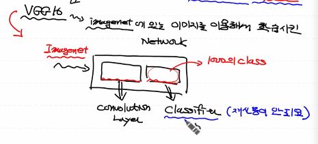
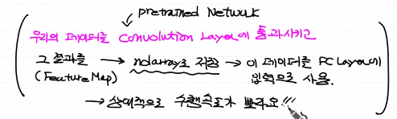
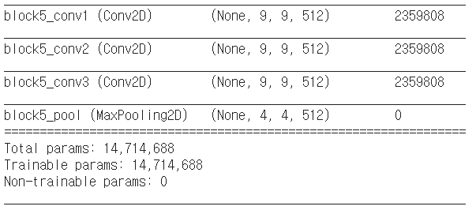
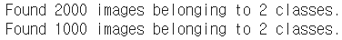
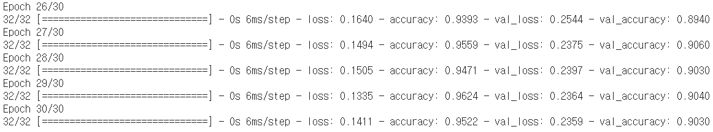
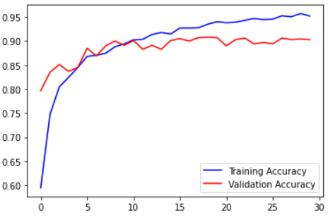
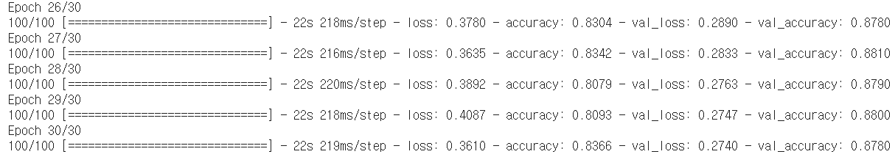
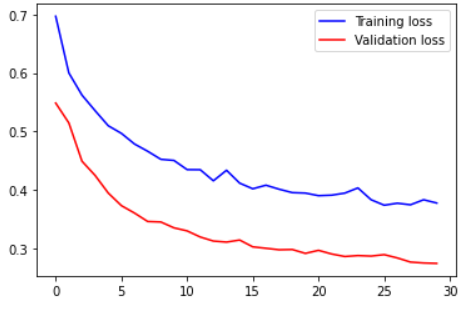
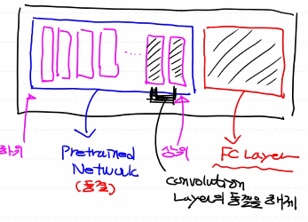
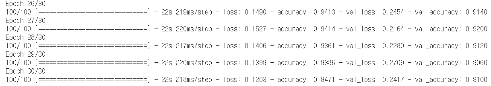

# day43_deep learning_Transfer Learning


#### 전이학습

> Transfer Learning

##### 특성 추출 (feature Extraction)

- pretrained network를 이용해서 우리 이미지에 대한 Feature Map 추출

  FC layer에 입력으로 넣어서 모델 학습

  ###### 기학습된 네트워크 (pretrained network)

  1. google Inception (30 layer)
  2. MS Resnet (152 layer)
  3. VGG16, VGG19
  4. mobilenet (속도가 빠름)
  5. efficiantnetB1~B6 (공모전에 사용)


- VGG16 : imagenet에 있는 이미지를 이용해서 학습시킨 network





```python
# pretrained network 생성
from tensorflow.keras.applications import VGG16

model_base = VGG16(weights='imagenet',
                   include_top=False,
                   input_shape=(150,150,3))
model_base.summary()
```



```python
# 개와 고양이 training data set에 대한 feature map을 추출

import os
import numpy as np
from tensorflow.keras.preprocessing.image import ImageDataGenerator

base_dir = '/content/drive/MyDrive/machine learning colab/cat_dog_small'
train_dir = os.path.join(base_dir,'train')
validation_dir = os.path.join(base_dir,'validation')

datagen = ImageDataGenerator(rescale=1/255)
batch_size=20

def extract_feature(directory, sample_count):
    features = np.zeros(shape=(sample_count,4,4,512))
    labels=np.zeros(shape=(sample_count,))

    generator = datagen.flow_from_directory(
        directory,
        target_size=(150,150),
        batch_size=batch_size,
        class_mode='binary'
    )
    
    i = 0

    for x_data_batch, t_data_batch in generator:
        feature_batch = model_base.predict(x_data_batch)
        features[i*batch_size:(i+1)*batch_size] = feature_batch
        labels[i*batch_size:(i+1)*batch_size] = t_data_batch

        i += 1
        if i*batch_size >= sample_count:
            break
    return features, labels

train_features, train_labels = extract_feature(train_dir, 2000)
validation_features, validation_labels = extract_feature(validation_dir, 1000)
```



```python
# classifier
train_features = np.reshape(train_features, (2000,4*4*512))
validation_features = np.reshape(validation_features, (1000,4*4*512))

from tensorflow.keras.models import Sequential
from tensorflow.keras.layers import Dense, Dropout
from tensorflow.keras.optimizers import Adam, RMSprop

model = Sequential()
model.add(Dense(256,
                activation='relu',
                input_shape=(4*4*512,)))
model.add(Dropout(0.5))
model.add(Dense(1,
                activation='sigmoid'))

model.compile(optimizer=RMSprop(learning_rate=2e-5),
              loss='binary_crossentropy',
              metrics=['accuracy'])

history = model.fit(train_features,
                    train_labels,
                    epochs=30,
                    batch_size=64,
                    validation_data=(validation_features,validation_labels))

```



```python
import matplotlib.pyplot as plt

train_acc = history.history['accuracy']
val_acc = history.history['val_accuracy']

train_loss = history.history['loss']
val_loss = history.history['val_loss']

plt.plot(train_acc, color='b', label='Training Accuracy')
plt.plot(val_acc, color='r', label='Validation Accuracy')
plt.legend()
plt.show()

# plt.plot(train_loss, color='b', label='Training loss')
# plt.plot(val_loss, color='r', label='Validation loss')
# plt.legend()
# plt.show()
```




```python
# 데이터가 많아지면 결과가 나아질 것
# 증식을 포함
# pretrained network와 classifier을 합쳐서 모델 생성
# 기학습된 모델을 따로 쓰는게 아니라 모델 안에 삽입 데이터가 많아지면 결과가 나아질 것
# 증식을 포함
# pretrained network와 classifier을 합쳐서 모델 생성
# 기학습된 모델을 따로 쓰는게 아니라 모델 안에 삽입


import os
import numpy as np
from tensorflow.keras.applications import VGG16
from tensorflow.keras.preprocessing.image import ImageDataGenerator
from tensorflow.keras.models import Sequential
from tensorflow.keras.layers import Dense, Dropout, Flatten
from tensorflow.keras.optimizers import RMSprop
import matplotlib.pyplot as plt

base_dir = '/content/drive/MyDrive/machine learning colab/cat_dog_small'
train_dir = os.path.join(base_dir,'train')
validation_dir = os.path.join(base_dir,'validation')

train_datagen = ImageDataGenerator(rescale=1/255,
                                   rotation_range=40,
                                   width_shift_range=0.1,
                                   height_shift_range=0.1,
                                   zoom_range=0.2,
                                   horizontal_flip=True,
                                   vertical_flip=True)

validation_datagen = ImageDataGenerator(rescale=1/255)

train_generator = train_datagen.flow_from_directory(
    train_dir,
    classes=['cats', 'dogs'],
    target_size=(150,150),
    batch_size=20,
    class_mode='binary'
)

validation_generator = validation_datagen.flow_from_directory(
    validation_dir,
    classes=['cats', 'dogs'],
    target_size=(150,150),
    batch_size=20,
    class_mode='binary'
)

# pretrained network
model_base = VGG16(weights='imagenet',
                   include_top=False,
                   input_shape=(150,150,3))

model_base.trainable=False # Convolution Layer를 동결

model = Sequential()

model.add(model_base)

model.add(Flatten(input_shape=(4*4*512,)))

model.add(Dense(units=256,
                activation='relu'))
model.add(Dropout(0.5))

model.add(Dense(units=1,
                activation='sigmoid'))
model.summary()

model.compile(optimizer=RMSprop(learning_rate=2e-5),
              loss='binary_crossentropy',
              metrics=['accuracy'])

history = model.fit(train_generator,
                    steps_per_epoch=100,
                    epochs=30,
                    validation_data=validation_generator,
                    validation_steps=50)


```



```python
import matplotlib.pyplot as plt

train_acc = history.history['accuracy']
val_acc = history.history['val_accuracy']

train_loss = history.history['loss']
val_loss = history.history['val_loss']

# plt.plot(train_acc, color='b', label='Training Accuracy')
# plt.plot(val_acc, color='r', label='Validation Accuracy')
# plt.legend()
# plt.show()

plt.plot(train_loss, color='b', label='Training loss')
plt.plot(val_loss, color='r', label='Validation loss')
plt.legend()
plt.show()
```




##### Fine Tuning (미세조정)

- pretrained network의 parameter는 완전 동결
- fine tuning은 모두 동결시키지 않고 몇개의 convolution layer는 동결 해제해서 학습 진행



- 절차
  1. pretrained network 위에 새로운 network 추가 (FC layer)
  2. Base Network를 동결
  3. 새로 추가한 FC layer를 학습
  4. base network의 일부분 layer를 동결에서 해제
  5. 동결을 해제한 층과 FC layer를 다시 학습

```python
# fine tuning

import os
import numpy as np
from tensorflow.keras.applications import VGG16
from tensorflow.keras.preprocessing.image import ImageDataGenerator
from tensorflow.keras.models import Sequential
from tensorflow.keras.layers import Dense, Dropout, Flatten
from tensorflow.keras.optimizers import RMSprop
import matplotlib.pyplot as plt

base_dir = '/content/drive/MyDrive/machine learning colab/cat_dog_small'
train_dir = os.path.join(base_dir,'train')
validation_dir = os.path.join(base_dir,'validation')

train_datagen = ImageDataGenerator(rescale=1/255,
                                   rotation_range=40,
                                   width_shift_range=0.1,
                                   height_shift_range=0.1,
                                   zoom_range=0.2,
                                   horizontal_flip=True,
                                   vertical_flip=True)

validation_datagen = ImageDataGenerator(rescale=1/255)

train_generator = train_datagen.flow_from_directory(
    train_dir,
    classes=['cats', 'dogs'],
    target_size=(150,150),
    batch_size=20,
    class_mode='binary'
)

validation_generator = validation_datagen.flow_from_directory(
    validation_dir,
    classes=['cats', 'dogs'],
    target_size=(150,150),
    batch_size=20,
    class_mode='binary'
)

# pretrained network
model_base = VGG16(weights='imagenet',
                   include_top=False,
                   input_shape=(150,150,3))

model_base.trainable=False # Convolution Layer를 동결

model = Sequential()

model.add(model_base)

model.add(Flatten(input_shape=(4*4*512,)))

model.add(Dense(units=256,
                activation='relu'))
model.add(Dropout(0.5))

model.add(Dense(units=1,
                activation='sigmoid'))
model.summary()

model.compile(optimizer=RMSprop(learning_rate=2e-5),
              loss='binary_crossentropy',
              metrics=['accuracy'])

history = model.fit(train_generator,
                    steps_per_epoch=100,
                    epochs=30,
                    validation_data=validation_generator,
                    validation_steps=50)

model_base.trainable = True

for layer in model_base.layers:
    if layer.name in ['block5_conv1', 'block5_conv2', 'block5_conv3']:
        layer.trainable = True
    else:
        layer.trainable = False

# 일반적으로 러닝 레이트를 더 작게 설정
model.compile(optimizer=RMSprop(learning_rate=1e-5),
              loss='binary_crossentropy',
              metrics=['accuracy'])

history = model.fit(train_generator,
                    steps_per_epoch=100,
                    epochs=30,
                    validation_data=validation_generator,
                    validation_steps=50)
```

