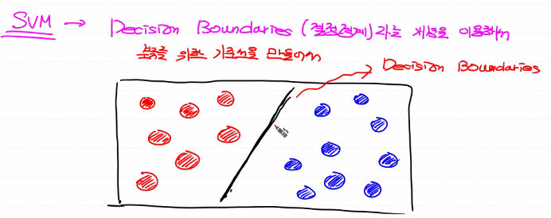
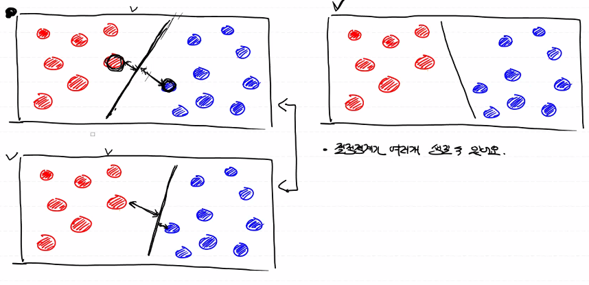
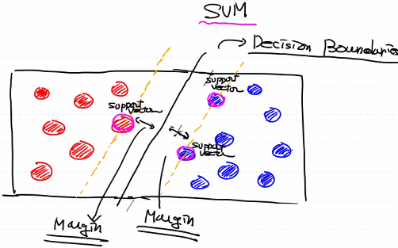
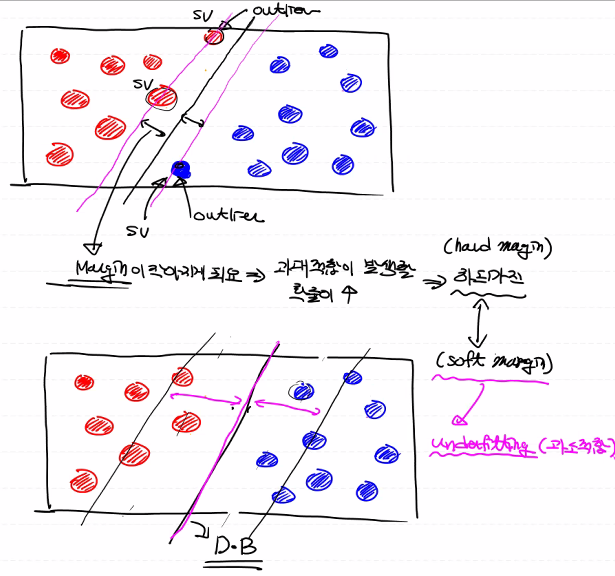
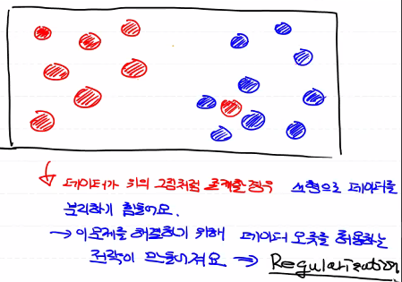
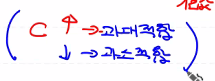
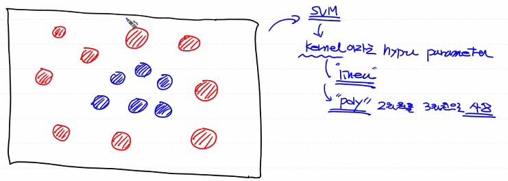
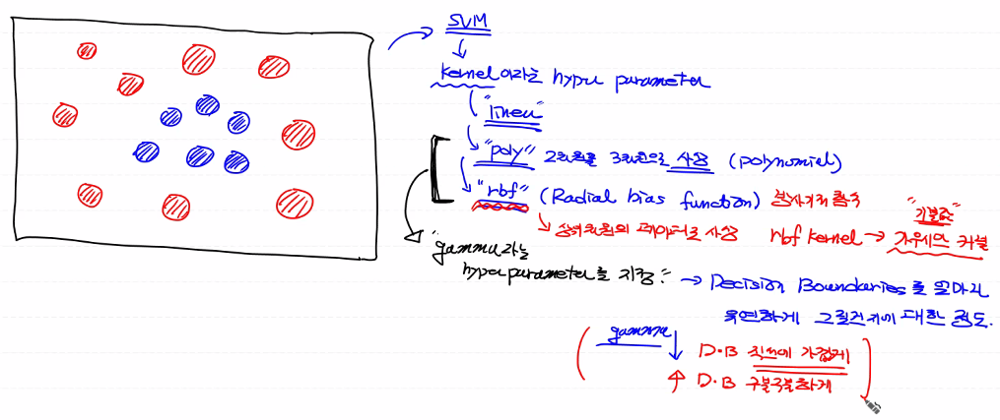
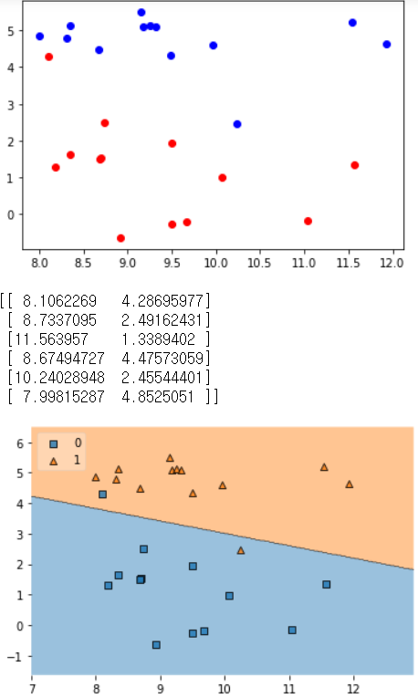
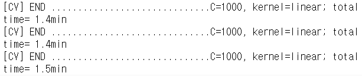

# day45_Machine Learning


#### Machine Leaning

- ##### Regression (회귀)

  - ###### Linear Regression

  - ###### Logistic Regression (binary classification)

  - ###### Multinomial classification

- ##### Neural Network

  - ###### DNN, CNN

- ##### KNN (K-nearest Neighbor) k최근접 이웃

- ##### SVM

  - ###### regression

  - ###### classification - 분류로 더 많이 이용됨

    성능은 Deep Learning에 비해 살짝 떨어짐, 간단, 속도 빠름


#### SVM

- Decision Boundaries (결정 경계)라는 개념을 이용해서 분류를 위한 기준선을 만들어서 



- classification은 해당 값이 선을 기준으로 어디에 있는가
- regression에서는 평균값을 이용해서 삽입


- SVM을 간단하게 표현하면

  "데이터를 선형으로 분리하는 최적의 결정결계를 찾는 알고리즘"





- support vector 들을 찾고 margin이 가장 큰 decision boundaries를 찾는 것
- 장점: 속도가 상당히 빨라요

1. 논문을 쓰거나 새로운 알고리즘을 고안하려면 모든 개념을 다 알고 깊게 알아야 함
2. 실제 현업에서는 sklearn만 쓰면 됨

- 단점: 이상치 영향을 많이 받음



- 이상치를 포함하면 margin이 작아지며 과대적합이 발생할 확률이 늘어남
- 이상치를 제거하면 margin이 늘어나며 과소적합이 발생할 확률이 늘어남



- 이 경우 선형으로는 해결 불가, Regularization 사용

- sklearn에서 SVM "C" hyper parameter

  얼마나 많은 데이터 포인트가 다른 범위에 놓이는 것을 허용할 지

  기본값이 '1'이고 이 값이 클수록 다른 범주에 놓이는 데이터 포인트를 적게 허용






- 'linear'

- 'poly'를 사용하면 2차원을 3차원으로 사상

- 'rbf'(Radial bias function) 방사기저 함수

  상위차원의 데이터로 사상

  rbf kernel -> 가우세만 커널 (기본값)

- poly나 rbf를 사용할 시 'gamma'라는 hyper parameter를 지정

  Decision Boundaries를 얼마나 유연하게 그릴건지에 대한 정도

  gamma 값이 작으면 직선에 가깝게, 과소적합

  gamma 값이 크면 구불구불 하게, 과대적합



```python
import numpy as np
from sklearn.svm import SVC
import mglearn
import matplotlib.pyplot as plt
import warnings
from mlxtend.plotting import plot_decision_regions

warnings.filterwarnings(action='ignore')

# training data set
x_data, t_data = mglearn.datasets.make_forge()

# t_data가 0인 경우 red 점으로 표현
# t_data가 1인 경우 blue 점으로 표현

# red점에 대한 좌표값만 들고와요!
x_data_red = x_data[t_data==0]
# blue점에 대한 좌표값만 들고와요!
x_data_blue = x_data[t_data==1]

plt.scatter(x_data_red[:,0],x_data_red[:,1], color='r')
plt.scatter(x_data_blue[:,0],x_data_blue[:,1], color='b')
plt.show()

# model
model = SVC(kernel='linear',
            C=1)
model.fit(x_data,
          t_data)

print(model.support_vectors_)

plot_decision_regions(X=x_data,
                      y=t_data,
                      clf=model,
                      legend=2)
plt.show()
```




- SVM model 구현은 어렵지 않음

  하지만 Hyper parameter를 조절해서 최적화하는 작업은 쉽지 않음

  -> 단순하게 처리하면 최적의 모델을 찾을 때까지 Hyper parameter를 수동으로 변경, 실행

  -> 이 과정을 자동화할 수 없을까?

  sklearn은 두가지 제공

  - Grid Search CV (Cross Validation)

    hyper parameter의 값을 몇 개 지정 한 뒤 수행

  - Randomise Search CV (Cross Validation)

    범위를 지정해서 랜덤하게 추출해서 CV를 실행 


- Grid Search CV

```python
# BMI예제를 이용해서 SVC 모델을 구현하고 Decision boundaries를
# 구해보아요!
# BMI의 총 데이터수는 20,000개인데 너무 많아서 각 label별로 30개만
# 샘플로 추출해서 이용해보아요!
# SVC를 이용해서 학습시키고 decision boundaries를 그려보아요!

# 모든 데이터를 이용해서 학습하고 
# 정확도가 얼마나 나오는지도 확인해 보아요!
# 이전에 Tensorflow로 구현한 예제와 정확도를 비교해 보아요!

import numpy as np
import pandas as pd
from sklearn.svm import SVC
import matplotlib.pyplot as plt
import warnings
from mlxtend.plotting import plot_decision_regions
from sklearn.metrics import classification_report
from sklearn.model_selection import train_test_split
from sklearn.model_selection import GridSearchCV

warnings.filterwarnings(action='ignore')

df = pd.read_csv('./data/bmi/bmi.csv', skiprows=3)

x_data = df[['height','weight']].values
t_data = df['label'].values

num_of_data = 30

# label 0 => red
x_data_red = x_data[t_data==0][:num_of_data]
t_data_red = t_data[t_data==0][:num_of_data]

# label 1 => blue
x_data_blue = x_data[t_data==1][:num_of_data]
t_data_blue = t_data[t_data==1][:num_of_data]

# label 2 => green
x_data_green = x_data[t_data==2][:num_of_data]
t_data_green = t_data[t_data==2][:num_of_data]

plt.scatter(x_data_red[:,0],x_data_red[:,1], color='r')
plt.scatter(x_data_blue[:,0],x_data_blue[:,1], color='b')
plt.scatter(x_data_green[:,0],x_data_green[:,1], color='g')

plt.show()


x_data_sample = np.concatenate((x_data_red,x_data_blue,x_data_green), axis=0)
t_data_sample = np.concatenate((t_data_red,t_data_blue,t_data_green), axis=0)

model = SVC(kernel='linear')
model.fit(x_data_sample, t_data_sample)

plot_decision_regions(X=x_data_sample,
                      y=t_data_sample,
                      clf=model,
                      legend=3)

plt.show()


x_data_train, x_data_test, t_data_train, t_data_test = \
train_test_split(x_data,
                 t_data,
                 test_size=0.2,
                 random_state=0)

param_grid = [
    { 'kernel' : ['linear'],
      'C' : [10,30,100,300,1000,3000,10000,30000]},    
    { 'kernel': ['rbf'],
      'C' : [1,3,10,30,100,300,1000,3000],
      'gamma': [0.01, 0.03, 0.1, 0.3, 1.0, 3.0]}
]

model = SVC()

grid_search = GridSearchCV(model,
                           param_grid,
                           cv=5,
                           scoring='accuracy',
                           verbose=2)

grid_search.fit(x_data, t_data)

print(grid_search.best_params_)
print(grid_search.best_score_)
```




- Random Search CV

```python
from scipy.stats import expon, reciprocal
from sklearn.model_selection import RandomizeSearchCV

x_data_train, x_data_test, t_data_train, t_data_test = \
train_test_split(x_data,
                 t_data,
                 test_size=0.2,
                 random_state=0)

param_dist = {
    'kernel' : ['linear', 'rbf'],
    'C': reciprocal(20,200000),
    'gamma': expon(scale=1.0)
}

model = SVC()

grid_search = RandomizeSearchCV(model,
                           param_dist,
                           cv=5,
                           n_iter=50,     
                           scoring='accuracy',
                           verbose=2)

grid_search.fit(x_data, t_data)

print(grid_search.best_params_)
print(grid_search.best_score_)
```

