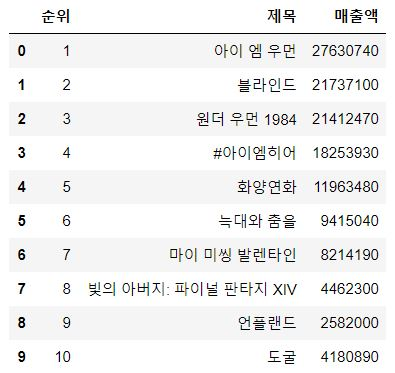
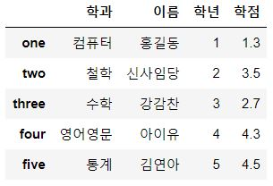

# day8_pandas_TIL

## pandas

### DataFrame 생성

1. dict로 생성
2. CSV로 생성
3. Database로 생성 => mysql 사용

- DBMS: 오라클사의 Oracle, IBM의 DB2, MS의 SQL Server

  ​			 MySQL, MariaDB, postgres, infomix, cybase, ...


#### Database로 생성

> MySQL에서 data를 읽어와서 DataFrame 만들기

- pymysql: python프로그램이 MySQL DBMS에 접속하기 위해 필요한 module

- 질의(query): database에서 데이터를 가져오려면 database에서 사용되는 언어로 query를 전달해야함

  SQL(데이터베이스용 프로그래밍 언어)

- %: 와일드 카드, 어떤 글자든 있어도 되고 비어있어도 된다

- 표현식:

  pymysql.connect(

  ​	host = '호스트명',

  ​	user = '유저이름',

  ​	password = '비밀번호'

  ​	db = '데이터를 가져올 database'

  ​	charset = '문자열 서식지정, 한글이면 utf8'

- query 표현식:

  sql = f'''

  ​	SELECT 컬럼명1, 2, 3

  ​	FROM table명

  ​	WHERE 컬럼명 LIKE 조건

  '''

- 출력:

  pd.read_sql(sql문, con=conn)

  - con = connection

```python
import pymysql
import numpy as np
import pandas as pd

# 데이터베이스 접속
# 연결이 성공하면 연결 객체가 만들어짐
conn = pymysql.connect(host='localhost',
                        user='data',
                        password='data',
                        db='library',
                        charset='utf8')

# 데이터 가져오기
# 책 제목에 특정 키워드가 들어가 있는 책들을 검색해서
# 해당책의 isbn, 제목, 저자, 가격 정보를 가져올 것

keyword = '코드'

# database에서 데이터를 가져오려면 database에서 사용되는 언어로 
# 질의(query)를 전달해야 함 => SQL(데이터베이스용 프로그래밍 언어)

# %: 와일드 카드, 어떤 글자든 있어도 되고 비어있어도 된다
sql = f'''
SELECT bisbn, btitle, bauthor, bprice 
FROM book 
WHERE btitle LIKE '%{keyword}%'
'''

# python의 예외처리 이용
# 코드를 작성하는 시점에선 되겠지만 실행할 때 데이터베이스가
# 중지되어 있으면 오류

# con: 데이터베이스 연결 지칭어 (connection)
try:
    df = pd.read_sql(sql, con=conn)
    display(df)
except Exception as err:
    print(err)
finally:
    conn.close()
```




### JSON

#### DataFrame을 JSON으로 변환

> JSON 형태로 변환하는 이유: DataFrame의 표준 표현방식을 따르기 위함: 재사용 용이, 공유 용이

- Database로부터 얻어온 데이터로 DataFrame을 생성한 후 JSON 형태로 파일에 저장

```python
import pymysql
import numpy as np
import pandas as pd

conn = pymysql.connect(host='localhost',
                        user='data',
                        password='data',
                        db='library',
                        charset='utf8')

keyword = '여행'

sql = f'''
SELECT bisbn, btitle, bauthor, bprice 
FROM book 
WHERE btitle LIKE '%{keyword}%'
'''

try:
    df = pd.read_sql(sql, con=conn)
    display(df)
except Exception as err:
    print(err)
finally:
    conn.close()
```


- 기존 python 파일처리 방식

  1.  파일 오픈   ( file1 = open('test.txt'), 'r' )

  2. 파일 처리   ( file1.readline() )

  3. 파일 close  ( file1.close() )

  원래 이렇게 처리해야 하는데 코드 방식을 바꾸면 효율적으로 처리 가능

- with: 파일 처리와 close 과정을 생략할 수 있음 

  

- 파일 위치: D:/python_ML/data/books_orient_column.json

  DataFrame 파일을 JSON형태로 변환하여 저장하는 과정

  - to_json: json 형태로 변경하는 메소드

  - force_ascii=False => 한글 처리하기

  - orient='columns': 방향을 컬럼방향으로 

    column명을 json의 key값으로 이용해서 JSON 파일 생성

  - orient='records': JSON 배열(json array) 형태로 생성 대괄호( [] ) 사용됨

    객체 하나하나가 JSON으로 구성

```python
# orient='columns'  => 방향을 컬럼방향으로
#                   => column명을 json의 key값으로 이용해서 JSON을 생성
with open('./data/books_orient_column.json', 'w', encoding='utf-8')  as file1:
    df.to_json(file1, force_ascii=False, orient='columns')

    
    
# orient='records'  => JSON 배열 형태로 생성 대괄호( [] ) 사용됨
#                   => 객체 하나하나가 JSON으로 구성
with open('./data/books_orient_records.json', 'w', encoding='utf-8')  as file2:
    df.to_json(file2, force_ascii=False, orient='records')

```


#### JSON으로 DataFrame 생성

1. json 모듈을 이용하는 방법
2. pandas 함수를 이용하는 방법


##### json 모듈을 이용하는 방법

- json.load(file): json 파일을 python 데이터 타입으로 변환하는 함수
  - column 기준 파일일 경우: json형태를 python의 dict로 변환
  - record 기준 파일일 경우: json array 형태를 python의 list로 변환

```python
import numpy as np    # 외장 모듈, 설치 필요
import pandas as pd   # 외장 모듈, 설치 필요
import json           # json은 내장 모듈


# json.load(file1) => json파일을 python dict으로 변환하는 함수
with open('./data/books_orient_column.json', 'r', encoding='utf-8') as file1:
    dict_book = json.load(file1)  # json을 읽어서 python의 dict로 변환
    
# print(dict_book)

# DataFrame은 일반 dict를 이용해서 만들 수 있음
df = pd.DataFrame(dict_book)
display(df)

-----------------------------------------------------------

# json.load(file1) => json파일을 python dict으로 변환하는 함수
with open('./data/books_orient_records.json', 'r', encoding='utf-8') as file1:
    dict_book = json.load(file1)  # json을 읽어서 python의 dict로 변환
    
# print(dict_book)
print(type(dict_book))  # 레코드 방향으로 읽을시 데이터 타입이 json.array  형태

# DataFrame은 일반 dict를 이용해서 만들 수 있음
df = pd.DataFrame(dict_book)
display(df)
```


### Open API

#### Open API로 DataFrame 생성

> Open API: 공개적으로 누구나 사용할 수 있는 웹 프로그램

- Open API는 파일과 요청 인터페이스, key값과 함께 제공됨

- 예제: 영화진흥위원회에서 제공하는 일일 박스오피스 순위 Open API

  1. 요청 URL:

     http://www.kobis.or.kr/kobisopenapi/webservice/rest/boxoffice/searchDailyBoxOfficeList.json

  2. key값:

     682ca358e95538a21f1702baa2------  (key값 masking 처리)

  3. key  682ca358e95538a21f1702baa2------ 

  4. targetDt  20210113

     

- GET 방식으로 호출

  Query String 을 이용해서 호출, 요청인자를 전달하기 위한 특별한 형식

  ?: 쿼리를 시작하는 기호

  &: 쿼리를 연결하는 기호

  => '요청URL' + '?key = key값 & targetDt = targetDt값' 

  => http://www.kobis.or.kr/kobisopenapi/webservice/rest/boxoffice/searchDailyBoxOfficeList.json?key=682ca358e95538a21f1702baa2------&targetDt=20210113


- chrome 확장 프로그램 json formatter를 받으면 이렇게 출력됨

